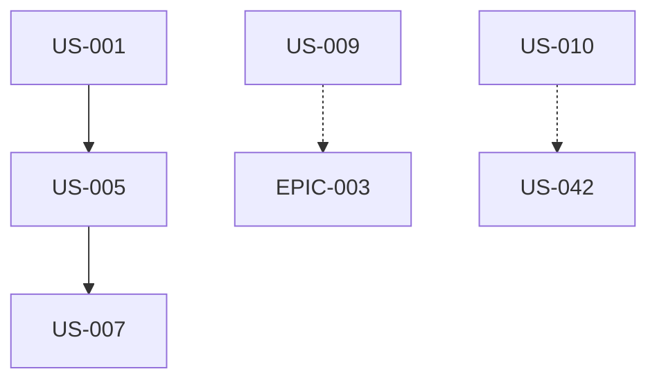

# EPIC-001 : Page d'accueil

## Description
Page d'accueil longue à sections ancrées concentrant le discours principal de l'agence. 13 sections couvrant l'ensemble de la proposition de valeur : hero, indicateurs, confiance clients, delivery moderne, offres, témoignages, blog, réalisations, technologies, valeurs et approche.

## MMF (Minimum Marketable Feature)
Version minimale fonctionnelle : Hero + Offres (4 piliers) + Formulaire contact + Navigation responsive. Cette version permet déjà de présenter l'agence, ses services et de capter des leads.

## User Stories
| US | Titre | Points | Priorité | Statut |
|----|-------|--------|----------|--------|
| US-001 | Hero avec proposition valeur et CTAs | 3 | Must | 🔴 |
| US-002 | Section indicateurs chiffrés | 2 | Must | 🔴 |
| US-003 | Section confiance clients/secteurs | 2 | Should | 🔴 |
| US-004 | Section delivery moderne | 3 | Must | 🔴 |
| US-005 | Section offres (4 piliers cartes) | 5 | Must | 🔴 |
| US-006 | Bandeau CTA milieu page | 1 | Should | 🔴 |
| US-007 | Section contact avec formulaire | 5 | Must | 🔴 |
| US-008 | Section témoignages clients | 3 | Should | 🔴 |
| US-009 | Aperçu blog (3 derniers articles) | 3 | Must | 🔴 |
| US-010 | Aperçu réalisations | 2 | Should | 🔴 |
| US-011 | Section technologies (11 stacks) | 2 | Must | 🔴 |
| US-012 | Section valeurs (4 piliers) | 2 | Should | 🔴 |
| US-013 | Section approche (timeline 5 étapes) | 3 | Must | 🔴 |

## Dépendances

## Critères de complétion
- [ ] 13 sections visibles et accessibles via ancres
- [ ] Navigation sticky fonctionnelle desktop + mobile
- [ ] Scroll smooth vers ancres
- [ ] Performance Lighthouse ≥ 90
- [ ] Responsive 320px → 1440px+
- [ ] Temps de chargement LCP < 2,5s
