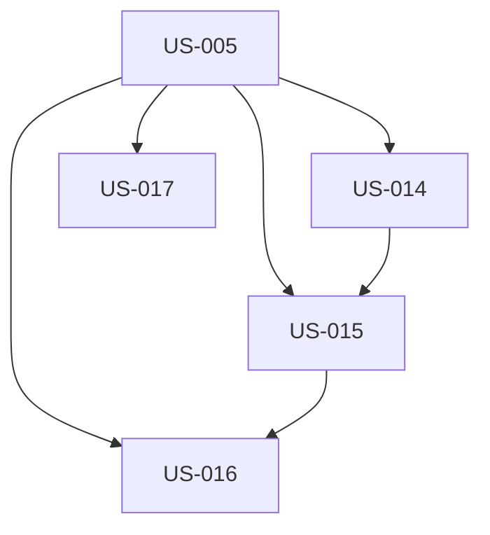

# EPIC-002 : Pages services

## Description
4 pages services dédiées approfondissant chaque pilier d'offre. Chaque page présente les problèmes clients, les offres détaillées, le processus spécifique, les technologies associées, les réalisations pertinentes et une FAQ.

## MMF (Minimum Marketable Feature)
Version minimale : Page Applications métier complète avec structure canonique (hero, problèmes, offres, processus, CTA contact). Cette page représente l'offre phare de l'agence et permet de tester le template réutilisable.

## User Stories
| US | Titre | Points | Priorité | Statut |
|----|-------|--------|----------|--------|
| US-014 | Page Développement web | 5 | Must | 🔴 |
| US-015 | Page Applications métier | 5 | Must | 🔴 |
| US-016 | Page Applications mobiles | 5 | Must | 🔴 |
| US-017 | Page Conseil et organisation | 5 | Should | 🔴 |

## Dépendances

## Critères de complétion
- [ ] 4 pages services live avec structure canonique
- [ ] Meta title/description unique par page
- [ ] FAQ avec schema FAQPage
- [ ] Liens internes vers blog (≥2 par page)
- [ ] Technologies filtrées par service
- [ ] CTAs vers formulaire contact avec sujet pré-rempli
