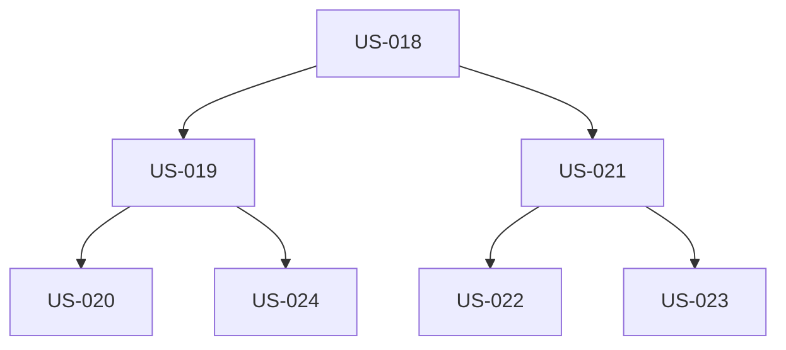

# EPIC-003 : Blog complet

## Description
Zone blog complète avec CMS Sanity, 3 catégories éditoriales (Avis, Tests, Process), pages liste et article, flux RSS, partage LinkedIn natif. Le blog est le moteur SEO/GEO du site.

## MMF (Minimum Marketable Feature)
Version minimale : Page liste blog + modèle article fonctionnel + CMS Sanity configuré + 3 articles de lancement (1 par catégorie). Cette version permet déjà de publier du contenu et d'établir la crédibilité technique.

## User Stories
| US | Titre | Points | Priorité | Statut |
|----|-------|--------|----------|--------|
| US-018 | CMS Sanity - Configuration et modèle données | 5 | Must | 🔴 |
| US-019 | Page liste blog avec filtres catégories | 3 | Must | 🔴 |
| US-020 | Pages catégories (Avis, Tests, Process) | 2 | Must | 🔴 |
| US-021 | Page article avec structure complète | 5 | Must | 🔴 |
| US-022 | Bouton partage LinkedIn et Open Graph | 3 | Must | 🔴 |
| US-023 | Prévisualisation brouillons CMS | 3 | Should | 🔴 |
| US-024 | Flux RSS blog | 1 | Could | 🔴 |

## Dépendances

## Critères de complétion
- [ ] CMS Sanity opérationnel avec 3 éditeurs
- [ ] Modèle article complet (cf. PRD section F03.2)
- [ ] Création brouillon → preview → publication sans dev
- [ ] 3 articles de lancement publiés (1/catégorie)
- [ ] Bouton LinkedIn fonctionnel, preview OG validée
- [ ] Schema BlogPosting valide
- [ ] Temps de lecture calculé automatiquement
- [ ] ISR Next.js (revalidation 1h)
