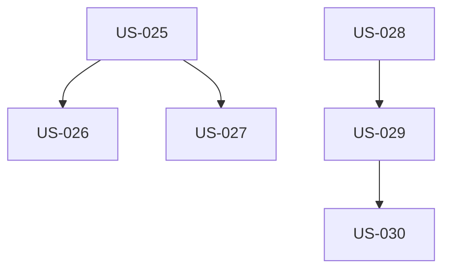

# EPIC-004 : Formulaire contact et intégrations

## Description
Formulaire de contact fonctionnel avec envoi email transactionnel (Resend), anti-spam, conformité RGPD. Intégrations analytics (Plausible) et bandeau consentement cookies (Tarteaucitron).

## MMF (Minimum Marketable Feature)
Version minimale : Formulaire contact opérationnel avec envoi email (Resend) + validation + anti-spam honeypot + consentement RGPD. Cette version permet déjà de capter des leads de manière conforme.

## User Stories
| US | Titre | Points | Priorité | Statut |
|----|-------|--------|----------|--------|
| US-025 | Formulaire contact avec validation | 5 | Must | 🔴 |
| US-026 | Envoi email Resend | 3 | Must | 🔴 |
| US-027 | Anti-spam (honeypot + reCAPTCHA) | 3 | Must | 🔴 |
| US-028 | Analytics Plausible Cloud | 2 | Must | 🔴 |
| US-029 | Bandeau cookies Tarteaucitron RGPD | 3 | Must | 🔴 |
| US-030 | Pages légales (mentions, confidentialité, cookies) | 2 | Must | 🔴 |

## Dépendances

## Critères de complétion
- [ ] Formulaire identique sur accueil et page `/contact`
- [ ] Validation côté client + serveur
- [ ] Email reçu en boîte métier (< 1 min)
- [ ] Message confirmation affiché après envoi
- [ ] Anti-spam opérationnel (test soumissions multiples)
- [ ] Analytics recevant événements
- [ ] Bandeau cookies conforme RGPD
- [ ] 3 pages légales accessibles footer
