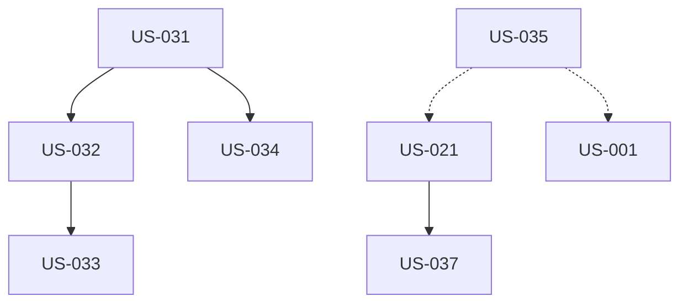

# EPIC-005 : SEO, GEO et performance

## Description
SEO technique complet (meta, sitemap, canonical, schema.org), stratégie GEO (llms.txt, answer-first, FAQ structurées), optimisations performance (Lighthouse ≥ 90), accessibilité WCAG 2.1 AA.

## MMF (Minimum Marketable Feature)
Version minimale : SEO technique de base (meta uniques, sitemap, canonical, schema Organization + BlogPosting) + performance Lighthouse ≥ 90 + accessibilité AA minimum. Cette version garantit l'indexation et la conformité technique.

## User Stories
| US | Titre | Points | Priorité | Statut |
|----|-------|--------|----------|--------|
| US-031 | SEO technique (meta, sitemap, canonical) | 3 | Must | 🔴 |
| US-032 | Structured data Schema.org | 3 | Must | 🔴 |
| US-033 | Google Search Console configuration | 1 | Must | 🔴 |
| US-034 | GEO - llms.txt et answer-first | 3 | Should | 🔴 |
| US-035 | Performance Lighthouse ≥ 90 | 5 | Must | 🔴 |
| US-036 | Accessibilité WCAG 2.1 AA | 5 | Must | 🔴 |
| US-037 | Open Graph optimisé LinkedIn | 2 | Must | 🔴 |

## Dépendances

## Critères de complétion
- [ ] Sitemap.xml inclut tous articles publiés
- [ ] Schema.org valides (Rich Results Test 0 erreur)
- [ ] GSC configurée + sitemap soumis
- [ ] Chaque article : intro answer-first ou keyTakeaways
- [ ] FAQ sur 4 pages services avec schema FAQPage
- [ ] Lighthouse Performance ≥ 90 (desktop + mobile)
- [ ] Lighthouse Accessibility ≥ 95
- [ ] axe-core 0 erreur critique
- [ ] Contraste validé (WebAIM)
- [ ] Navigation clavier complète testée
