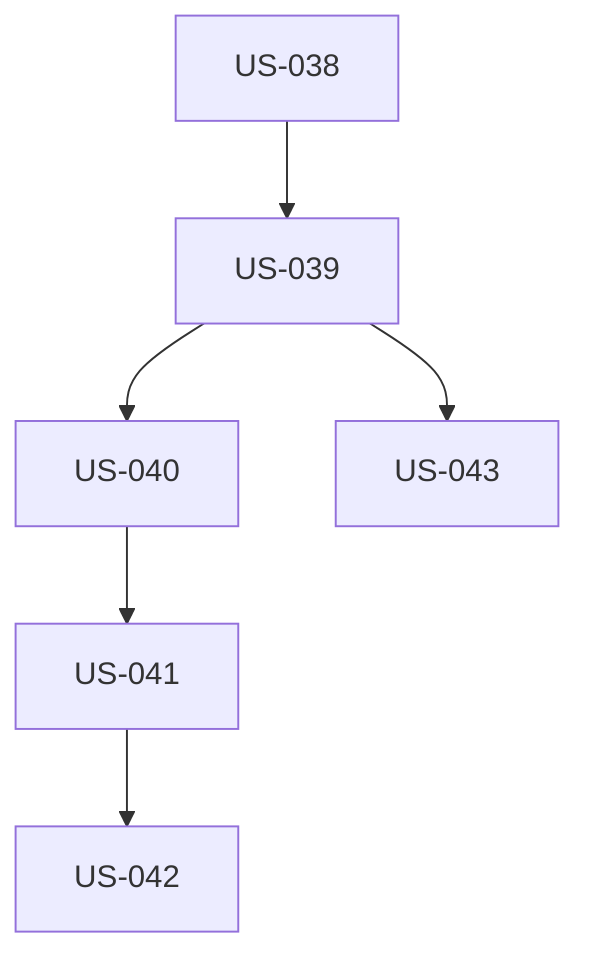

# EPIC-006 : Infrastructure et déploiement

## Description
Setup complet de l'infrastructure : projet Next.js 15+ configuré, hébergement Cloudflare Pages, pipeline CI/CD GitHub Actions, domaine configuré avec HTTPS, monitoring et alertes.

## MMF (Minimum Marketable Feature)
Version minimale : Projet Next.js 15.5.15+ initialisé avec TypeScript + Tailwind, déploiement Cloudflare Pages fonctionnel, domaine configuré avec HTTPS, environnement staging accessible. Cette version permet de déployer le site en production.

## User Stories
| US | Titre | Points | Priorité | Statut |
|----|-------|--------|----------|--------|
| US-038 | Setup Next.js 15 + TypeScript + Tailwind | 3 | Must | 🔴 |
| US-039 | Configuration Cloudflare Pages | 3 | Must | 🔴 |
| US-040 | Pipeline CI/CD GitHub Actions | 5 | Must | 🔴 |
| US-041 | Domaine + DNS + HTTPS | 2 | Must | 🔴 |
| US-042 | Headers sécurité (CSP, HSTS, etc.) | 2 | Must | 🔴 |
| US-043 | Environnements staging/production | 2 | Should | 🔴 |

## Dépendances

## Critères de complétion
- [ ] Next.js ≥ 15.5.15 (patches CVE critiques)
- [ ] TypeScript strict mode
- [ ] Tailwind CSS 4.x configuré
- [ ] Cloudflare Pages déploie depuis main automatiquement
- [ ] CI/CD : tests + linting + Lighthouse audit
- [ ] Domaine configuré, certificat SSL actif
- [ ] Headers sécurité configurés
- [ ] Staging accessible (URL temporaire)
- [ ] Environnements .env correctement isolés
