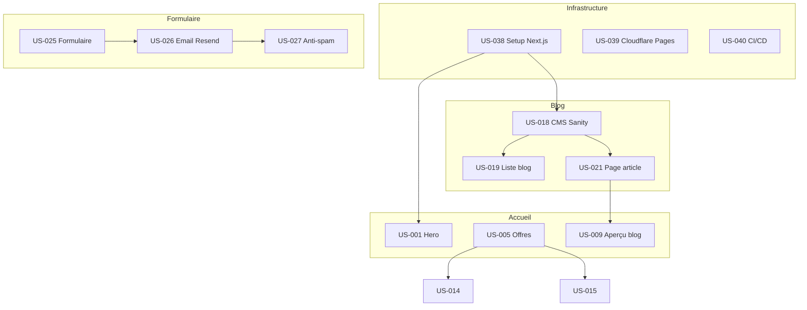

# Index du Backlog — Agentic Agency

**Date de génération :** 29 mai 2026  
**Product Owner :** Certifié CSPO  
**Projet :** Site vitrine Agentic Agency — Lot 1 MVP

---

## Vue d'ensemble

### Métriques globales
- **6 EPICs** structurant le périmètre fonctionnel
- **43 User Stories** au total
- **~100-110 story points** estimés (Fibonacci 1-8)
- **Sprints estimés :** 4-5 sprints de 2 semaines (vélocité cible : 20-25 points/sprint)
- **Durée estimée :** 7-9 semaines (aligné avec planning PRD)

### Répartition par priorité (MoSCoW)
| Priorité | Nombre US | Points estimés | % |
|----------|-----------|----------------|---|
| **Must** | 33 | ~85 points | 77% |
| **Should** | 8 | ~20 points | 19% |
| **Could** | 2 | ~3 points | 4% |

---

## EPICs et User Stories

### EPIC-001 : Page d'accueil
**Description :** Page longue à 13 sections ancrées concentrant le discours principal.  
**MMF :** Hero + Offres + Formulaire contact + Navigation responsive  
**Points total :** 37

| US | Titre | Points | Priorité | Persona |
|----|-------|--------|----------|---------|
| US-001 | Hero avec proposition valeur et CTAs | 3 | Must | P-001 |
| US-002 | Section indicateurs chiffrés | 2 | Must | P-001 |
| US-003 | Section confiance clients/secteurs | 2 | Should | P-001 |
| US-004 | Section delivery moderne | 3 | Must | P-003 |
| US-005 | Section offres (4 piliers cartes) | 5 | Must | P-001 |
| US-006 | Bandeau CTA milieu page | 1 | Should | P-001 |
| US-007 | Section contact avec formulaire | 5 | Must | P-001 |
| US-008 | Section témoignages clients | 3 | Should | P-001 |
| US-009 | Aperçu blog (3 derniers articles) | 3 | Must | P-002 |
| US-010 | Aperçu réalisations | 2 | Should | P-001 |
| US-011 | Section technologies (11 stacks) | 2 | Must | P-002 |
| US-012 | Section valeurs (4 piliers) | 2 | Should | P-001 |
| US-013 | Section approche (timeline 5 étapes) | 3 | Must | P-003 |

**Dépendances clés :** US-009 dépend d'EPIC-003 (Blog)

---

### EPIC-002 : Pages services
**Description :** 4 pages services dédiées avec structure canonique réutilisable.  
**MMF :** Page Applications métier complète (offre phare)  
**Points total :** 20

| US | Titre | Points | Priorité | Persona |
|----|-------|--------|----------|---------|
| US-014 | Page Développement web | 5 | Must | P-001 |
| US-015 | Page Applications métier | 5 | Must | P-002 |
| US-016 | Page Applications mobiles | 5 | Must | P-001 |
| US-017 | Page Conseil et organisation | 5 | Should | P-004 |

**Dépendances clés :** Toutes pages dépendent d'US-005 (Cartes offre accueil) pour cohérence

---

### EPIC-003 : Blog complet
**Description :** Blog avec CMS Sanity, 3 catégories, partage LinkedIn, RSS.  
**MMF :** Page liste + modèle article + CMS configuré + 3 articles lancement  
**Points total :** 22

| US | Titre | Points | Priorité | Persona |
|----|-------|--------|----------|---------|
| US-018 | CMS Sanity - Configuration et modèle données | 5 | Must | P-003 |
| US-019 | Page liste blog avec filtres catégories | 3 | Must | P-002 |
| US-020 | Pages catégories (Avis, Tests, Process) | 2 | Must | P-002 |
| US-021 | Page article avec structure complète | 5 | Must | P-002 |
| US-022 | Bouton partage LinkedIn et Open Graph | 3 | Must | P-005 |
| US-023 | Prévisualisation brouillons CMS | 3 | Should | P-003 |
| US-024 | Flux RSS blog | 1 | Could | P-005 |

**Dépendances clés :** US-018 est la base (toutes les autres US blog en dépendent)

---

### EPIC-004 : Formulaire contact et intégrations
**Description :** Formulaire + email transactionnel + analytics + RGPD.  
**MMF :** Formulaire opérationnel + email Resend + anti-spam + consentement RGPD  
**Points total :** 18

| US | Titre | Points | Priorité | Persona |
|----|-------|--------|----------|---------|
| US-025 | Formulaire contact avec validation | 5 | Must | P-001 |
| US-026 | Envoi email Resend | 3 | Must | P-001 |
| US-027 | Anti-spam (honeypot + reCAPTCHA) | 3 | Must | P-001 |
| US-028 | Analytics Plausible Cloud | 2 | Must | P-003 |
| US-029 | Bandeau cookies Tarteaucitron RGPD | 3 | Must | P-001 |
| US-030 | Pages légales (mentions, confidentialité, cookies) | 2 | Must | P-001 |

**Dépendances clés :** US-025 → US-026 → US-027 (séquence formulaire)

---

### EPIC-005 : SEO, GEO et performance
**Description :** SEO technique + GEO + Lighthouse ≥ 90 + WCAG AA.  
**MMF :** SEO base + performance ≥ 90 + accessibilité AA  
**Points total :** 23

| US | Titre | Points | Priorité | Persona |
|----|-------|--------|----------|---------|
| US-031 | SEO technique (meta, sitemap, canonical) | 3 | Must | P-002 |
| US-032 | Structured data Schema.org | 3 | Must | P-002 |
| US-033 | Google Search Console configuration | 1 | Must | P-003 |
| US-034 | GEO - llms.txt et answer-first | 3 | Should | P-002 |
| US-035 | Performance Lighthouse ≥ 90 | 5 | Must | P-001 |
| US-036 | Accessibilité WCAG 2.1 AA | 5 | Must | P-001 |
| US-037 | Open Graph optimisé LinkedIn | 2 | Must | P-005 |

**Dépendances clés :** US-031 → US-032 → US-033 (séquence SEO)

---

### EPIC-006 : Infrastructure et déploiement
**Description :** Setup Next.js + Cloudflare Pages + CI/CD + domaine + sécurité.  
**MMF :** Projet Next.js + déploiement Cloudflare + domaine HTTPS  
**Points total :** 17

| US | Titre | Points | Priorité | Persona |
|----|-------|--------|----------|---------|
| US-038 | Setup Next.js 15 + TypeScript + Tailwind | 3 | Must | P-002 |
| US-039 | Configuration Cloudflare Pages | 3 | Must | P-003 |
| US-040 | Pipeline CI/CD GitHub Actions | 5 | Must | P-002 |
| US-041 | Domaine + DNS + HTTPS | 2 | Must | P-001 |
| US-042 | Headers sécurité (CSP, HSTS, etc.) | 2 | Must | P-002 |
| US-043 | Environnements staging/production | 2 | Should | P-003 |

**Dépendances clés :** US-038 → US-039 → US-040 (séquence infrastructure)

---

## Matrice de dépendances critiques

---

## Sprint 1 = Walking Skeleton (recommandation)

**Objectif :** Livrer un squelette fonctionnel complet end-to-end.  
**Points cible :** 20-25 points  
**US sélectionnées :**

| US | Titre | Points | Justification |
|----|-------|--------|---------------|
| US-038 | Setup Next.js | 3 | Fondation technique |
| US-039 | Cloudflare Pages | 3 | Déploiement |
| US-001 | Hero | 3 | Landing minimale |
| US-005 | Offres | 5 | Proposition de valeur |
| US-025 | Formulaire | 5 | Capture lead |
| US-026 | Email Resend | 3 | Notification |
| US-041 | Domaine HTTPS | 2 | Accessibilité publique |

**Total Sprint 1 :** 24 points  
**Livrables :** Page accueil minimale (hero + offres) + formulaire contact fonctionnel + déploiement production HTTPS

---

## Sprints suivants (proposition)

### Sprint 2 : Blog + Navigation (22 points)
US-018 (CMS Sanity) + US-019 (Liste blog) + US-021 (Article) + US-002-004 (Sections accueil)

### Sprint 3 : Pages services + Intégrations (24 points)
US-014-016 (Pages services) + US-027-030 (Anti-spam, Analytics, RGPD)

### Sprint 4 : SEO + Performance (23 points)
US-031-037 (SEO technique, GEO, Lighthouse, Accessibilité)

### Sprint 5 : Finitions + CI/CD (18 points)
US-040 (CI/CD) + US-006-013 (Sections accueil restantes) + US-022-024 (LinkedIn, Preview, RSS)

---

## Critères de complétion MVP (Definition of Done)

### Fonctionnel
- [ ] 13 sections accueil présentes et ancrées
- [ ] 4 pages services live avec structure complète
- [ ] Blog opérationnel : liste + 3 articles publiés (1/catégorie)
- [ ] Formulaire contact envoi email < 1 min
- [ ] CMS Sanity : création → preview → publication sans dev
- [ ] Navigation responsive desktop + mobile

### Technique
- [ ] Lighthouse Performance ≥ 90 (desktop + mobile)
- [ ] WCAG 2.1 AA (Lighthouse Accessibility ≥ 95)
- [ ] HTTPS actif, certificat valide
- [ ] Sitemap.xml inclut blog, soumis GSC
- [ ] Schema.org valides (Rich Results Test 0 erreur)
- [ ] Bouton LinkedIn fonctionnel, preview OG validée (3 articles min)
- [ ] Analytics Plausible recevant événements
- [ ] Bandeau cookies RGPD conforme
- [ ] CI/CD GitHub Actions : Lint + Tests + Build passent

### Éditorial
- [ ] 11 stacks visibles avec versions
- [ ] Pas de promesse trompeuse IA/agentique
- [ ] Aucune mention site de référence confidentiel
- [ ] 3 articles blog conformes charte (catégorie, longueur, ton)
- [ ] Chaque article : cover, extrait, seoTitle, seoDescription, ogImage 1200×627
- [ ] Intro answer-first OU keyTakeaways sur articles lancement

---

## Personas référencées

| ID | Nom | Rôle | US associées |
|----|-----|------|--------------|
| P-001 | Sophie Martineau | Dirigeante PME | 16 US (focus conversion, simplicité) |
| P-002 | Marc Lefebvre | DSI/CTO | 12 US (focus technique, qualité) |
| P-003 | Claire Dubois | Product Owner | 6 US (focus delivery, autonomie) |
| P-004 | Thomas Bernard | Directeur Transformation | 1 US (conseil) |
| P-005 | Julie Renard | Développeur Freelance | 3 US (partage, réseau) |

---

## Prochaines étapes

1. **Valider le backlog** avec `/gate:validate-backlog`
2. **Planifier Sprint 1** avec `/project:decompose-tasks 001`
3. **Obtenir prochaine story** avec `/sprint:next-story`
4. **Suivre progression** avec `/sprint:status`

---

**Backlog généré par :** Product Owner certifié CSPO  
**Conformité SCRUM :** INVEST ✅ | 3C ✅ | Gherkin SMART ✅ | MMF par EPIC ✅  
**Date génération :** 29 mai 2026  
**Version backlog :** 1.0
