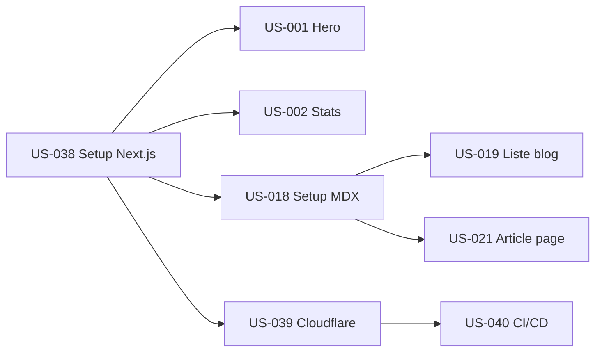

# Sprint 001 — Walking Skeleton

## Sprint Goal

> Un visiteur peut voir la page d'accueil skeleton et lire 1 article de blog déployé sur Cloudflare Pages.

## Informations

| Champ | Valeur |
|-------|--------|
| **Durée** | 2 semaines |
| **Début** | 2026-05-29 |
| **Fin prévue** | 2026-06-12 |
| **Vélocité cible** | 20 points |
| **Heures estimées** | ~40h |

## User Stories

| ID | Story | Points | Priorité | Statut |
|----|-------|--------|----------|--------|
| US-038 | Setup Next.js + TypeScript + Tailwind | 2 | Must | 🔴 To Do |
| US-001 | Hero section accueil | 3 | Must | 🔴 To Do |
| US-002 | Section indicateurs chiffrés | 2 | Must | 🔴 To Do |
| US-039 | Configuration Cloudflare Pages + deploy | 2 | Must | 🔴 To Do |
| US-040 | Pipeline CI/CD GitHub Actions | 3 | Must | 🔴 To Do |
| US-018 | Setup MDX + 1 article exemple | 3 | Must | 🔴 To Do |
| US-019 | Page liste blog | 2 | Must | 🔴 To Do |
| US-021 | Page article /blog/[slug] | 3 | Must | 🔴 To Do |

**Total : 20 points**

## Livrables Sprint

- [ ] Site déployé sur `agentic-agency.pages.dev`
- [ ] Page accueil avec Hero + Stats (skeleton)
- [ ] Header + Footer basiques
- [ ] 1 article blog lisible en MDX
- [ ] Page index blog avec liste articles
- [ ] CI qui passe (lint + type-check + build)
- [ ] Deploy automatique sur Cloudflare Pages

## Dépendances

## Ordre d'implémentation recommandé

1. **US-038** Setup Next.js + TypeScript + Tailwind + Radix UI
2. **US-039** Cloudflare Pages + premier deploy
3. **US-040** GitHub Actions CI (lint + build)
4. **US-001** Hero section + Header/Footer skeleton
5. **US-002** Section indicateurs chiffrés
6. **US-018** Setup MDX + 1 article exemple
7. **US-019** Page liste blog
8. **US-021** Page article dynamique /blog/[slug]

## Definition of Done

- [ ] Code TypeScript strict (no `any`)
- [ ] Lint passe (ESLint + Prettier)
- [ ] Build passe sans erreur
- [ ] Deploy sur Cloudflare Pages réussi
- [ ] Responsive mobile (testé iPhone SE + iPad + Desktop)
- [ ] Lighthouse Performance ≥ 80 (skeleton, seuil relâché Sprint 1)
