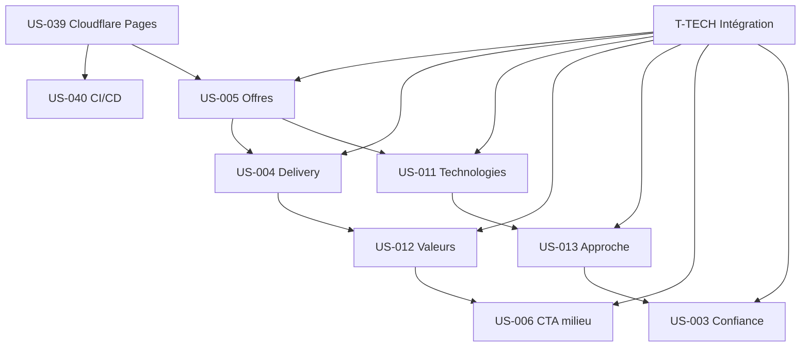

# Dépendances — Sprint 002 Accueil Complet + Infra

## Dépendances inter-US

## Dépendances externes (Sprint 1)

| Dépendance | Statut | Impact |
|------------|--------|--------|
| US-038 Setup Next.js | ✅ Done (Sprint 1) | Base du projet |
| Repo GitHub | 🔲 À créer (US-039) | Bloquant pour Cloudflare + CI/CD |
| Bug MDX corrigé | ✅ Done | MDXRemote fonctionnel |
| Styles prose | ✅ Done | CSS custom opérationnel |

## Dépendances hors sprint

| US | Dépendance | Impact |
|----|------------|--------|
| US-005 Offres | US-014/015/016/017 Pages services | Liens "En savoir plus" → placeholder /services |
| US-004 Delivery | US-019 Page blog | Lien CTA → /blog existant |
| US-012 Valeurs | US-007 Section contact | CTA → #contact → placeholder |
| US-006 CTA milieu | US-007 Section contact | Scroll #contact → placeholder |
| US-003 Confiance | US-018 CMS Sanity | Logos statiques (pas CMS) |

## Stratégie pour dépendances manquantes

- Liens vers pages non créées → pointer vers `/services` ou `/blog` (pages liste)
- Section #contact non implémentée → CTA pointe vers `/contact` (page placeholder ou ancre footer)
- CMS Sanity non branché → données hardcodées dans fichiers TypeScript
