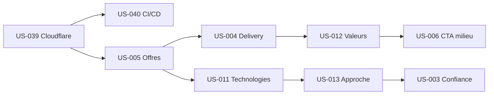

# Sprint 002 — Accueil Complet + Infra

## Sprint Goal

> La page d'accueil affiche les 13 sections complètes et le site est déployé sur Cloudflare Pages avec CI/CD.

## Informations

| Champ | Valeur |
|-------|--------|
| **Durée** | 2 semaines |
| **Début** | 2026-05-29 |
| **Fin prévue** | 2026-06-12 |
| **Vélocité Sprint 1** | 15 pts |
| **Capacité cible** | 25 pts |

## Prérequis Sprint 1

- [x] Sprint Review effectuée
- [x] Rétrospective effectuée
- [x] Bug frontmatter MDX corrigé (MDXRemote)
- [x] Styles prose ajoutés (globals.css)
- [ ] Repo GitHub créé (action Sprint 2)

## Sprint Backlog

### Priorité 1 — Infra reportée (bloquant)

| ID | Titre | Points | Priorité |
|----|-------|--------|----------|
| US-039 | Configuration Cloudflare Pages + deploy | 3 | 🔴 Must |
| US-040 | Pipeline CI/CD GitHub Actions | 5 | 🔴 Must |

### Priorité 2 — Sections accueil (EPIC-001)

| ID | Titre | Points | Priorité |
|----|-------|--------|----------|
| US-005 | Offres — 4 piliers + cartes | 5 | 🔴 Must |
| US-004 | Delivery moderne | 3 | 🔴 Must |
| US-011 | Technologies (11 stacks) | 2 | 🔴 Must |
| US-012 | Valeurs (4 piliers) | 2 | 🔴 Must |
| US-013 | Approche — timeline 5 étapes | 3 | 🔴 Must |
| US-006 | Bandeau CTA milieu page | 1 | 🟡 Should |
| US-003 | Confiance clients/secteurs | 2 | 🟡 Should |

**Total engagé : 26 points**

### Buffer / Sprint 3

| ID | Titre | Points | Raison report |
|----|-------|--------|---------------|
| US-007 | Section contact + formulaire | 5 | EPIC-004 Sprint 3 |
| US-008 | Témoignages clients | 3 | Contenus client requis |
| US-009 | Aperçu blog (3 articles) | 3 | Nécessite +2 articles MDX |
| US-010 | Aperçu réalisations | 2 | Contenus client requis |

## Ordre d'implémentation

1. **US-039** Cloudflare Pages + premier deploy
2. **US-040** GitHub Actions CI (lint + build + deploy)
3. **US-005** Offres — 4 piliers (section la plus complexe)
4. **US-004** Delivery moderne
5. **US-011** Technologies (grille 11 stacks)
6. **US-012** Valeurs (4 piliers)
7. **US-013** Approche (timeline 5 étapes)
8. **US-006** Bandeau CTA milieu
9. **US-003** Confiance clients/secteurs

## Definition of Done

- [ ] Code TypeScript strict (no `any`)
- [ ] Lint passe (ESLint)
- [ ] Build passe sans erreur
- [ ] Deploy Cloudflare Pages réussi
- [ ] Responsive mobile (iPhone SE + iPad + Desktop)
- [ ] 13 sections visibles sur l'accueil
- [ ] CI/CD opérationnel (lint + build automatique)

## Risques

| Risque | Impact | Mitigation |
|--------|--------|------------|
| Scope 26 pts > vélocité 15 pts | Élevé | Réduire : reporter US-003 si nécessaire |
| Cloudflare config bloquante | Moyen | Compte + repo GitHub prérequis |
| Contenus placeholder | Faible | Textes provisoires acceptables |

## Actions Rétro Sprint 1

- [x] ~~Installer @tailwindcss/typography~~ → Résolu avec CSS custom prose
- [ ] Créer repo GitHub + deploy Cloudflare (US-039)
- [ ] MAJ tech-spec pour Next.js 16 + MDXRemote
- [ ] Ajouter Lighthouse CI (reporté Sprint 3)
