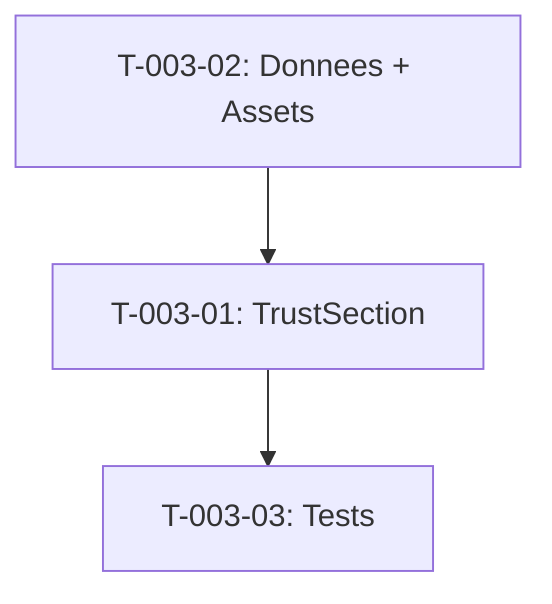

# Taches - US-003 : Section Confiance Clients/Secteurs

## Informations US
- **Epic** : EPIC-001
- **Persona** : P-001 - Dirigeante PME
- **Story Points** : 2
- **Sprint** : sprint-002-accueil-complet

## Resume de la US
**En tant que** P-001 - Dirigeante PME
**Je veux** voir des logos de clients ou secteurs reconnus
**Afin de** me rassurer que l'agence a de l'experience avec des entreprises similaires

## Vue d'ensemble des taches

| ID | Type | Tache | Estimation | Depend de | Statut |
|----|------|-------|------------|-----------|--------|
| T-003-01 | [FE] | Composant TrustSection (logos grayscale) | 2h | - | 🔲 |
| T-003-02 | [FE] | Donnees logos/secteurs + assets SVG | 1h | - | 🔲 |
| T-003-03 | [TEST] | Tests unitaires | 1h | T-003-01 | 🔲 |

**Total estime** : 4h

---

## Detail des taches

### T-003-01 : Composant TrustSection
- **Type** : [FE]
- **Estimation** : 2h
- **Depend de** : -

**Description** :
Creer la section confiance avec grille de logos en grayscale.

**Fichier a creer** :
- `site/src/components/sections/trust-section.tsx`

**Layout** :
- 6-10 logos/icones en grille horizontale
- Grayscale par defaut
- Desktop : ligne unique ou 2 lignes
- Mobile : grille 3 colonnes

**Criteres de validation** :
- [ ] 6-10 items affiches
- [ ] Logos en grayscale (filtre CSS)
- [ ] Section id="confiance"
- [ ] Fallback placeholder si logo manquant
- [ ] Alt text sur chaque logo
- [ ] Si < 6 logos : centrage adapte

---

### T-003-02 : Donnees logos/secteurs + assets
- **Type** : [FE]
- **Estimation** : 1h
- **Depend de** : -

**Fichiers a creer** :
- `site/src/data/trust.ts`
- `site/public/images/clients/` (logos SVG ou icones secteurs)

**Approche** :
- Phase 1 : icones secteurs generiques (Fintech, Sante, Industrie, etc.)
- Phase 2 : logos clients reels (quand accords obtenus)

**Structure** :
```typescript
type TrustItem = {
  name: string
  logo?: string
  sector: string
}
```

**Criteres de validation** :
- [ ] Fichier donnees type-safe
- [ ] Minimum 6 items (secteurs)
- [ ] Assets SVG optimises
- [ ] Alt descriptif pour chaque item

---

### T-003-03 : Tests unitaires
- **Type** : [TEST]
- **Estimation** : 1h
- **Depend de** : T-003-01

**Tests** :
1. Rend 6+ items
2. Logos en grayscale
3. Alt text present
4. Fallback si logo manquant
5. Section masquee si < 6 items

---

## Graphe de dependances



## Resume

| Couche | Nb taches | Heures |
|--------|-----------|--------|
| [FE] | 2 | 3h |
| [TEST] | 1 | 1h |
| **TOTAL** | **3** | **4h** |
