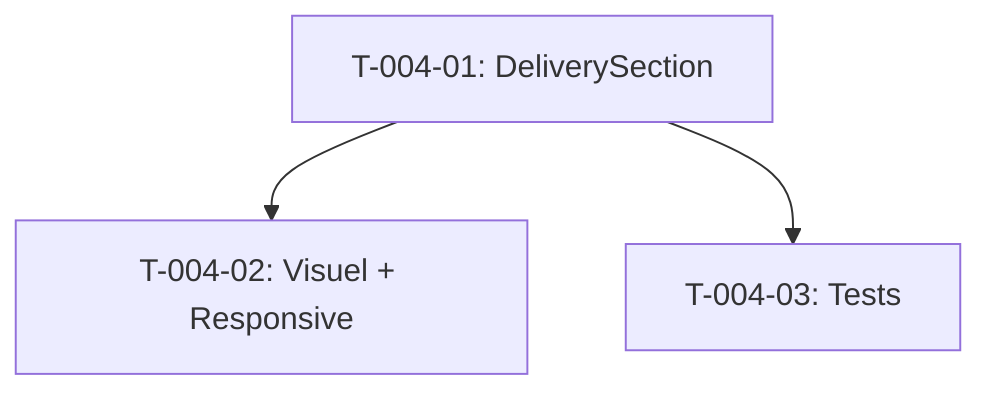

# Taches - US-004 : Section Delivery Moderne

## Informations US
- **Epic** : EPIC-001
- **Persona** : P-003 - Product Owner
- **Story Points** : 3
- **Sprint** : sprint-002-accueil-complet

## Resume de la US
**En tant que** P-003 - Product Owner
**Je veux** comprendre l'approche delivery de l'agence (cycles courts, revues, automatisation)
**Afin de** valider qu'ils travaillent de maniere agile et moderne

## Vue d'ensemble des taches

| ID | Type | Tache | Estimation | Depend de | Statut |
|----|------|-------|------------|-----------|--------|
| T-004-01 | [FE] | Composant DeliverySection (texte + CTA blog) | 3h | - | 🔲 |
| T-004-02 | [FE] | Visuel illustratif + responsive | 1.5h | T-004-01 | 🔲 |
| T-004-03 | [TEST] | Tests unitaires | 1.5h | T-004-01 | 🔲 |

**Total estime** : 6h

---

## Detail des taches

### T-004-01 : Composant DeliverySection
- **Type** : [FE]
- **Estimation** : 3h
- **Depend de** : -

**Description** :
Creer la section Delivery moderne avec titre H2, 2 paragraphes explicatifs et CTA vers /blog.

**Fichiers a creer** :
- `site/src/components/sections/delivery-section.tsx`
- `site/src/data/delivery.ts`

**Contenu** :
- Titre H2 : "Le delivery moderne comme avantage"
- 2 paragraphes : cycles courts, revues, automatisation
- CTA : "Lire nos retours d'experience" → /blog

**Layout** :
- Desktop : texte a gauche, visuel a droite (2 colonnes)
- Mobile : texte puis visuel empiles

**Criteres de validation** :
- [ ] Titre H2 visible
- [ ] 2 paragraphes lisibles
- [ ] CTA cliquable vers /blog
- [ ] Section id="delivery" pour ancrage
- [ ] Focus delivery agile, PAS hype IA

---

### T-004-02 : Visuel illustratif + responsive
- **Type** : [FE]
- **Estimation** : 1.5h
- **Depend de** : T-004-01

**Description** :
Ajouter un visuel illustrant le delivery moderne (timeline, code review, etc.) et assurer le responsive.

**Criteres de validation** :
- [ ] Visuel affiche a cote du texte (desktop)
- [ ] Visuel sous le texte (mobile)
- [ ] Alt descriptif sur le visuel
- [ ] Pas de scroll horizontal mobile
- [ ] Visuel SVG ou illustration CSS/Tailwind

---

### T-004-03 : Tests unitaires
- **Type** : [TEST]
- **Estimation** : 1.5h
- **Depend de** : T-004-01

**Fichier a creer** :
- `site/src/components/sections/__tests__/delivery-section.test.tsx`

**Tests** :
1. Rend titre H2
2. Rend 2 paragraphes
3. CTA pointe vers /blog
4. Alt sur le visuel

**Criteres de validation** :
- [ ] Tests passent
- [ ] Couverture > 80%

---

## Graphe de dependances

## Resume

| Couche | Nb taches | Heures |
|--------|-----------|--------|
| [FE] | 2 | 4.5h |
| [TEST] | 1 | 1.5h |
| **TOTAL** | **3** | **6h** |
