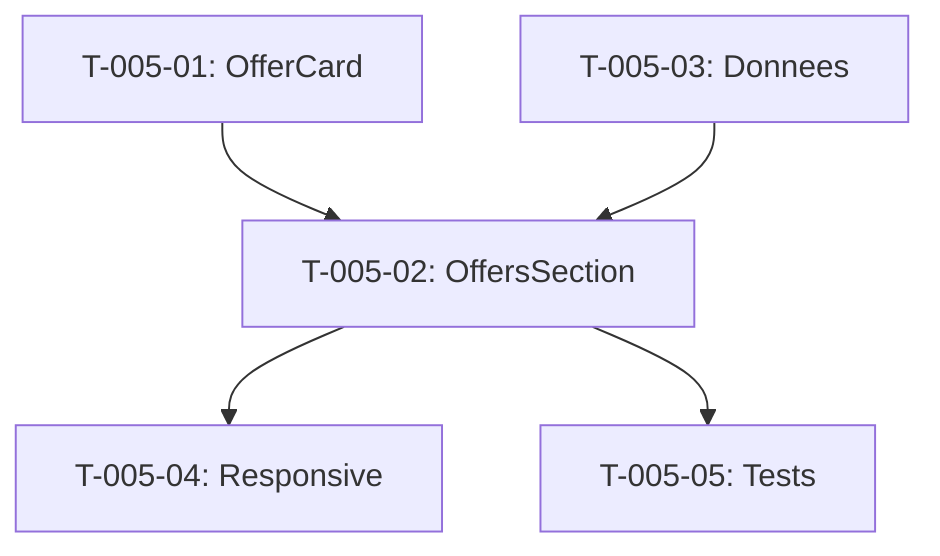

# Taches - US-005 : Section Offres (4 piliers cartes)

## Informations US
- **Epic** : EPIC-001
- **Persona** : P-001 - Dirigeante PME
- **Story Points** : 5
- **Sprint** : sprint-002-accueil-complet

## Resume de la US
**En tant que** P-001 - Dirigeante PME
**Je veux** voir les 4 piliers d'offres avec des cartes detaillees
**Afin de** identifier rapidement le service qui correspond a mon besoin

## Vue d'ensemble des taches

| ID | Type | Tache | Estimation | Depend de | Statut |
|----|------|-------|------------|-----------|--------|
| T-005-01 | [FE] | Composant OfferCard (titre, desc, CTA) | 2h | - | 🔲 |
| T-005-02 | [FE] | Composant OffersSection (4 piliers + grille) | 3h | T-005-01 | 🔲 |
| T-005-03 | [FE] | Donnees contenu (4 piliers x 2-3 cartes) | 1.5h | - | 🔲 |
| T-005-04 | [FE] | Responsive mobile (cartes empilees) + hover | 1.5h | T-005-02 | 🔲 |
| T-005-05 | [TEST] | Tests unitaires composants | 2h | T-005-02 | 🔲 |

**Total estime** : 10h

---

## Detail des taches

### T-005-01 : Composant OfferCard
- **Type** : [FE]
- **Estimation** : 2h
- **Depend de** : -

**Description** :
Creer le composant OfferCard reutilisable avec titre, description, CTA.

**Fichiers a creer** :
- `site/src/components/sections/offers/offer-card.tsx`

**Props** :
- `title: string`
- `description: string`
- `href: string`
- `ctaLabel?: string` (defaut: "En savoir plus")

**Criteres de validation** :
- [ ] Composant rend titre + description + CTA
- [ ] CTA est un lien vers la page service
- [ ] Troncature texte apres 3 lignes si trop long
- [ ] Accessibilite : aria-labels, focus visible

---

### T-005-02 : Composant OffersSection (4 piliers + grille)
- **Type** : [FE]
- **Estimation** : 3h
- **Depend de** : T-005-01

**Description** :
Creer la section complete avec 4 piliers, chacun contenant 2-3 OfferCards.

**Fichiers a creer** :
- `site/src/components/sections/offers/offers-section.tsx`
- `site/src/components/sections/offers/offer-pillar.tsx`

**4 piliers** :
1. Developpement web
2. Applications metier (phare)
3. Applications mobiles
4. Conseil

**Layout** :
- Desktop : 2 colonnes (ou 4 si espace suffisant)
- Chaque pilier : titre H3 + description courte + cartes

**Criteres de validation** :
- [ ] 4 piliers affiches avec titre H2 section
- [ ] Chaque pilier contient 2-3 cartes
- [ ] Section id="offres" pour ancrage
- [ ] Framer Motion animations entree (optionnel)

---

### T-005-03 : Donnees contenu (4 piliers x 2-3 cartes)
- **Type** : [FE]
- **Estimation** : 1.5h
- **Depend de** : -

**Description** :
Creer le fichier de donnees TypeScript avec le contenu des 4 piliers et 8-12 cartes.

**Fichier a creer** :
- `site/src/data/offers.ts`

**Structure** :
```typescript
type OfferPillar = {
  title: string
  description: string
  offers: Offer[]
}
type Offer = {
  title: string
  description: string
  href: string
}
```

**Contenu** :
- Pilier 1 : Developpement web (2-3 cartes)
- Pilier 2 : Applications metier (3 cartes : sur mesure, dette technique, integration SI)
- Pilier 3 : Applications mobiles (2 cartes)
- Pilier 4 : Conseil (2 cartes)

**Criteres de validation** :
- [ ] Fichier TypeScript type-safe
- [ ] Minimum 8 cartes au total
- [ ] Liens vers /services/[slug] (placeholder)
- [ ] Textes coherents avec PRD section S05

---

### T-005-04 : Responsive mobile + effets hover
- **Type** : [FE]
- **Estimation** : 1.5h
- **Depend de** : T-005-02

**Description** :
Adapter la section pour mobile et ajouter les effets d'interaction.

**Criteres de validation** :
- [ ] Mobile (< 640px) : cartes empilees verticalement
- [ ] Tablette (640-1024px) : 2 colonnes
- [ ] Desktop (> 1024px) : grille complete
- [ ] Hover : scale ou border sur carte
- [ ] Pas de scroll horizontal mobile
- [ ] CTAs accessibles (min 44x44px tactile)

---

### T-005-05 : Tests unitaires composants
- **Type** : [TEST]
- **Estimation** : 2h
- **Depend de** : T-005-02

**Fichiers a creer** :
- `site/src/components/sections/offers/__tests__/offer-card.test.tsx`
- `site/src/components/sections/offers/__tests__/offers-section.test.tsx`

**Tests** :
1. OfferCard rend titre, description, lien
2. OfferCard tronque texte long
3. OffersSection rend 4 piliers
4. OffersSection rend toutes les cartes
5. Liens fonctionnels vers /services/*

**Criteres de validation** :
- [ ] Tests passent (`npm run test`)
- [ ] Couverture > 80% pour ces composants

---

## Graphe de dependances



## Resume

| Couche | Nb taches | Heures |
|--------|-----------|--------|
| [FE] | 4 | 8h |
| [TEST] | 1 | 2h |
| **TOTAL** | **5** | **10h** |
