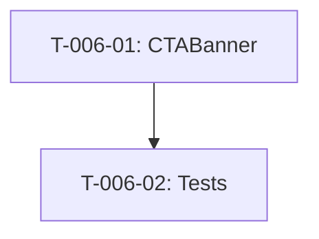

# Taches - US-006 : Bandeau CTA Milieu Page

## Informations US
- **Epic** : EPIC-001
- **Persona** : P-001 - Dirigeante PME
- **Story Points** : 1
- **Sprint** : sprint-002-accueil-complet

## Resume de la US
**En tant que** P-001 - Dirigeante PME
**Je veux** voir un appel a l'action visible au milieu de la page
**Afin de** pouvoir contacter l'agence facilement sans scroller jusqu'en bas

## Vue d'ensemble des taches

| ID | Type | Tache | Estimation | Depend de | Statut |
|----|------|-------|------------|-----------|--------|
| T-006-01 | [FE] | Composant CTABanner (bandeau contraste + lien) | 1.5h | - | 🔲 |
| T-006-02 | [TEST] | Test unitaire + a11y contraste | 0.5h | T-006-01 | 🔲 |

**Total estime** : 2h

---

## Detail des taches

### T-006-01 : Composant CTABanner
- **Type** : [FE]
- **Estimation** : 1.5h
- **Depend de** : -

**Description** :
Creer le bandeau CTA avec fond contraste, texte incitatif et bouton.

**Fichier a creer** :
- `site/src/components/sections/cta-banner.tsx`

**Contenu** :
- Texte : "Pret a accelerer votre produit ?"
- CTA : "Echanger sur votre projet" → scroll vers #contact
- Fallback : si #contact absent → /contact

**Layout** :
- Desktop : texte et CTA sur une ligne, fond contraste pleine largeur
- Mobile : texte et CTA empiles, bouton min 44x44px

**Criteres de validation** :
- [ ] Bandeau avec fond contraste visible
- [ ] Texte incitatif affiche
- [ ] CTA cliquable avec smooth scroll vers #contact
- [ ] Contraste >= 4.5:1 (WCAG AA)
- [ ] Section id="cta-milieu"
- [ ] Focus visible sur le bouton

---

### T-006-02 : Test unitaire + a11y
- **Type** : [TEST]
- **Estimation** : 0.5h
- **Depend de** : T-006-01

**Tests** :
1. Rend texte et bouton CTA
2. Lien pointe vers #contact
3. Bouton accessible (role, aria-label)

---

## Graphe de dependances

## Resume

| Couche | Nb taches | Heures |
|--------|-----------|--------|
| [FE] | 1 | 1.5h |
| [TEST] | 1 | 0.5h |
| **TOTAL** | **2** | **2h** |
