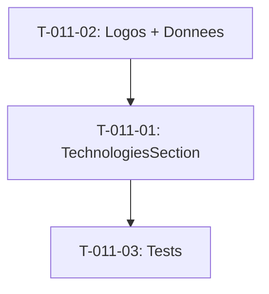

# Taches - US-011 : Section Technologies (11 stacks)

## Informations US
- **Epic** : EPIC-001
- **Persona** : P-002 - DSI/CTO
- **Story Points** : 2
- **Sprint** : sprint-002-accueil-complet

## Resume de la US
**En tant que** P-002 - DSI/CTO
**Je veux** voir les 11 stacks maitrisees avec versions
**Afin de** valider l'expertise technique sur les technologies qui m'interessent

## Vue d'ensemble des taches

| ID | Type | Tache | Estimation | Depend de | Statut |
|----|------|-------|------------|-----------|--------|
| T-011-01 | [FE] | Composant TechnologiesSection (grille 11 items) | 2h | - | 🔲 |
| T-011-02 | [FE] | Logos SVG + donnees stacks/versions | 1.5h | - | 🔲 |
| T-011-03 | [TEST] | Tests unitaires | 0.5h | T-011-01 | 🔲 |

**Total estime** : 4h

---

## Detail des taches

### T-011-01 : Composant TechnologiesSection
- **Type** : [FE]
- **Estimation** : 2h
- **Depend de** : -

**Description** :
Creer la section avec grille responsive affichant 11 technologies.

**Fichiers a creer** :
- `site/src/components/sections/technologies-section.tsx`

**11 stacks** :
Symfony, Laravel, PHP, React, Vue.js, Angular, Flutter, React Native, Python, C#/.NET, Paperclip

**Layout** :
- Desktop : grille 4-5 colonnes
- Tablette : 3 colonnes
- Mobile : 2 colonnes

**Criteres de validation** :
- [ ] 11 items affiches avec nom + version
- [ ] Grille responsive
- [ ] Section id="technologies"
- [ ] Hover effect (scale, border)
- [ ] Fallback texte si logo manquant

---

### T-011-02 : Logos SVG + donnees stacks/versions
- **Type** : [FE]
- **Estimation** : 1.5h
- **Depend de** : -

**Description** :
Preparer les logos SVG optimises et le fichier de donnees TypeScript.

**Fichiers a creer** :
- `site/src/data/technologies.ts`
- `site/public/images/tech/` (11 logos SVG)

**Structure donnees** :
```typescript
type Technology = {
  name: string
  version: string
  logo: string  // path vers SVG
}
```

**Criteres de validation** :
- [ ] 11 logos SVG optimises
- [ ] Fichier donnees type-safe
- [ ] Versions a jour (Symfony 8.0/PHP 8.5, React 19, etc.)
- [ ] Alt text pour chaque logo

---

### T-011-03 : Tests unitaires
- **Type** : [TEST]
- **Estimation** : 0.5h
- **Depend de** : T-011-01

**Tests** :
1. Rend 11 items
2. Chaque item affiche nom + version
3. Fallback si logo manquant

---

## Graphe de dependances



## Resume

| Couche | Nb taches | Heures |
|--------|-----------|--------|
| [FE] | 2 | 3.5h |
| [TEST] | 1 | 0.5h |
| **TOTAL** | **3** | **4h** |
