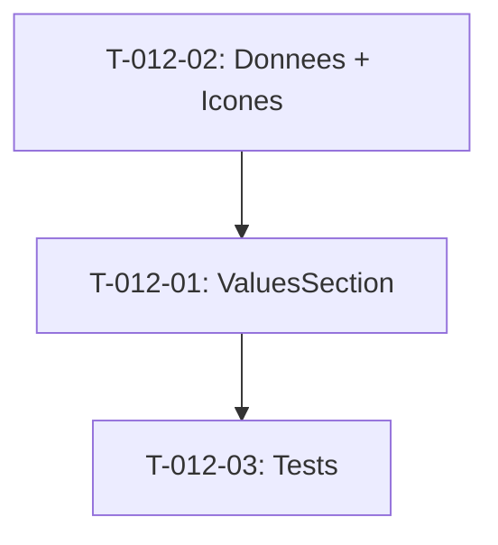

# Taches - US-012 : Section Valeurs (4 piliers)

## Informations US
- **Epic** : EPIC-001
- **Persona** : P-001 - Dirigeante PME
- **Story Points** : 2
- **Sprint** : sprint-002-accueil-complet

## Resume de la US
**En tant que** P-001 - Dirigeante PME
**Je veux** comprendre les valeurs de l'agence
**Afin de** valider qu'elles correspondent a ma culture d'entreprise

## Vue d'ensemble des taches

| ID | Type | Tache | Estimation | Depend de | Statut |
|----|------|-------|------------|-----------|--------|
| T-012-01 | [FE] | Composant ValuesSection (4 cartes + icones) | 2h | - | 🔲 |
| T-012-02 | [FE] | Donnees valeurs + icones SVG + responsive | 1h | - | 🔲 |
| T-012-03 | [TEST] | Tests unitaires | 1h | T-012-01 | 🔲 |

**Total estime** : 4h

---

## Detail des taches

### T-012-01 : Composant ValuesSection
- **Type** : [FE]
- **Estimation** : 2h
- **Depend de** : -

**Description** :
Creer la section avec 4 cartes valeurs, chacune avec icone, titre et description.

**Fichiers a creer** :
- `site/src/components/sections/values-section.tsx`

**4 valeurs** :
1. Fiabilite : Code maintenable, MEP maitrisees
2. Rigueur : Tests, revues, criteres acceptation
3. Partenariat : Extension equipe, pas boite noire
4. Pragmatisme : Pas sur-ingenierie, valeur metier d'abord

**Layout** :
- Desktop : grille 2x2
- Mobile : cartes empilees verticalement

**Criteres de validation** :
- [ ] 4 cartes affichees avec icone + titre + description
- [ ] CTA "Parler de votre projet" vers #contact
- [ ] Section id="valeurs"
- [ ] Grille 2x2 desktop, stack mobile
- [ ] Espacement uniforme

---

### T-012-02 : Donnees valeurs + icones SVG
- **Type** : [FE]
- **Estimation** : 1h
- **Depend de** : -

**Fichiers a creer** :
- `site/src/data/values.ts`
- Icones SVG inline ou composants React (Lucide/Heroicons)

**Criteres de validation** :
- [ ] Fichier donnees type-safe
- [ ] 4 icones distinctes et coherentes
- [ ] Descriptions 2-3 lignes max
- [ ] Fallback si icone manquante (couleur de fond)

---

### T-012-03 : Tests unitaires
- **Type** : [TEST]
- **Estimation** : 1h
- **Depend de** : T-012-01

**Tests** :
1. Rend 4 cartes valeurs
2. Chaque carte a icone + titre + description
3. CTA present et pointe vers #contact
4. Layout adaptatif

---

## Graphe de dependances

## Resume

| Couche | Nb taches | Heures |
|--------|-----------|--------|
| [FE] | 2 | 3h |
| [TEST] | 1 | 1h |
| **TOTAL** | **3** | **4h** |
