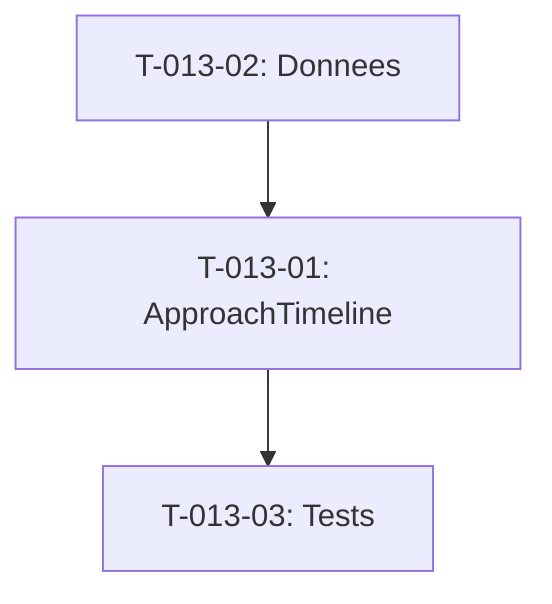

# Taches - US-013 : Section Approche (Timeline 5 etapes)

## Informations US
- **Epic** : EPIC-001
- **Persona** : P-003 - Product Owner
- **Story Points** : 3
- **Sprint** : sprint-002-accueil-complet

## Resume de la US
**En tant que** P-003 - Product Owner
**Je veux** comprendre le processus de travail etape par etape
**Afin de** savoir a quoi m'attendre tout au long du projet

## Vue d'ensemble des taches

| ID | Type | Tache | Estimation | Depend de | Statut |
|----|------|-------|------------|-----------|--------|
| T-013-01 | [FE] | Composant ApproachTimeline (horizontal/vertical) | 3h | - | 🔲 |
| T-013-02 | [FE] | Donnees 5 etapes + responsive | 1.5h | - | 🔲 |
| T-013-03 | [TEST] | Tests unitaires | 1.5h | T-013-01 | 🔲 |

**Total estime** : 6h

---

## Detail des taches

### T-013-01 : Composant ApproachTimeline
- **Type** : [FE]
- **Estimation** : 3h
- **Depend de** : -

**Description** :
Creer la timeline avec 5 etapes numerotees, horizontale (desktop) et verticale (mobile).

**Fichiers a creer** :
- `site/src/components/sections/approach-timeline.tsx`

**5 etapes** :
1. Discovery : cadrage, personas, processus
2. Conception : wireframes, architecture, specs
3. Developpement iteratif : sprints 2 semaines, demos
4. Recette : tests, formation, docs
5. Transfert : MEP, monitoring, handover

**Layout** :
- Desktop : timeline horizontale avec ligne de connexion
- Tablette : grille 2x3 ou horizontale avec scroll
- Mobile : timeline verticale avec numerotation

**Criteres de validation** :
- [ ] 5 etapes numerotees (1 a 5)
- [ ] Ligne visuelle connectant les etapes
- [ ] Titre + description courte par etape
- [ ] Section id="approche"
- [ ] Transition fluide desktop → mobile
- [ ] Animations entree (Framer Motion optionnel)

---

### T-013-02 : Donnees 5 etapes + responsive
- **Type** : [FE]
- **Estimation** : 1.5h
- **Depend de** : -

**Fichier a creer** :
- `site/src/data/approach.ts`

**Structure** :
```typescript
type ApproachStep = {
  number: number
  title: string
  description: string
}
```

**Criteres de validation** :
- [ ] Fichier donnees type-safe
- [ ] 5 etapes avec descriptions 1-2 lignes
- [ ] Textes coherents avec PRD section 7.3
- [ ] Troncature si texte trop long

---

### T-013-03 : Tests unitaires
- **Type** : [TEST]
- **Estimation** : 1.5h
- **Depend de** : T-013-01

**Tests** :
1. Rend 5 etapes
2. Chaque etape a numero + titre + description
3. Timeline horizontale en desktop
4. Timeline verticale en mobile
5. Responsive intermediaire (tablette)

---

## Graphe de dependances



## Resume

| Couche | Nb taches | Heures |
|--------|-----------|--------|
| [FE] | 2 | 4.5h |
| [TEST] | 1 | 1.5h |
| **TOTAL** | **3** | **6h** |
