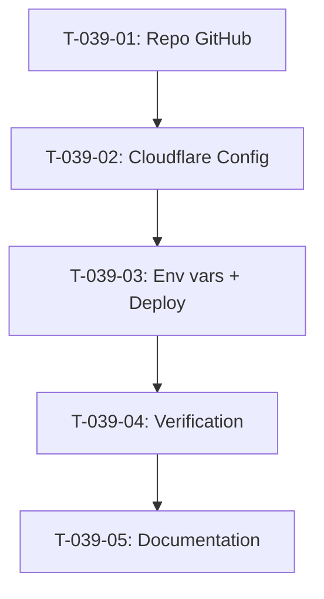

# Taches - US-039 : Configuration Cloudflare Pages

## Informations US
- **Epic** : EPIC-006
- **Persona** : P-003 - Product Owner
- **Story Points** : 3
- **Sprint** : sprint-002-accueil-complet

## Resume de la US
**En tant que** P-003 - Product Owner
**Je veux** que le site soit heberge sur Cloudflare Pages
**Afin de** beneficier de performances edge EU, gratuite et conformite RGPD

## Vue d'ensemble des taches

| ID | Type | Tache | Estimation | Depend de | Statut |
|----|------|-------|------------|-----------|--------|
| T-039-01 | [OPS] | Creer repo GitHub + push code | 1h | - | 🔲 |
| T-039-02 | [OPS] | Connecter Cloudflare Pages + config build | 2h | T-039-01 | 🔲 |
| T-039-03 | [OPS] | Variables d'environnement + premier deploy | 1.5h | T-039-02 | 🔲 |
| T-039-04 | [TEST] | Verifier deploy accessible + rollback | 1h | T-039-03 | 🔲 |
| T-039-05 | [DOC] | Documenter process deploy | 0.5h | T-039-04 | 🔲 |

**Total estime** : 6h

---

## Detail des taches

### T-039-01 : Creer repo GitHub + push code existant
- **Type** : [OPS]
- **Estimation** : 1h
- **Depend de** : -

**Description** :
Creer le repository GitHub pour le projet agentic-agency et pousser le code existant du Sprint 1.

**Actions** :
1. Creer repo sur GitHub (public ou prive)
2. Configurer `.gitignore` (node_modules, .next, .env.local)
3. Init git + premier commit + push

**Criteres de validation** :
- [ ] Repo GitHub cree et accessible
- [ ] Code Sprint 1 pousse sur branche `main`
- [ ] `.gitignore` correct (pas de node_modules)

---

### T-039-02 : Connecter Cloudflare Pages + config build
- **Type** : [OPS]
- **Estimation** : 2h
- **Depend de** : T-039-01

**Description** :
Connecter le repo GitHub a Cloudflare Pages et configurer les parametres de build Next.js.

**Actions** :
1. Connecter compte Cloudflare au repo GitHub
2. Configurer build settings :
   - Framework preset : Next.js
   - Build command : `npm run build`
   - Root directory : `site/`
   - Node version : 20.x
3. Configurer environnements :
   - Production : branche `main`
   - Preview : branches `feature/*`

**Criteres de validation** :
- [ ] Cloudflare Pages connecte au repo
- [ ] Build settings configures
- [ ] Branche main = production
- [ ] Preview deploys actifs sur feature branches

---

### T-039-03 : Variables d'environnement + premier deploy
- **Type** : [OPS]
- **Estimation** : 1.5h
- **Depend de** : T-039-02

**Description** :
Configurer les variables d'environnement dans Cloudflare Pages et effectuer le premier deploiement.

**Variables production** :
- `NEXT_PUBLIC_SITE_URL` : https://agentic-agency.pages.dev (temporaire)
- `NEXT_PUBLIC_PLAUSIBLE_DOMAIN` : (vide pour l'instant)
- Futures : `SANITY_PROJECT_ID`, `RESEND_API_KEY`, `RECAPTCHA_SECRET_KEY`

**Criteres de validation** :
- [ ] Variables d'environnement configurees
- [ ] Secrets non visibles dans logs
- [ ] Premier build reussi
- [ ] Site accessible via URL Cloudflare (ex: agentic-agency.pages.dev)
- [ ] Deploy < 2 min

---

### T-039-04 : Verifier deploy accessible + rollback
- **Type** : [TEST]
- **Estimation** : 1h
- **Depend de** : T-039-03

**Description** :
Verifier que le site deploye fonctionne correctement et que le rollback est possible.

**Criteres de validation** :
- [ ] Site accessible via URL Cloudflare
- [ ] HTTPS actif (certificat SSL automatique)
- [ ] Pages fonctionnelles (accueil, blog)
- [ ] Rollback vers version precedente teste
- [ ] Logs de build visibles dans dashboard Cloudflare

---

### T-039-05 : Documenter process deploy
- **Type** : [DOC]
- **Estimation** : 0.5h
- **Depend de** : T-039-04

**Description** :
Documenter le processus de deploiement dans le README du site.

**Criteres de validation** :
- [ ] Section "Deploiement" dans README.md
- [ ] URL de production documentee
- [ ] Process de rollback documente

---

## Graphe de dependances

## Resume

| Couche | Nb taches | Heures |
|--------|-----------|--------|
| [OPS] | 3 | 4.5h |
| [TEST] | 1 | 1h |
| [DOC] | 1 | 0.5h |
| **TOTAL** | **5** | **6h** |
