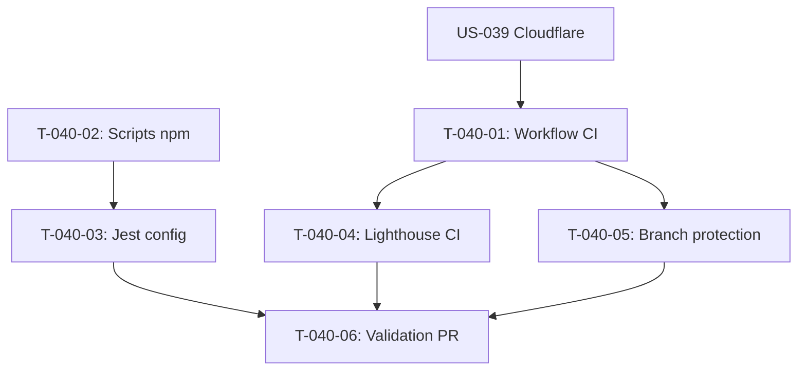

# Taches - US-040 : Pipeline CI/CD GitHub Actions

## Informations US
- **Epic** : EPIC-006
- **Persona** : P-002 - DSI/CTO
- **Story Points** : 5
- **Sprint** : sprint-002-accueil-complet

## Resume de la US
**En tant que** P-002 - DSI/CTO
**Je veux** un pipeline CI/CD automatise (tests, linting, audits qualite)
**Afin de** garantir qu'aucun code defaillant n'arrive en production

## Vue d'ensemble des taches

| ID | Type | Tache | Estimation | Depend de | Statut |
|----|------|-------|------------|-----------|--------|
| T-040-01 | [OPS] | Creer workflow .github/workflows/ci.yml | 3h | US-039 | 🔲 |
| T-040-02 | [OPS] | Ajouter scripts npm manquants | 1.5h | - | 🔲 |
| T-040-03 | [OPS] | Configurer Jest + React Testing Library | 2h | T-040-02 | 🔲 |
| T-040-04 | [OPS] | Configurer Lighthouse CI | 1.5h | T-040-01 | 🔲 |
| T-040-05 | [OPS] | Branch protection rules GitHub | 1h | T-040-01 | 🔲 |
| T-040-06 | [TEST] | Valider pipeline complete (PR test) | 1h | T-040-03, T-040-04, T-040-05 | 🔲 |

**Total estime** : 10h

---

## Detail des taches

### T-040-01 : Creer workflow CI/CD GitHub Actions
- **Type** : [OPS]
- **Estimation** : 3h
- **Depend de** : US-039 (repo GitHub)

**Description** :
Creer le fichier `.github/workflows/ci.yml` avec les etapes de validation.

**Fichiers a creer** :
- `.github/workflows/ci.yml`

**Etapes du pipeline** :
1. Checkout code
2. Setup Node.js 20.x + cache npm
3. `npm ci` (install dependencies)
4. `npm run lint` (ESLint)
5. `npm run type-check` (tsc --noEmit)
6. `npm run format:check` (Prettier)
7. `npm run test` (Jest)
8. `npm run build` (Next.js)

**Declencheurs** :
- Push sur `main`
- Pull Request vers `main`

**Criteres de validation** :
- [ ] Workflow cree et fonctionnel
- [ ] Toutes les etapes executees en sequence
- [ ] Cache npm configure (gain de temps)
- [ ] Matrice Node 20.x

---

### T-040-02 : Ajouter scripts npm manquants
- **Type** : [OPS]
- **Estimation** : 1.5h
- **Depend de** : -

**Description** :
Ajouter les scripts npm manquants dans package.json pour le CI.

**Fichier** : `site/package.json`

**Scripts a ajouter** :
```json
{
  "type-check": "tsc --noEmit",
  "format:check": "prettier --check .",
  "test": "jest",
  "test:ci": "jest --ci --coverage"
}
```

**Fichiers a creer** :
- `.prettierrc` (config Prettier)
- `.prettierignore`

**Criteres de validation** :
- [ ] Scripts npm fonctionnels localement
- [ ] `npm run type-check` passe
- [ ] `npm run format:check` passe
- [ ] `npm run test` passe (meme si 0 tests)

---

### T-040-03 : Configurer Jest + React Testing Library
- **Type** : [OPS]
- **Estimation** : 2h
- **Depend de** : T-040-02

**Description** :
Installer et configurer Jest avec React Testing Library pour les composants Next.js.

**Dependances a installer** :
- `jest`
- `@jest/types`
- `ts-jest` ou `@swc/jest`
- `@testing-library/react`
- `@testing-library/jest-dom`
- `jest-environment-jsdom`

**Fichiers a creer** :
- `site/jest.config.ts`
- `site/jest.setup.ts`

**Criteres de validation** :
- [ ] Jest configure et fonctionnel
- [ ] `npm run test` execute sans erreur
- [ ] Test de smoke cree (ex: composant Button rend correctement)
- [ ] Coverage report genere

---

### T-040-04 : Configurer Lighthouse CI
- **Type** : [OPS]
- **Estimation** : 1.5h
- **Depend de** : T-040-01

**Description** :
Configurer Lighthouse CI dans le workflow GitHub Actions.

**Fichiers a creer** :
- `site/.lighthouserc.json`

**Configuration** :
- Pages a auditer : `/` (accueil)
- Seuils : Performance >= 90, Accessibility >= 95
- Upload : temporary-public-storage
- Mode : warning (non bloquant)

**Criteres de validation** :
- [ ] Lighthouse CI execute dans le pipeline
- [ ] Rapport Lighthouse visible dans logs CI
- [ ] Score affiche en commentaire PR (optionnel)
- [ ] Non bloquant (warning only)

---

### T-040-05 : Branch protection rules GitHub
- **Type** : [OPS]
- **Estimation** : 1h
- **Depend de** : T-040-01

**Description** :
Configurer les regles de protection de branche sur GitHub.

**Configuration** :
- Require status checks before merging
- Status checks requis : Lint, Type Check, Tests, Build
- Lighthouse CI : non requis (warning)
- Require branches to be up to date

**Criteres de validation** :
- [ ] Branche `main` protegee
- [ ] PR obligatoire pour merger
- [ ] Status checks bloquants configures
- [ ] Merge direct sur main bloque

---

### T-040-06 : Valider pipeline complete (PR test)
- **Type** : [TEST]
- **Estimation** : 1h
- **Depend de** : T-040-03, T-040-04, T-040-05

**Description** :
Creer une PR de test pour valider que l'ensemble du pipeline fonctionne.

**Actions** :
1. Creer branche `feature/test-ci`
2. Modifier un fichier mineur
3. Pousser et creer PR
4. Verifier que tous les checks passent
5. Verifier que le merge est bloque si un check echoue
6. Merger la PR

**Criteres de validation** :
- [ ] Tous les checks passent (Lint, Type Check, Tests, Build)
- [ ] Lighthouse CI rapport visible
- [ ] Branch protection bloque si check echoue
- [ ] PR mergee avec succes

---

## Graphe de dependances



## Resume

| Couche | Nb taches | Heures |
|--------|-----------|--------|
| [OPS] | 5 | 9h |
| [TEST] | 1 | 1h |
| **TOTAL** | **6** | **10h** |
