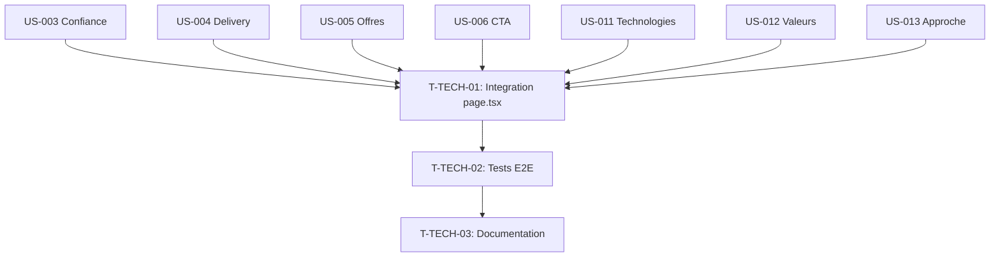

# Taches Techniques Transverses — Sprint 002

## Vue d'ensemble

| ID | Type | Tache | Estimation | Depend de | Statut |
|----|------|-------|------------|-----------|--------|
| T-TECH-01 | [FE] | Integrer 7 sections dans page.tsx (ordre + anchors) | 2h | Toutes sections | 🔲 |
| T-TECH-02 | [TEST] | Test E2E accueil 13 sections (Playwright) | 2h | T-TECH-01 | 🔲 |
| T-TECH-03 | [DOC] | MAJ README + IMPLEMENTATION.md | 1h | T-TECH-02 | 🔲 |

**Total estime** : 5h

---

## Detail des taches

### T-TECH-01 : Integrer sections dans page.tsx
- **Type** : [FE]
- **Estimation** : 2h
- **Depend de** : Toutes les sections (US-003 a US-013)

**Description** :
Integrer les 7 nouvelles sections dans la page d'accueil en respectant l'ordre defini et ajouter les ancres de navigation.

**Fichier a modifier** :
- `site/src/app/page.tsx`

**Ordre des 13 sections sur l'accueil** :
1. Hero (existant - Sprint 1)
2. Stats (existant - Sprint 1)
3. **Confiance** (US-003) — #confiance
4. **Delivery** (US-004) — #delivery
5. **Offres** (US-005) — #offres
6. **CTA milieu** (US-006) — #cta-milieu
7. **Technologies** (US-011) — #technologies
8. **Valeurs** (US-012) — #valeurs
9. **Approche** (US-013) — #approche
10. Temoignages (Sprint 3)
11. Apercu blog (Sprint 3)
12. Apercu realisations (Sprint 3)
13. Contact (Sprint 3)

**Criteres de validation** :
- [ ] 9 sections visibles sur l'accueil (6 existantes + 3 placeholder)
- [ ] Ordre respecte
- [ ] Anchors id= fonctionnels
- [ ] Smooth scroll entre sections
- [ ] Pas de regression sur sections existantes
- [ ] Performance : LCP < 2.5s

---

### T-TECH-02 : Test E2E accueil 13 sections
- **Type** : [TEST]
- **Estimation** : 2h
- **Depend de** : T-TECH-01

**Description** :
Creer un test E2E Playwright qui verifie la presence et l'ordre des sections sur la page d'accueil.

**Fichiers a creer** :
- `site/tests/e2e/homepage.spec.ts`
- `site/playwright.config.ts` (si absent)

**Tests** :
1. Page accueil charge sans erreur
2. Toutes les sections visibles (scroll)
3. Sections dans le bon ordre
4. Anchors fonctionnels (#offres, #contact)
5. CTA cliquables
6. Responsive mobile (viewport 375px)
7. Responsive desktop (viewport 1440px)

**Criteres de validation** :
- [ ] Playwright installe et configure
- [ ] Tests passent en local
- [ ] < 30s execution totale

---

### T-TECH-03 : MAJ README + IMPLEMENTATION.md
- **Type** : [DOC]
- **Estimation** : 1h
- **Depend de** : T-TECH-02

**Description** :
Mettre a jour la documentation du projet avec les nouvelles sections et le process de deploiement.

**Fichiers a modifier** :
- `site/README.md`
- `site/IMPLEMENTATION.md`

**Contenu a ajouter** :
- Liste des 13 sections accueil
- Commandes de test (`npm run test`, `npx playwright test`)
- Process de deploiement Cloudflare
- Structure des composants sections/

**Criteres de validation** :
- [ ] README a jour
- [ ] IMPLEMENTATION.md reflete l'etat Sprint 2

---

## Graphe de dependances

