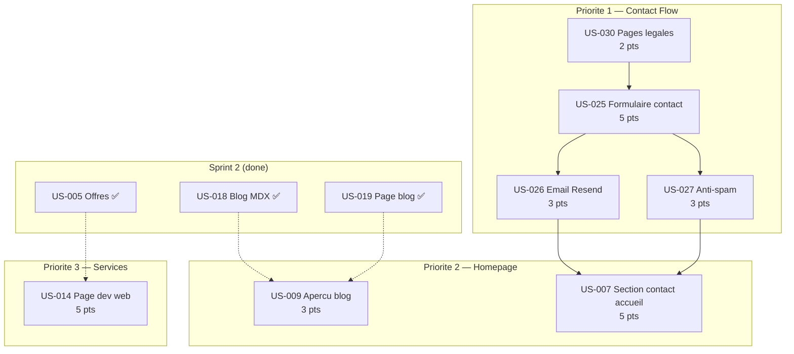

# Dependances — Sprint 003

## Graphe de dependances

## Dependances externes

| Dependance | Type | Statut | Impact |
|------------|------|--------|--------|
| Compte Resend | Service externe | A creer | Bloque US-026 |
| API Key Resend | Env var | A configurer | Bloque US-026 |
| Cloudflare Turnstile keys | Service externe | A creer (dashboard CF) | Bloque US-027 |
| Domaine email verifie (Resend) | Config | Optionnel (onboarding@ dispo) | Non bloquant |

## Parallelisation

| Phase | US paralleles | Condition |
|-------|---------------|-----------|
| Phase 1 | US-030 + US-009 | Independantes |
| Phase 2 | US-025 | Apres US-030 |
| Phase 3 | US-026 + US-027 | Apres US-025, paralleles entre eux |
| Phase 4 | US-007 | Apres US-026 + US-027 |
| Phase 5 | US-014 | Independante (parallele phase 2-4) |
