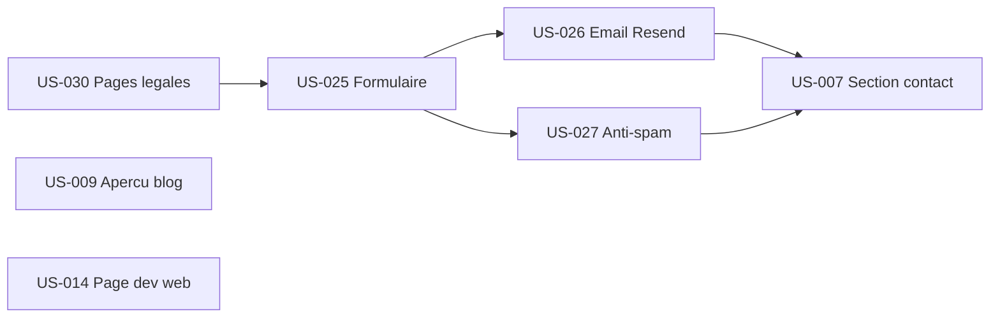

# Sprint 003 — Contact + Legal + Services

## Sprint Goal

> Le formulaire de contact est fonctionnel avec envoi email et anti-spam, les pages legales sont en ligne, et la premiere page service sert de template reutilisable.

## Informations

| Champ | Valeur |
|-------|--------|
| **Duree** | 2 semaines |
| **Debut** | 2026-05-30 |
| **Fin prevue** | 2026-06-13 |
| **Velocite Sprint 2** | 26 pts |
| **Capacite cible** | 26 pts |

## Prerequisites Sprint 2

- [x] CI/CD GitHub Actions operationnel
- [x] Cloudflare Workers deploy automatique
- [x] Homepage 10/13 sections (contact = placeholder)
- [x] Blog MDX fonctionnel (3 articles existants)
- [x] Branch protection active

## Sprint Backlog

### Priorite 1 — Contact Flow (EPIC-004)

| ID | Titre | Points | Priorite | Dependance |
|----|-------|--------|----------|------------|
| US-030 | Pages legales (mentions, confidentialite, cookies) | 2 | Must | - |
| US-025 | Formulaire contact avec validation | 5 | Must | US-030 |
| US-026 | Envoi email Resend | 3 | Must | US-025 |
| US-027 | Anti-spam (honeypot + Turnstile) | 3 | Must | US-025, US-026 |

### Priorite 2 — Homepage Completion (EPIC-001)

| ID | Titre | Points | Priorite | Dependance |
|----|-------|--------|----------|------------|
| US-007 | Section contact accueil (remplace placeholder) | 5 | Must | US-025, US-026, US-027 |
| US-009 | Apercu blog (3 derniers articles) | 3 | Must | - |

### Priorite 3 — Service Pages (EPIC-002)

| ID | Titre | Points | Priorite | Dependance |
|----|-------|--------|----------|------------|
| US-014 | Page Developpement web (template service) | 5 | Must | US-005 (done) |

### Buffer / Sprint 4

| ID | Titre | Points | Raison report |
|----|-------|--------|---------------|
| US-008 | Temoignages clients | 3 | Contenus client requis |
| US-010 | Apercu realisations | 2 | Contenus client requis |
| US-015 | Page Applications metier | 5 | Template US-014 d'abord |
| US-016 | Page Applications mobiles | 5 | Template US-014 d'abord |
| US-028 | Analytics Plausible | 2 | Non bloquant pour MVP |
| US-029 | Bandeau cookies RGPD | 3 | Apres analytics |

## Ordre d'implementation

1. **US-030** Pages legales (prerequis lien confidentialite dans formulaire)
2. **US-009** Apercu blog (independant, parallele)
3. **US-025** Formulaire contact validation
4. **US-026** Envoi email Resend (API Route)
5. **US-027** Anti-spam (honeypot + Cloudflare Turnstile)
6. **US-007** Section contact accueil (remplace placeholder)
7. **US-014** Page Developpement web (template service)

## Definition of Done

- [ ] Code TypeScript strict (no `any`)
- [ ] Lint + format passent
- [ ] Build passe sans erreur
- [ ] Deploy Cloudflare Workers reussi
- [ ] Tests unitaires (Jest + RTL) pour chaque composant
- [ ] Tests E2E (Playwright) pour parcours contact
- [ ] Formulaire fonctionnel (envoi email reel)
- [ ] 3 pages legales accessibles depuis footer
- [ ] 12/13 sections homepage (manque: temoignages, realisations)
- [ ] Page /services/developpement-web live

## Risques

| Risque | Impact | Mitigation |
|--------|--------|------------|
| API Resend config (domaine email) | Moyen | Domaine custom differe, utiliser onboarding@resend.dev |
| Cloudflare Turnstile setup | Faible | Alternative : honeypot seul (pas de Turnstile) |
| Rate limiting sur CF Workers | Moyen | KV store ou in-memory simple |
| Scope 26 pts = Sprint 2 velocite | Faible | Buffer US reporte si necessaire |

## Decisions techniques

1. **Turnstile** au lieu de reCAPTCHA (natif Cloudflare, gratuit, pas de Google)
2. **react-hook-form + zod** pour validation formulaire
3. **Resend** pour email transactionnel (API simple, react-email templates)
4. **Pages legales** en MDX ou composants React statiques (pas de CMS)
5. **Footer** : remplacer /cgv par /cookies (alignement US-030)
