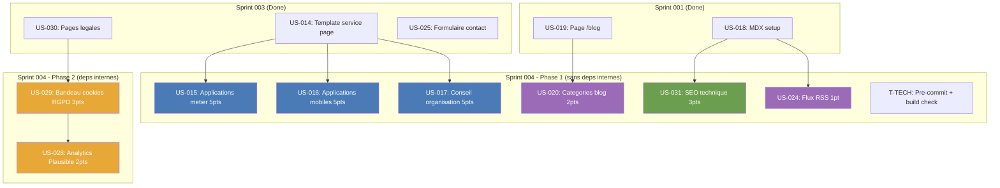

# Dependances — Sprint 004

## Graphe de dependances

## Ordre d'execution recommande

### Phase 1 — Parallelisable (pas de deps internes)

| US | Titre | Pts | Parallelisable avec |
|----|-------|-----|---------------------|
| US-015 | Applications metier | 5 | US-016, US-017, US-020, US-031, US-024 |
| US-016 | Applications mobiles | 5 | US-015, US-017, US-020, US-031, US-024 |
| US-017 | Conseil organisation | 5 | US-015, US-016, US-020, US-031, US-024 |
| US-020 | Categories blog | 2 | US-015, US-016, US-017, US-031, US-024 |
| US-031 | SEO technique | 3 | US-015, US-016, US-017, US-020, US-024 |
| US-024 | Flux RSS | 1 | Tout |
| T-TECH | Pre-commit + build check | - | Tout (debut sprint) |

### Phase 2 — Apres Phase 1

| US | Titre | Pts | Depend de |
|----|-------|-----|-----------|
| US-029 | Bandeau cookies RGPD | 3 | US-030 (done) |
| US-028 | Analytics Plausible | 2 | US-029 (consent manager) |

**Note** : US-029 peut demarrer en Phase 1 car sa seule dependance (US-030) est done.
US-028 depend de US-029 pour integration dans le consent manager.

## Opportunites de parallelisme

- **Maximum** : 7 US + tech tasks en parallele (Phase 1)
- **Chemin critique** : T-TECH → US-029 → US-028 (5h environ)
- **3 pages services** : 100% independantes, reutilisent meme template
