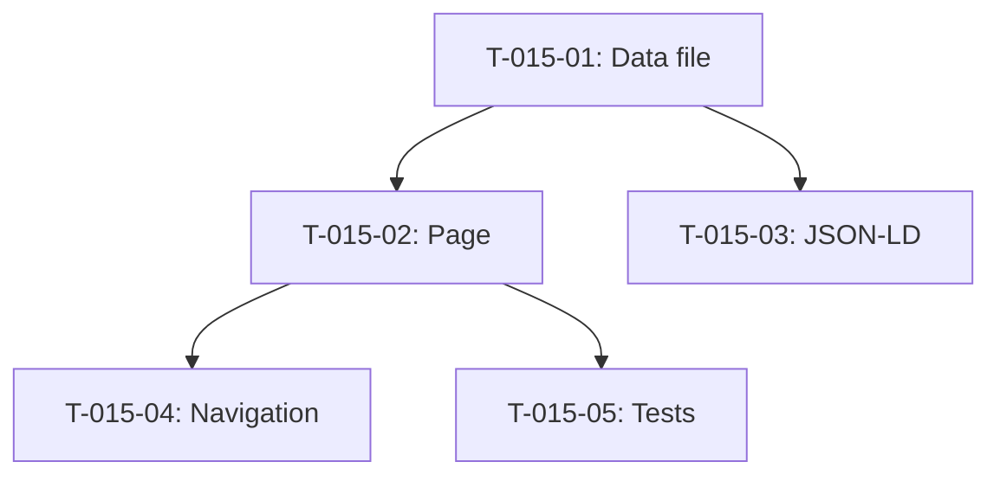

# Taches - US-015 : Page Applications metier

## Informations US
- **Epic** : EPIC-002
- **Persona** : P-002 - DSI/CTO
- **Story Points** : 5
- **Sprint** : sprint-004-services-seo-rgpd

## Resume de la US
**En tant que** DSI/CTO
**Je veux** consulter une page dediee aux applications metier
**Afin de** comprendre l'expertise sur les applications complexes, l'integration SI et la qualite du code

## Vue d'ensemble des taches

| ID | Type | Tache | Estimation | Depend de | Statut |
|----|------|-------|------------|-----------|--------|
| T-015-01 | [FE] | Creer data file applications-metier.ts | 2h | - | 🔲 |
| T-015-02 | [FE] | Creer page /services/applications-metier | 0.5h | T-015-01 | 🔲 |
| T-015-03 | [FE] | Schema JSON-LD FAQPage | 1h | T-015-01 | 🔲 |
| T-015-04 | [FE] | Navigation header/footer (lien service) | 0.5h | T-015-02 | 🔲 |
| T-015-05 | [TEST] | Tests composant page + snapshot | 2h | T-015-02 | 🔲 |

**Total estime** : 6h

---

## Detail des taches

### T-015-01 : Creer data file applications-metier.ts
- **Type** : [FE]
- **Estimation** : 2h
- **Depend de** : -

**Description** :
Creer le fichier de donnees structurees pour la page service, en suivant le pattern de `src/data/services/developpement-web.ts`.

**Fichiers a creer** :
- `src/data/services/applications-metier.ts`

**Contenu** :
- Hero : titre, sous-titre, CTA "Decrire mon projet" → /contact?sujet=application-metier
- Problemes clients : dette technique, SI obsolete, integration complexe, scalabilite
- Cartes offre : Application sur mesure, Evolution & dette technique, Integration SI & APIs
- Process : 5 etapes identiques au template
- Technologies filtrees : Symfony, Laravel, API Platform, PostgreSQL, Docker
- FAQ : 3-5 questions specifiques applications metier
- CTA final

**Criteres de validation** :
- [ ] Toutes les sections remplies
- [ ] Types conformes a ServicePageData
- [ ] Meta title : "Applications metier sur mesure | Agentic Agency"
- [ ] Meta description 140-160 caracteres

---

### T-015-02 : Creer page /services/applications-metier
- **Type** : [FE]
- **Estimation** : 0.5h
- **Depend de** : T-015-01

**Fichiers a creer** :
- `src/app/services/applications-metier/page.tsx`

**Pattern** : identique a `src/app/services/developpement-web/page.tsx` (12 lignes)
- Import metadata depuis data file
- Import ServicePageTemplate
- Export metadata + default component

**Criteres** :
- [ ] Page accessible a /services/applications-metier
- [ ] Metadata Next.js exportee
- [ ] Template reutilise correctement

---

### T-015-03 : Schema JSON-LD FAQPage
- **Type** : [FE]
- **Estimation** : 1h
- **Depend de** : T-015-01

**Description** :
Ajouter le schema FAQPage valide pour le SEO, en suivant le pattern existant dans le template service.

**Criteres** :
- [ ] Schema FAQPage valide (tester avec Google Rich Results Test)
- [ ] Questions/reponses coherentes avec la FAQ affichee

---

### T-015-04 : Navigation header/footer
- **Type** : [FE]
- **Estimation** : 0.5h
- **Depend de** : T-015-02

**Fichiers a modifier** :
- `src/components/layout/header.tsx` (si dropdown services)
- `src/components/layout/footer.tsx` (section Services)

**Criteres** :
- [ ] Lien visible dans la navigation
- [ ] Lien dans le footer section Services

---

### T-015-05 : Tests composant page + snapshot
- **Type** : [TEST]
- **Estimation** : 2h
- **Depend de** : T-015-02

**Fichiers a creer** :
- `src/app/services/applications-metier/__tests__/page.test.tsx`

**Tests** :
- [ ] Page renders sans erreur
- [ ] Meta title correct
- [ ] Sections presentes (hero, problemes, offres, process, FAQ, CTA)
- [ ] Lien CTA pointe vers /contact?sujet=application-metier
- [ ] Schema FAQPage present dans le HTML

---

## Graphe de dependances

