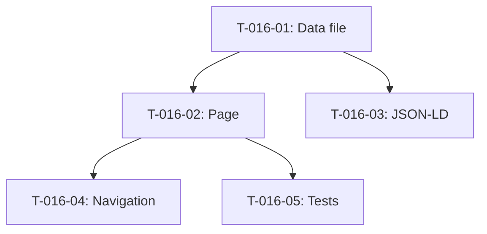

# Taches - US-016 : Page Applications mobiles

## Informations US
- **Epic** : EPIC-002
- **Persona** : P-001 - Dirigeante PME
- **Story Points** : 5
- **Sprint** : sprint-004-services-seo-rgpd

## Resume de la US
**En tant que** Dirigeante PME
**Je veux** consulter une page dediee aux applications mobiles
**Afin de** comprendre les offres (Flutter, React Native) et le processus de developpement mobile

## Vue d'ensemble des taches

| ID | Type | Tache | Estimation | Depend de | Statut |
|----|------|-------|------------|-----------|--------|
| T-016-01 | [FE] | Creer data file applications-mobiles.ts | 2h | - | 🔲 |
| T-016-02 | [FE] | Creer page /services/applications-mobiles | 0.5h | T-016-01 | 🔲 |
| T-016-03 | [FE] | Schema JSON-LD FAQPage | 1h | T-016-01 | 🔲 |
| T-016-04 | [FE] | Navigation header/footer (lien service) | 0.5h | T-016-02 | 🔲 |
| T-016-05 | [TEST] | Tests composant page + snapshot | 2h | T-016-02 | 🔲 |

**Total estime** : 6h

---

## Detail des taches

### T-016-01 : Creer data file applications-mobiles.ts
- **Type** : [FE]
- **Estimation** : 2h
- **Depend de** : -

**Fichiers a creer** :
- `src/data/services/applications-mobiles.ts`

**Contenu** :
- Hero : titre, sous-titre, CTA "Discuter de mon app mobile" → /contact?sujet=mobile
- Problemes clients : cout developpement double (iOS+Android), maintenance complexe, app obsolete
- Cartes offre : MVP mobile, Application native cross-platform, Evolution app existante
- Process : 5 etapes
- Technologies filtrees : Flutter 3.41, React Native 0.85, Dart
- FAQ : 3-5 questions mobiles (Flutter vs RN, cout, delais, stores)
- CTA final

**Criteres** :
- [ ] Types conformes a ServicePageData
- [ ] Meta title : "Applications mobiles iOS & Android | Agentic Agency"
- [ ] Technologies incluent Flutter, React Native, Dart

---

### T-016-02 : Creer page /services/applications-mobiles
- **Type** : [FE]
- **Estimation** : 0.5h
- **Depend de** : T-016-01

**Fichiers a creer** :
- `src/app/services/applications-mobiles/page.tsx`

**Pattern** : identique a developpement-web/page.tsx

---

### T-016-03 : Schema JSON-LD FAQPage
- **Type** : [FE]
- **Estimation** : 1h
- **Depend de** : T-016-01

**Criteres** :
- [ ] Schema FAQPage valide

---

### T-016-04 : Navigation header/footer
- **Type** : [FE]
- **Estimation** : 0.5h
- **Depend de** : T-016-02

**Fichiers a modifier** :
- `src/components/layout/footer.tsx`

---

### T-016-05 : Tests composant page
- **Type** : [TEST]
- **Estimation** : 2h
- **Depend de** : T-016-02

**Fichiers a creer** :
- `src/app/services/applications-mobiles/__tests__/page.test.tsx`

**Tests** :
- [ ] Page renders sans erreur
- [ ] Sections presentes
- [ ] CTA → /contact?sujet=mobile
- [ ] Schema FAQPage present

---

## Graphe de dependances

