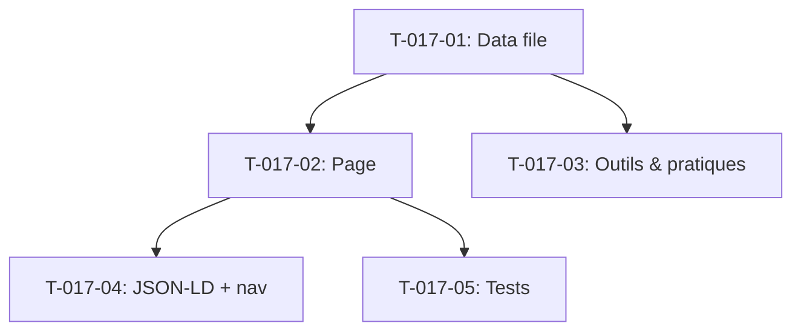

# Taches - US-017 : Page Conseil et organisation

## Informations US
- **Epic** : EPIC-002
- **Persona** : P-004 - Directeur Transformation
- **Story Points** : 5
- **Sprint** : sprint-004-services-seo-rgpd

## Resume de la US
**En tant que** Directeur Transformation
**Je veux** consulter une page dediee au conseil et a l'accompagnement organisationnel
**Afin de** comprendre comment l'agence peut m'aider a structurer mes equipes IT et moderniser nos pratiques

## Vue d'ensemble des taches

| ID | Type | Tache | Estimation | Depend de | Statut |
|----|------|-------|------------|-----------|--------|
| T-017-01 | [FE] | Creer data file conseil-organisation.ts | 2h | - | 🔲 |
| T-017-02 | [FE] | Creer page /services/conseil-organisation | 0.5h | T-017-01 | 🔲 |
| T-017-03 | [FE] | Adapter section "Outils & pratiques" (variant du template) | 1.5h | T-017-01 | 🔲 |
| T-017-04 | [FE] | Schema JSON-LD FAQPage + navigation | 1h | T-017-02 | 🔲 |
| T-017-05 | [TEST] | Tests composant page | 2h | T-017-02 | 🔲 |

**Total estime** : 7h

---

## Detail des taches

### T-017-01 : Creer data file conseil-organisation.ts
- **Type** : [FE]
- **Estimation** : 2h
- **Depend de** : -

**Fichiers a creer** :
- `src/data/services/conseil-organisation.ts`

**Contenu** :
- Hero : titre, sous-titre, CTA "Discuter de ma transformation" → /contact?sujet=conseil
- Problemes clients : equipes en silos, pas de culture qualite, turnover eleve, projets en retard chronique
- Cartes offre : Audit & diagnostic, Structuration equipes IT, Formation & coaching, Accompagnement transformation
- Process : 5 etapes adaptees (audit → plan → coaching → deploiement → suivi)
- Section "Outils & pratiques" au lieu de "Technologies" : Scrum, Kanban, CI/CD, TDD, Git Flow, SonarQube
- FAQ : 3-5 questions conseil/transformation
- CTA final

**Criteres** :
- [ ] Types conformes a ServicePageData (ou extension)
- [ ] Meta title : "Conseil IT & transformation Agile | Agentic Agency"
- [ ] Section "Outils & pratiques" differenciee visuellement

---

### T-017-02 : Creer page /services/conseil-organisation
- **Type** : [FE]
- **Estimation** : 0.5h
- **Depend de** : T-017-01

**Fichiers a creer** :
- `src/app/services/conseil-organisation/page.tsx`

---

### T-017-03 : Adapter section "Outils & pratiques"
- **Type** : [FE]
- **Estimation** : 1.5h
- **Depend de** : T-017-01

**Description** :
La page conseil n'a pas de section "Technologies" classique. Elle utilise une section "Outils & pratiques" avec des items methodologiques (Scrum, Kanban, etc.) plutot que des logos technologiques.

**Option** : Soit adapter le type ServicePageData pour supporter un label de section alternatif, soit creer une variante du composant ServiceTechnologies.

**Fichiers a modifier** :
- `src/data/services/types.ts` (ajout champ optionnel `technologiesLabel`)
- `src/components/services/service-page-template.tsx` (utiliser le label custom si present)

**Criteres** :
- [ ] Section affichee avec titre "Outils & pratiques"
- [ ] Items : Scrum, Kanban, CI/CD, TDD, etc.
- [ ] Ne casse pas les autres pages services existantes

---

### T-017-04 : Schema JSON-LD FAQPage + navigation
- **Type** : [FE]
- **Estimation** : 1h
- **Depend de** : T-017-02

**Fichiers a modifier** :
- `src/components/layout/footer.tsx`

---

### T-017-05 : Tests composant page
- **Type** : [TEST]
- **Estimation** : 2h
- **Depend de** : T-017-02

**Fichiers a creer** :
- `src/app/services/conseil-organisation/__tests__/page.test.tsx`

**Tests** :
- [ ] Page renders sans erreur
- [ ] Section "Outils & pratiques" presente (pas "Technologies")
- [ ] CTA → /contact?sujet=conseil
- [ ] Schema FAQPage present

---

## Graphe de dependances

