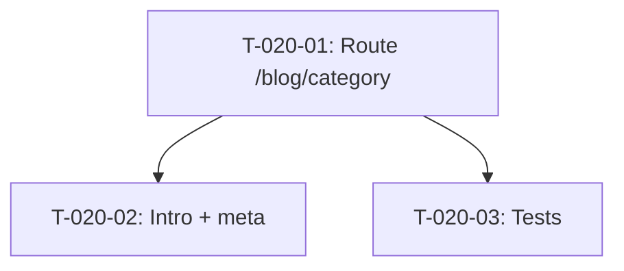

# Taches - US-020 : Pages categories blog

## Informations US
- **Epic** : EPIC-003
- **Persona** : P-002 - DSI/CTO
- **Story Points** : 2
- **Sprint** : sprint-004-services-seo-rgpd

## Resume de la US
**En tant que** DSI/CTO
**Je veux** acceder a des pages dediees par categorie blog
**Afin de** consulter uniquement les articles d'une categorie specifique avec une introduction contextuelle

## Vue d'ensemble des taches

| ID | Type | Tache | Estimation | Depend de | Statut |
|----|------|-------|------------|-----------|--------|
| T-020-01 | [FE] | Creer route /blog/[category] avec generateStaticParams | 2h | - | 🔲 |
| T-020-02 | [FE] | Intro categorie + metadata unique par categorie | 1h | T-020-01 | 🔲 |
| T-020-03 | [TEST] | Tests pages categories (3 categories + vide) | 1.5h | T-020-01 | 🔲 |

**Total estime** : 4.5h

---

## Detail des taches

### T-020-01 : Creer route /blog/[category]
- **Type** : [FE]
- **Estimation** : 2h
- **Depend de** : -

**Fichiers a creer** :
- `src/app/blog/[category]/page.tsx`

**Implementation** :
- `generateStaticParams()` retourne les 3 categories : avis, tests, process
- `generateMetadata()` genere title/description par categorie
- Composant filtre les posts via `getPostsByCategory(category)`
- Reutilise BlogCard pour l'affichage
- Gestion categorie vide : message "Aucun article dans cette categorie"

**Routes creees** :
- `/blog/avis`
- `/blog/tests`
- `/blog/process`

**Criteres** :
- [ ] 3 pages categories accessibles
- [ ] Filtrage correct des articles
- [ ] Message si categorie vide
- [ ] Lien "Voir tous les articles" vers /blog

---

### T-020-02 : Intro categorie + metadata
- **Type** : [FE]
- **Estimation** : 1h
- **Depend de** : T-020-01

**Description** :
Ajouter une introduction contextuelle (2-3 lignes) en haut de chaque page categorie.

**Contenu par categorie** :
- **Avis** : "Retours d'experience sur les outils, frameworks et pratiques..."
- **Tests** : "Strategies de test, TDD, couverture et qualite logicielle..."
- **Process** : "Methodologies agiles, organisation d'equipe et livraison continue..."

**Metadata par categorie** :
- title : "[Categorie] | Blog Agentic Agency"
- description : texte intro

**Fichiers a modifier** :
- `src/components/layout/footer.tsx` — liens directs vers /blog/avis, /blog/tests, /blog/process (remplacer les ?category=)

---

### T-020-03 : Tests pages categories
- **Type** : [TEST]
- **Estimation** : 1.5h
- **Depend de** : T-020-01

**Fichiers a creer** :
- `src/app/blog/[category]/__tests__/page.test.tsx`

**Tests** :
- [ ] Page /blog/tests rend les articles "tests"
- [ ] Page /blog/avis rend les articles "avis"
- [ ] Categorie vide affiche message appropriee
- [ ] Intro categorie visible
- [ ] Meta title correct par categorie

---

## Graphe de dependances

