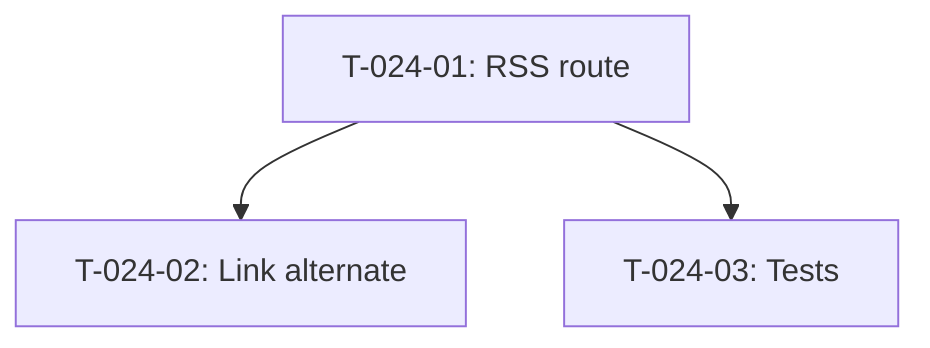

# Taches - US-024 : Flux RSS blog

## Informations US
- **Epic** : EPIC-003
- **Persona** : P-002 - DSI/CTO
- **Story Points** : 1
- **Sprint** : sprint-004-services-seo-rgpd

## Resume de la US
**En tant que** lecteur du blog
**Je veux** m'abonner via un flux RSS
**Afin de** recevoir les nouveaux articles dans mon lecteur de flux

## Vue d'ensemble des taches

| ID | Type | Tache | Estimation | Depend de | Statut |
|----|------|-------|------------|-----------|--------|
| T-024-01 | [FE] | Creer route /blog/rss.xml (RSS 2.0) | 1.5h | - | 🔲 |
| T-024-02 | [FE] | Ajouter link rel=alternate dans blog metadata | 0.5h | T-024-01 | 🔲 |
| T-024-03 | [TEST] | Test validation XML feed | 1h | T-024-01 | 🔲 |

**Total estime** : 3h

---

## Detail des taches

### T-024-01 : Creer route /blog/rss.xml
- **Type** : [FE]
- **Estimation** : 1.5h
- **Depend de** : -

**Fichiers a creer** :
- `src/app/blog/rss.xml/route.ts`

**Implementation** :
- Route handler GET retournant du XML
- Utilise `getAllPosts()` de `@/lib/mdx`
- Format RSS 2.0
- Max 50 articles les plus recents
- Chaque item : title, link (URL absolue), description (150-200 chars), pubDate (RFC 822), guid, category

**Option** : utiliser le package `feed` ou generer le XML manuellement (simple pour RSS 2.0).

**Criteres** :
- [ ] /blog/rss.xml retourne XML valide
- [ ] Content-Type: application/xml
- [ ] Max 50 articles
- [ ] Tri reverse chronologique
- [ ] Dates RFC 822

---

### T-024-02 : Ajouter link rel=alternate
- **Type** : [FE]
- **Estimation** : 0.5h
- **Depend de** : T-024-01

**Fichiers a modifier** :
- `src/app/blog/page.tsx` — ajouter dans metadata :
  ```typescript
  alternates: {
    types: {
      'application/rss+xml': '/blog/rss.xml',
    },
  },
  ```
- `src/app/layout.tsx` — optionnel: ajouter lien RSS global

**Criteres** :
- [ ] `<link rel="alternate" type="application/rss+xml">` present dans le head de /blog

---

### T-024-03 : Test validation XML feed
- **Type** : [TEST]
- **Estimation** : 1h
- **Depend de** : T-024-01

**Fichiers a creer** :
- `src/app/blog/rss.xml/__tests__/route.test.ts`

**Tests** :
- [ ] GET retourne status 200
- [ ] Content-Type est application/xml
- [ ] XML contient `<rss version="2.0">`
- [ ] Items presents avec title, link, pubDate
- [ ] Max 50 items

---

## Graphe de dependances


