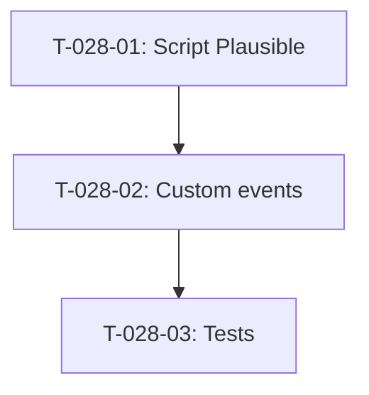

# Taches - US-028 : Analytics Plausible Cloud

## Informations US
- **Epic** : EPIC-004
- **Persona** : P-003 - Product Owner
- **Story Points** : 2
- **Sprint** : sprint-004-services-seo-rgpd

## Resume de la US
**En tant que** Product Owner
**Je veux** suivre le trafic du site et les evenements cles (formulaires, clics CTA)
**Afin de** mesurer l'efficacite du site et ajuster la strategie editoriale

## Vue d'ensemble des taches

| ID | Type | Tache | Estimation | Depend de | Statut |
|----|------|-------|------------|-----------|--------|
| T-028-01 | [FE] | Integrer script Plausible dans layout | 1h | - | 🔲 |
| T-028-02 | [FE] | Utilitaire custom events + tracking CTA | 2h | T-028-01 | 🔲 |
| T-028-03 | [TEST] | Tests script loading + events | 1.5h | T-028-02 | 🔲 |

**Total estime** : 4.5h

---

## Detail des taches

### T-028-01 : Integrer script Plausible dans layout
- **Type** : [FE]
- **Estimation** : 1h
- **Depend de** : -

**Fichiers a modifier** :
- `src/app/layout.tsx` — ajouter `<Script>` Plausible
- `.env.example` — ajouter `NEXT_PUBLIC_PLAUSIBLE_DOMAIN`

**Implementation** :
- Script : `<Script defer data-domain={domain} src="https://plausible.io/js/script.js" />`
- Variable : `NEXT_PUBLIC_PLAUSIBLE_DOMAIN` pour staging/prod
- Conditionnel : ne pas charger si variable absente (graceful degradation, comme Turnstile)

**Criteres** :
- [ ] Script present dans le HTML en production
- [ ] Pas de script si env var manquante (dev)
- [ ] Pas de blocage du rendu (defer)

---

### T-028-02 : Utilitaire custom events + tracking CTA
- **Type** : [FE]
- **Estimation** : 2h
- **Depend de** : T-028-01

**Fichiers a creer** :
- `src/lib/analytics.ts` — fonctions utilitaires

**Events a tracker** :
- `CTA Clicked` : props { location, destination }
- `Contact Form Submitted` : props { sujet }
- `Blog Article Read` : props { slug, category }
- `Service Page Viewed` : props { service }

**Implementation** :
```typescript
export function trackEvent(name: string, props?: Record<string, string>) {
  if (typeof window !== 'undefined' && window.plausible) {
    window.plausible(name, { props });
  }
}
```

**Fichiers a modifier** :
- `src/components/ui/button.tsx` ou CTA components — ajouter tracking onClick
- `src/app/api/contact/route.ts` — event server-side si besoin

**Criteres** :
- [ ] Fonction trackEvent disponible
- [ ] Types TypeScript pour window.plausible
- [ ] Events fires sur CTA clicks
- [ ] Graceful degradation si Plausible absent

---

### T-028-03 : Tests script loading + events
- **Type** : [TEST]
- **Estimation** : 1.5h
- **Depend de** : T-028-02

**Fichiers a creer** :
- `src/lib/__tests__/analytics.test.ts`

**Tests** :
- [ ] trackEvent appelle window.plausible
- [ ] trackEvent ne crash pas si plausible absent
- [ ] Props transmis correctement

---

## Graphe de dependances


