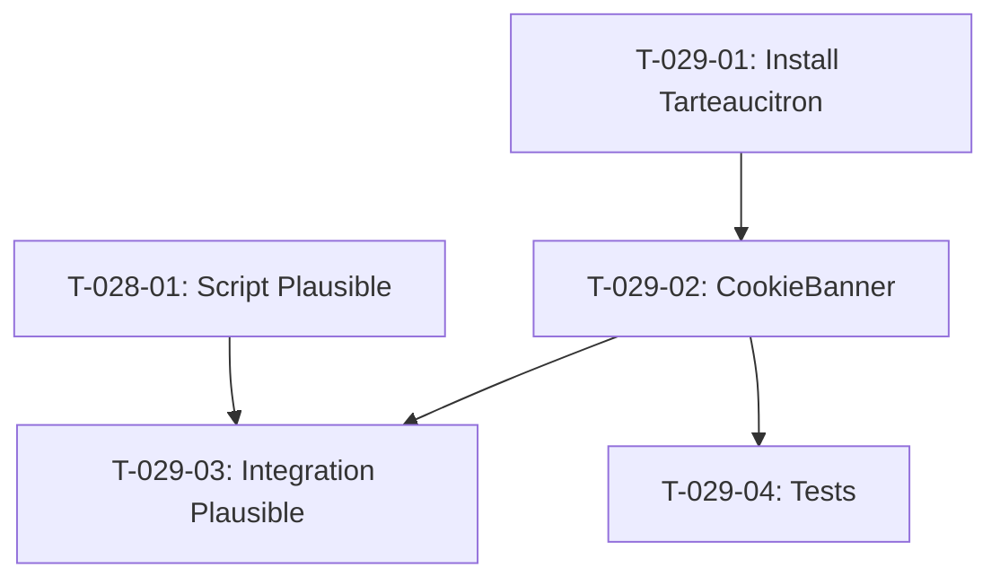

# Taches - US-029 : Bandeau cookies RGPD

## Informations US
- **Epic** : EPIC-004
- **Persona** : P-001 - Dirigeante PME
- **Story Points** : 3
- **Sprint** : sprint-004-services-seo-rgpd

## Resume de la US
**En tant que** Dirigeante PME
**Je veux** voir un bandeau cookies conforme RGPD a ma premiere visite
**Afin de** donner ou refuser mon consentement de maniere eclairee

## Vue d'ensemble des taches

| ID | Type | Tache | Estimation | Depend de | Statut |
|----|------|-------|------------|-----------|--------|
| T-029-01 | [FE] | Installer et configurer Tarteaucitron.js | 2h | - | 🔲 |
| T-029-02 | [FE] | Composant CookieBanner client-side | 2h | T-029-01 | 🔲 |
| T-029-03 | [FE] | Integration Plausible dans consent manager | 1h | T-029-02, T-028-01 | 🔲 |
| T-029-04 | [TEST] | Tests consentement accept/refuse/custom | 2h | T-029-02 | 🔲 |

**Total estime** : 7h

---

## Detail des taches

### T-029-01 : Installer et configurer Tarteaucitron.js
- **Type** : [FE]
- **Estimation** : 2h
- **Depend de** : -

**Commandes** :
```bash
npm install tarteaucitronjs
```

**Fichiers a creer** :
- `src/lib/cookie-consent.ts` — configuration Tarteaucitron

**Configuration** :
```typescript
tarteaucitron.init({
  privacyUrl: "/confidentialite",
  hashtag: "#tarteaucitron",
  cookieName: "tarteaucitron",
  highPrivacy: true,    // Bloque avant consentement
  orientation: "bottom",
  removeCredit: false,
  showIcon: true,
  DenyAllCta: true,
  AcceptAllCta: true,
  cookieslist: true,
  mandatory: false,
  readmoreLink: "/confidentialite",
  language: { locale: "fr" }
});
```

**Criteres** :
- [ ] Tarteaucitron installe et configure
- [ ] highPrivacy = true (bloque avant consentement)
- [ ] Langue francaise

---

### T-029-02 : Composant CookieBanner client-side
- **Type** : [FE]
- **Estimation** : 2h
- **Depend de** : T-029-01

**Fichiers a creer** :
- `src/components/cookie-banner.tsx`

**Implementation** :
- Composant "use client" charge dynamiquement Tarteaucitron
- 3 boutons : "Accepter tout", "Refuser tout", "Personnaliser"
- Lien vers /confidentialite
- Position : bandeau fixe en bas de page
- Style coherent avec le design system (navy, Inter font)
- Lazy load : charger client-side only (eviter SSR conflicts)

**Fichiers a modifier** :
- `src/app/layout.tsx` — ajouter <CookieBanner /> apres <Footer />

**Criteres** :
- [ ] Bandeau visible premiere visite
- [ ] 3 actions fonctionnelles
- [ ] Lien /confidentialite visible
- [ ] Aucun cookie non-essentiel avant consentement
- [ ] Cookie "tarteaucitron" cree apres choix
- [ ] Bandeau ne reapparait pas apres choix

---

### T-029-03 : Integration Plausible dans consent manager
- **Type** : [FE]
- **Estimation** : 1h
- **Depend de** : T-029-02, T-028-01

**Description** :
Plausible est cookieless → techniquement pas besoin de consentement.
Mais par transparence RGPD, on le mentionne dans le bandeau comme "analytics cookieless".
Si l'utilisateur refuse tout, Plausible continue (cookieless = exempt RGPD).

**Criteres** :
- [ ] Plausible mentionne dans la liste des services
- [ ] Plausible marque comme "cookieless" / "exempt consentement"
- [ ] Plausible fonctionne meme si refus (pas de cookies)

---

### T-029-04 : Tests consentement
- **Type** : [TEST]
- **Estimation** : 2h
- **Depend de** : T-029-02

**Fichiers a creer** :
- `src/components/__tests__/cookie-banner.test.tsx`

**Tests** :
- [ ] Bandeau s'affiche si pas de cookie consent
- [ ] "Accepter tout" cree cookie consentement
- [ ] "Refuser tout" cree cookie refus
- [ ] Bandeau disparait apres choix
- [ ] Plausible mentionne dans la liste

---

## Graphe de dependances


