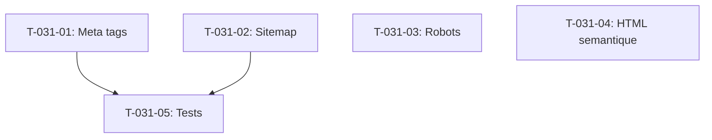

# Taches - US-031 : SEO technique (meta, sitemap, canonical)

## Informations US
- **Epic** : EPIC-005
- **Persona** : P-002 - DSI/CTO
- **Story Points** : 3
- **Sprint** : sprint-004-services-seo-rgpd

## Resume de la US
**En tant que** DSI/CTO
**Je veux** que toutes les pages aient des meta tags uniques et un sitemap dynamique
**Afin de** garantir une indexation optimale par Google

## Vue d'ensemble des taches

| ID | Type | Tache | Estimation | Depend de | Statut |
|----|------|-------|------------|-----------|--------|
| T-031-01 | [FE] | Audit + completion meta tags toutes pages | 2h | - | 🔲 |
| T-031-02 | [FE] | Creer sitemap.ts dynamique | 1.5h | - | 🔲 |
| T-031-03 | [FE] | Creer robots.ts | 0.5h | - | 🔲 |
| T-031-04 | [FE] | Verifier HTML semantique + h1 unique | 1h | - | 🔲 |
| T-031-05 | [TEST] | Tests meta tags + sitemap validation | 2h | T-031-01, T-031-02 | 🔲 |

**Total estime** : 7h

---

## Detail des taches

### T-031-01 : Audit + completion meta tags toutes pages
- **Type** : [FE]
- **Estimation** : 2h
- **Depend de** : -

**Description** :
Auditer toutes les pages existantes et completer les metadata Next.js manquantes.

**Pages a verifier/completer** :
| Page | title (50-60 chars) | description (140-160 chars) | canonical |
|------|---------------------|------------------------------|-----------|
| / | ✅ A verifier | ✅ A verifier | Ajouter |
| /services/* | ✅ Dans data files | ✅ Dans data files | Ajouter |
| /blog | A completer | A completer | Ajouter |
| /blog/[slug] | ✅ Dynamique | ✅ Dynamique | Ajouter |
| /contact | A completer | A completer | Ajouter |
| /mentions-legales | A completer | A completer | Ajouter |
| /confidentialite | A completer | A completer | Ajouter |
| /cookies | A completer | A completer | Ajouter |

**Fichiers a modifier** :
- Chaque `page.tsx` — ajouter/completer export `metadata`

**Criteres** :
- [ ] Chaque page a un title unique (50-60 chars)
- [ ] Chaque page a une description unique (140-160 chars)
- [ ] html lang="fr" (deja fait dans layout.tsx)
- [ ] Canonical URL definie

---

### T-031-02 : Creer sitemap.ts dynamique
- **Type** : [FE]
- **Estimation** : 1.5h
- **Depend de** : -

**Fichiers a creer** :
- `src/app/sitemap.ts`

**Implementation** :
```typescript
import { MetadataRoute } from 'next'
import { getAllPosts } from '@/lib/mdx'

export default async function sitemap(): Promise<MetadataRoute.Sitemap> {
  const posts = await getAllPosts()
  const baseUrl = 'https://agentic-agency.fr'

  const staticPages = [
    { url: baseUrl, lastModified: new Date(), priority: 1.0 },
    { url: `${baseUrl}/services/developpement-web`, priority: 0.8 },
    // ... toutes les pages statiques
  ]

  const blogPages = posts.map(post => ({
    url: `${baseUrl}/blog/${post.slug}`,
    lastModified: new Date(post.date),
    priority: 0.7,
  }))

  return [...staticPages, ...blogPages]
}
```

**Priorites** :
- Accueil : 1.0
- Services : 0.8
- Blog articles : 0.7
- Legal : 0.3

**Criteres** :
- [ ] Sitemap accessible a /sitemap.xml
- [ ] Toutes les pages publiques incluses
- [ ] URLs absolues HTTPS
- [ ] Priority et lastModified renseignes
- [ ] XML valide

---

### T-031-03 : Creer robots.ts
- **Type** : [FE]
- **Estimation** : 0.5h
- **Depend de** : -

**Fichiers a creer** :
- `src/app/robots.ts`

**Implementation** :
```typescript
import { MetadataRoute } from 'next'

export default function robots(): MetadataRoute.Robots {
  return {
    rules: { userAgent: '*', allow: '/', disallow: ['/api/'] },
    sitemap: 'https://agentic-agency.fr/sitemap.xml',
  }
}
```

**Criteres** :
- [ ] robots.txt accessible
- [ ] Allow: /
- [ ] Disallow: /api/
- [ ] Lien vers sitemap

---

### T-031-04 : Verifier HTML semantique + h1 unique
- **Type** : [FE]
- **Estimation** : 1h
- **Depend de** : -

**Description** :
Audit de toutes les pages pour verifier :
- Un seul `<h1>` par page
- Hierarchie titres correcte (H1 > H2 > H3, pas de saut)
- Balises semantiques : `<header>`, `<main>`, `<article>`, `<nav>`, `<footer>`
- Images : alt descriptifs, next/image avec srcset

**Criteres** :
- [ ] 1 seul h1 par page
- [ ] Pas de saut de niveau (h1→h3)
- [ ] Toutes images ont alt descriptif
- [ ] next/image utilise partout

---

### T-031-05 : Tests meta tags + sitemap validation
- **Type** : [TEST]
- **Estimation** : 2h
- **Depend de** : T-031-01, T-031-02

**Fichiers a creer** :
- `src/app/__tests__/sitemap.test.ts`
- `src/app/__tests__/seo.test.ts`

**Tests** :
- [ ] Sitemap retourne XML valide
- [ ] Sitemap inclut toutes les pages statiques
- [ ] Sitemap inclut les articles de blog
- [ ] robots.txt contient disallow /api/
- [ ] Chaque page a metadata title et description

---

## Graphe de dependances


