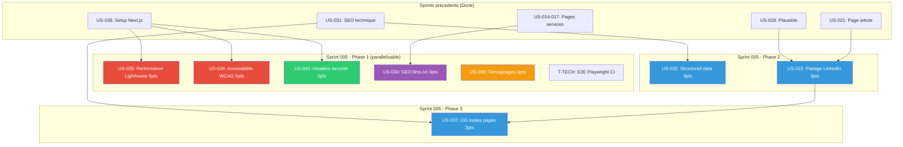

# Dependances — Sprint 005

## Graphe de dependances

## Ordre d'execution recommande

### Phase 1 — Parallelisable (pas de deps internes)

| US | Titre | Pts | Parallelisable avec |
|----|-------|-----|---------------------|
| US-035 | Performance Lighthouse | 5 | Tout |
| US-036 | Accessibilite WCAG | 5 | Tout |
| US-042 | Headers securite | 2 | Tout |
| US-034 | GEO llms.txt | 3 | Tout |
| US-008 | Temoignages | 3 | Tout |
| T-TECH | E2E Playwright CI | - | Tout |

### Phase 2 — Apres Phase 1

| US | Titre | Pts | Depend de |
|----|-------|-----|-----------|
| US-032 | Structured data | 3 | US-031 (done) |
| US-022 | Partage LinkedIn | 3 | US-021 + US-028 (done) |

Note : US-032 et US-022 n'ont pas de deps internes au sprint, peuvent demarrer en Phase 1 aussi.

### Phase 3 — Apres US-022

| US | Titre | Pts | Depend de |
|----|-------|-----|-----------|
| US-037 | OG toutes pages | 2 | US-022 (share button + OG blog) |

## Opportunites de parallelisme

- **Maximum** : 8 US + tech en parallele (toutes deps externes resolues)
- **Chemin critique** : US-022 → US-037 (5h environ)
- **US-035 et US-036** sont les plus lourdes (5 pts chacune) mais independantes
