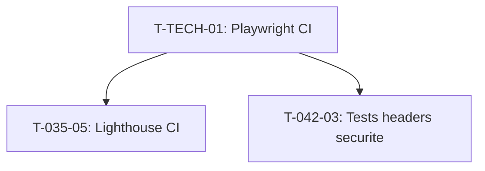

# Taches Techniques Transverses - Sprint 005

## Actions Retro S-004

### T-TECH-01 : E2E Playwright dans CI

- **Type** : [OPS]
- **Estimation** : 2h
- **Depend de** : -
- **Priorite** : Haute (action retro)

**Description** :
Configurer Playwright dans GitHub Actions pour tester les parcours cles.

**Actions** :
- Ajouter step Playwright dans le workflow CI existant
- Installer navigateurs Playwright dans CI (cache pour perf)
- Configurer playwright.config.ts pour CI (headless, base URL)
- Minimum 3 scenarios E2E :
  1. Homepage → clic service → page service → CTA contact
  2. Blog → clic article → lecture article → partage
  3. Contact → remplir formulaire → soumission (mock API)
- Timeout CI : 5 minutes max pour E2E
- Upload screenshots d'echec comme artifacts

**Fichiers a creer/modifier** :
- `.github/workflows/ci.yml` (ajouter job e2e)
- `playwright.config.ts` (verifier config CI)
- `e2e/*.spec.ts` (scenarios si pas existants)

**Criteres** :
- [ ] `npm run test:e2e` execute dans CI
- [ ] Minimum 3 scenarios couverts
- [ ] Screenshots d'echec en artifacts
- [ ] < 5 minutes execution

---

### T-TECH-02 : Lighthouse CI bloquant

- **Type** : [OPS]
- **Estimation** : (inclus dans T-035-05)
- **Depend de** : T-TECH-01
- **Priorite** : Moyenne (action retro)

**Description** :
Passer Lighthouse CI de "warn" a "error" avec seuils bloquants.

Note : cette tache est fusionnee avec T-035-05 (Lighthouse CI bloquant dans US-035).
Les seuils : perf >= 90, a11y >= 90, SEO >= 95.

---

## Graphe de dependances techniques

## Resume

| ID | Tache | Estimation | Priorite |
|----|-------|------------|----------|
| T-TECH-01 | E2E Playwright dans CI | 2h | Haute |
| T-TECH-02 | Lighthouse CI bloquant | (inclus T-035-05) | Moyenne |

**Total** : 2h (+ 2h dans T-035-05)
