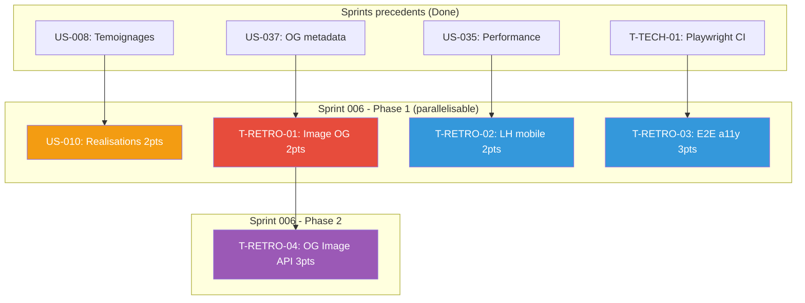

# Dependances — Sprint 006

## Graphe de dependances

## Ordre d'execution recommande

### Phase 1 — Parallelisable (pas de deps internes)

| Item | Titre | Pts | Parallelisable avec |
|------|-------|-----|---------------------|
| US-010 | Realisations clients | 2 | Tout |
| T-RETRO-01 | Image OG reelle | 2 | Tout |
| T-RETRO-02 | Lighthouse CI mobile | 2 | Tout |
| T-RETRO-03 | E2E a11y scenarios | 3 | Tout |

### Phase 2 — Apres T-RETRO-01

| Item | Titre | Pts | Depend de |
|------|-------|-----|-----------|
| T-RETRO-04 | OG Image API dynamique | 3 | T-RETRO-01 (image de base) |

## Opportunites de parallelisme

- **Maximum** : 4 items en parallele (Phase 1)
- **Chemin critique** : T-RETRO-01 → T-RETRO-04 (5h environ)
- Sprint court : 12 pts sur capacite 26 → marge confortable
