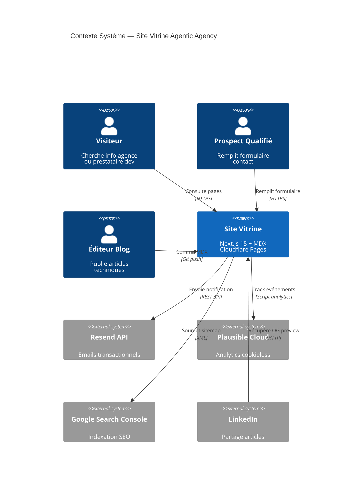
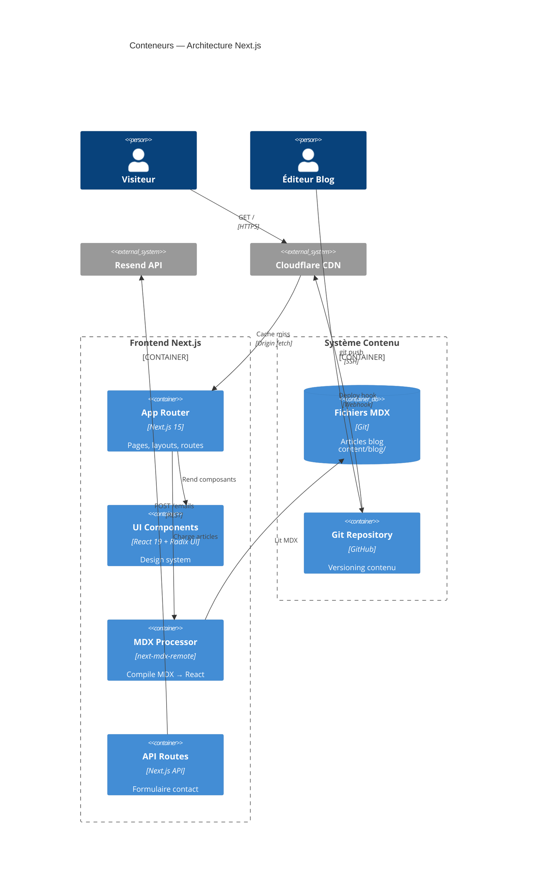
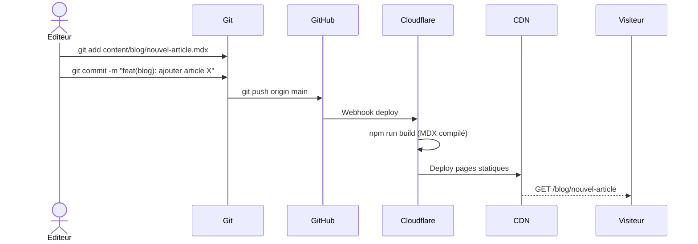
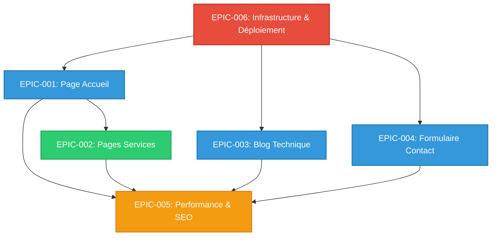

# Spécification Technique — Site Vitrine Agentic Agency

**Version :** 1.0  
**Date :** 29 mai 2026  
**Statut :** Draft  
**Référence :** PRD v1.0

---

## 1. Vue d'ensemble

### 1.1 Résumé technique

Site vitrine statique moderne générant des leads qualifiés, positionné comme référence SEO/GEO du développement web francophone.

**Caractéristiques principales :**
- Page d'accueil longue (13 sections ancrées)
- 4 pages services dédiées
- Blog technique 3 catégories (Avis, Tests, Process)
- Système de publication autonome sans redéploiement
- Performance maximale (Lighthouse ≥ 90)
- Accessibilité WCAG 2.1 AA
- Optimisation GEO (Generative Engine Optimization)
- RGPD natif (hébergement EU, analytics cookieless)

### 1.2 Stack technique complète

| Couche | Technologie | Version | Justification |
|--------|-------------|---------|---------------|
| **Framework** | Next.js App Router | ≥ 15.5.15 | SSR/ISR natif, patches CVE-2025-55182 (RCE) + CVE-2026-23869 (DoS) |
| **Langage** | TypeScript | 5.x | Type safety, maintenabilité |
| **Runtime** | React | 19.x | Imposé par Next.js 15 |
| **Styles** | Tailwind CSS | 4.x | Design system, productivité, classes arbitraires |
| **UI Components** | Radix UI | Latest | Headless, ARIA natif, WCAG AA |
| **Animations** | Framer Motion | Latest | Performance, API déclarative |
| **CMS** | MDX + Git | — | **DÉCISION CLIENT : limiter SaaS**, blog simple (3 catégories, ~3 articles/mois) |
| **Alternative CMS** | Keystatic | Latest | UI admin sur fichiers Git si non-dev doit éditer |
| **Email** | Resend | — | 100 emails/jour gratuit, templates React |
| **Hébergement** | Cloudflare Pages | — | Gratuit, edge EU, RGPG compliant |
| **Analytics** | Plausible Cloud | — | 9€/mois, cookieless, EU |
| **Consentement** | Tarteaucitron.js | — | Open-source, RGPD |
| **Tests E2E** | Playwright | Latest | Cross-browser, CI/CD |
| **Tests unitaires** | Vitest | Latest | Compatible Next.js |
| **Linting** | ESLint + Prettier | — | Quality gates |
| **i18n (préparé)** | next-intl | Latest | Lot 2, désactivé V1 |

**Budget annuel : ~108€/an** (Plausible 9€/mois uniquement, hébergement gratuit)

### 1.3 Principes d'architecture

1. **Performance First** : SSG par défaut, ISR pour blog, lazy loading systématique
2. **Type Safety** : TypeScript strict, validation Zod
3. **Accessibility First** : Radix UI (ARIA natif), tests axe-core CI
4. **SEO/GEO Native** : Metadata Next.js, structured data, llms.txt
5. **Privacy by Design** : Analytics cookieless, hébergement EU, RGPD natif
6. **Content as Code** : MDX + Git, versioning natif, review process
7. **Progressive Enhancement** : JS optionnel, HTML sémantique
8. **Extensibilité** : i18n préparé, architecture modulaire

---

## 2. Architecture Applicative

### 2.1 Diagramme C4 — Contexte Système



### 2.2 Diagramme C4 — Conteneurs



### 2.3 Structure du projet Next.js

```
agentic-agency/
├── app/                              # App Router Next.js 15
│   ├── layout.tsx                    # Root layout (metadata, fonts)
│   ├── page.tsx                      # Accueil (13 sections)
│   ├── globals.css                   # Tailwind imports
│   │
│   ├── services/
│   │   ├── developpement-web/
│   │   │   └── page.tsx
│   │   ├── applications-metier/
│   │   │   └── page.tsx
│   │   ├── applications-mobiles/
│   │   │   └── page.tsx
│   │   └── conseil-organisation/
│   │       └── page.tsx
│   │
│   ├── blog/
│   │   ├── page.tsx                  # Liste articles
│   │   ├── [slug]/
│   │   │   └── page.tsx              # Article dynamique
│   │   ├── avis/
│   │   │   └── page.tsx              # Catégorie Avis
│   │   ├── tests/
│   │   │   └── page.tsx              # Catégorie Tests
│   │   └── process/
│   │       └── page.tsx              # Catégorie Process
│   │
│   ├── contact/
│   │   └── page.tsx                  # Formulaire contact
│   │
│   ├── mentions-legales/
│   │   └── page.tsx
│   ├── confidentialite/
│   │   └── page.tsx
│   ├── cookies/
│   │   └── page.tsx
│   │
│   ├── api/
│   │   └── contact/
│   │       └── route.ts              # POST formulaire
│   │
│   ├── sitemap.ts                    # Sitemap dynamique
│   ├── robots.ts                     # Robots.txt
│   └── opengraph-image.tsx           # OG image par défaut
│
├── components/
│   ├── ui/                           # Composants Radix UI
│   │   ├── button.tsx
│   │   ├── card.tsx
│   │   ├── input.tsx
│   │   ├── textarea.tsx
│   │   ├── select.tsx
│   │   └── checkbox.tsx
│   │
│   ├── sections/                     # Sections accueil
│   │   ├── hero.tsx
│   │   ├── stats.tsx
│   │   ├── trust.tsx
│   │   ├── delivery.tsx
│   │   ├── offers.tsx
│   │   ├── cta-mid.tsx
│   │   ├── contact-form.tsx
│   │   ├── testimonials.tsx
│   │   ├── blog-preview.tsx
│   │   ├── portfolio.tsx
│   │   ├── technologies.tsx
│   │   ├── values.tsx
│   │   └── approach.tsx
│   │
│   ├── blog/
│   │   ├── article-card.tsx
│   │   ├── article-header.tsx
│   │   ├── article-content.tsx
│   │   ├── table-of-contents.tsx
│   │   ├── category-badge.tsx
│   │   ├── share-linkedin.tsx
│   │   └── related-articles.tsx
│   │
│   ├── layout/
│   │   ├── header.tsx
│   │   ├── footer.tsx
│   │   ├── nav-desktop.tsx
│   │   └── nav-mobile.tsx
│   │
│   └── mdx/                          # Composants MDX custom
│       ├── callout.tsx
│       ├── code-block.tsx
│       ├── image-caption.tsx
│       └── comparison-table.tsx
│
├── content/
│   └── blog/                         # Articles MDX
│       ├── premiere-experience-cursor-ai.mdx
│       ├── symfony-vs-laravel-2026.mdx
│       └── checklist-mep-production.mdx
│
├── lib/
│   ├── mdx.ts                        # Fonctions MDX (getPost, getAllPosts)
│   ├── blog-utils.ts                 # Tri, filtrage, pagination
│   ├── schemas/                      # Validation Zod
│   │   ├── contact.ts
│   │   └── blog.ts
│   ├── email/
│   │   ├── templates/
│   │   │   └── contact-notification.tsx
│   │   └── resend.ts
│   └── analytics.ts                  # Plausible wrapper
│
├── public/
│   ├── images/
│   │   ├── hero/
│   │   ├── technologies/
│   │   ├── testimonials/
│   │   └── blog/
│   ├── llms.txt                      # GEO
│   └── favicon.ico
│
├── styles/
│   └── mdx.css                       # Styles prose MDX
│
├── types/
│   ├── blog.ts
│   ├── service.ts
│   └── contact.ts
│
├── next.config.ts                    # Config Next.js + MDX
├── tailwind.config.ts                # Tokens design
├── tsconfig.json
├── package.json
├── .env.local.example
├── .eslintrc.json
├── .prettierrc
├── playwright.config.ts
└── vitest.config.ts
```

---

## 3. Pages et Rendu

### 3.1 Stratégie de rendu par page

| Page | Stratégie | Revalidation | Justification |
|------|-----------|--------------|---------------|
| `/` (accueil) | SSG `force-static` | Build | Contenu stable, performance max (LCP < 1s) |
| `/services/*` (×4) | SSG | Build | Contenu stable |
| `/blog` (liste) | SSG | Build | Regénéré à chaque deploy (MDX commit) |
| `/blog/[slug]` | SSG | Build | Articles générés au build |
| `/blog/avis` | SSG | Build | Filtre catégorie statique |
| `/blog/tests` | SSG | Build | idem |
| `/blog/process` | SSG | Build | idem |
| `/contact` | SSG | Build | Formulaire client-side, pas de SSR requis |
| `/mentions-legales` | SSG | Build | Contenu stable |
| `/confidentialite` | SSG | Build | Contenu stable |
| `/cookies` | SSG | Build | Contenu stable |

**Flux publication blog avec MDX + Git :**



**Avantages MDX + Git :**
- Pas de dépendance SaaS (limitation client)
- Versioning natif (rollback, historique)
- Review process (PR + approbation)
- Performance maximale (SSG pur)
- Gratuit

**Inconvénients :**
- Redéploiement requis (~2-3 min)
- Interface technique (éditeur Markdown)

**Migration future vers Keystatic (si besoin) :**
- UI admin sur fichiers Git
- Open-source, hébergement self-hosted
- Commits automatiques depuis interface
- Compatible structure MDX existante

### 3.2 Page d'accueil (13 sections)

#### S01 — Hero

```tsx
// app/page.tsx (extrait)
import Hero from '@/components/sections/hero'

export default function HomePage() {
  return (
    <main>
      <Hero />
      {/* ... 12 autres sections */}
    </main>
  )
}

// components/sections/hero.tsx
import { Button } from '@/components/ui/button'
import { ArrowRightIcon } from '@radix-ui/react-icons'

export default function Hero() {
  return (
    <section id="hero" className="relative min-h-screen flex items-center">
      <div className="container mx-auto px-4">
        <div className="max-w-3xl">
          <h1 className="text-5xl md:text-7xl font-bold tracking-tight mb-6">
            Livrez plus vite.
            <br />
            <span className="text-primary">Sans sacrifier la qualité.</span>
          </h1>
          
          <p className="text-xl md:text-2xl text-muted-foreground mb-8">
            Agence de développement web, applications métier et mobiles.
            Symfony, Laravel, React, Flutter. Delivery moderne, code maintenable.
          </p>

          <div className="flex flex-col sm:flex-row gap-4">
            <Button size="lg" asChild>
              <a href="#contact">
                Réserver un échange
                <ArrowRightIcon className="ml-2 h-5 w-5" />
              </a>
            </Button>
            
            <Button size="lg" variant="outline" asChild>
              <a href="#offres">Découvrir nos offres</a>
            </Button>
          </div>
        </div>
      </div>

      {/* Illustration produit ou code stylisé (lazy loaded) */}
      <div className="absolute right-0 top-1/2 -translate-y-1/2 w-1/2 opacity-20 pointer-events-none">
        {/* SVG ou image optimisée */}
      </div>
    </section>
  )
}
```

#### S02 — Stats (4 KPIs)

```tsx
// components/sections/stats.tsx
const stats = [
  { value: '11', label: 'Stacks maîtrisées', suffix: '' },
  { value: '15', label: 'Années expérience cumulée', suffix: '+' },
  { value: '30', label: 'Projets accompagnés', suffix: '+' },
  { value: '95', label: 'Satisfaction client', suffix: '%' },
]

export default function Stats() {
  return (
    <section id="stats" className="py-20 bg-muted/50">
      <div className="container mx-auto px-4">
        <div className="grid grid-cols-2 md:grid-cols-4 gap-8">
          {stats.map((stat) => (
            <div key={stat.label} className="text-center">
              <div className="text-4xl md:text-6xl font-bold text-primary mb-2">
                {stat.value}{stat.suffix}
              </div>
              <div className="text-sm md:text-base text-muted-foreground">
                {stat.label}
              </div>
            </div>
          ))}
        </div>
      </div>
    </section>
  )
}
```

#### S03 — Confiance (logos clients/secteurs)

```tsx
// components/sections/trust.tsx
import Image from 'next/image'

const sectors = [
  { name: 'Fintech', logo: '/images/sectors/fintech.svg' },
  { name: 'Santé', logo: '/images/sectors/health.svg' },
  { name: 'Industrie', logo: '/images/sectors/industry.svg' },
  { name: 'E-commerce', logo: '/images/sectors/ecommerce.svg' },
  { name: 'SaaS', logo: '/images/sectors/saas.svg' },
  { name: 'Services', logo: '/images/sectors/services.svg' },
]

export default function Trust() {
  return (
    <section id="confiance" className="py-20">
      <div className="container mx-auto px-4">
        <p className="text-center text-muted-foreground mb-12">
          Ils nous font confiance dans ces secteurs
        </p>
        
        <div className="grid grid-cols-3 md:grid-cols-6 gap-8 items-center opacity-60 hover:opacity-100 transition-opacity">
          {sectors.map((sector) => (
            <div key={sector.name} className="grayscale hover:grayscale-0 transition-all">
              <Image
                src={sector.logo}
                alt={sector.name}
                width={120}
                height={60}
                className="mx-auto"
              />
            </div>
          ))}
        </div>
      </div>
    </section>
  )
}
```

#### S04 — Delivery moderne

```tsx
// components/sections/delivery.tsx
import { Button } from '@/components/ui/button'

export default function Delivery() {
  return (
    <section id="delivery-moderne" className="py-20">
      <div className="container mx-auto px-4 max-w-4xl">
        <h2 className="text-3xl md:text-5xl font-bold mb-6 text-center">
          Le delivery moderne comme <span className="text-primary">avantage concurrentiel</span>
        </h2>
        
        <div className="prose prose-lg mx-auto mb-8">
          <p>
            Nous ne surfons pas sur la hype IA. Nous automatisons intelligemment
            ce qui doit l'être : tests, revues de code, déploiements. Pour libérer
            du temps sur l'essentiel : comprendre votre métier, concevoir l'architecture
            adaptée, livrer de la valeur sprint après sprint.
          </p>
          
          <p>
            Cycles courts, feedback continu, code maintenable. C'est notre méthode
            depuis 10 ans. Pas un effet de mode.
          </p>
        </div>

        <div className="text-center">
          <Button variant="outline" asChild>
            <a href="/blog/process">
              Lire nos retours d'expérience →
            </a>
          </Button>
        </div>
      </div>
    </section>
  )
}
```

#### S05 — Offres (4 piliers × cartes)

```tsx
// components/sections/offers.tsx
import { Card } from '@/components/ui/card'
import { Button } from '@/components/ui/button'

const pillars = [
  {
    id: 'web',
    title: 'Développement Web',
    description: 'Sites, plateformes, refontes. Symfony, Laravel, React.',
    offers: [
      {
        title: 'Site vitrine / institutionnel',
        description: 'Performance, SEO, RGPD. Next.js ou Symfony.',
        cta: 'Discuter de mon site',
      },
      {
        title: 'Plateforme web sur mesure',
        description: 'SaaS, marketplace, portail. Architecture scalable.',
        cta: 'Décrire mon projet',
      },
    ],
    link: '/services/developpement-web',
  },
  // ... 3 autres piliers
]

export default function Offers() {
  return (
    <section id="offres" className="py-20 bg-muted/30">
      <div className="container mx-auto px-4">
        <h2 className="text-4xl md:text-5xl font-bold mb-16 text-center">
          Nos offres
        </h2>

        <div className="space-y-16">
          {pillars.map((pillar) => (
            <div key={pillar.id}>
              <h3 className="text-2xl font-bold mb-2">{pillar.title}</h3>
              <p className="text-muted-foreground mb-6">{pillar.description}</p>
              
              <div className="grid md:grid-cols-2 gap-6 mb-4">
                {pillar.offers.map((offer) => (
                  <Card key={offer.title} className="p-6">
                    <h4 className="text-xl font-semibold mb-2">{offer.title}</h4>
                    <p className="text-muted-foreground mb-4">{offer.description}</p>
                    <Button asChild>
                      <a href="#contact">{offer.cta}</a>
                    </Button>
                  </Card>
                ))}
              </div>

              <a href={pillar.link} className="text-primary hover:underline">
                En savoir plus sur {pillar.title} →
              </a>
            </div>
          ))}
        </div>
      </div>
    </section>
  )
}
```

#### S06 — CTA milieu

```tsx
// components/sections/cta-mid.tsx
export default function CtaMid() {
  return (
    <section id="cta-milieu" className="py-20 bg-primary text-primary-foreground">
      <div className="container mx-auto px-4 text-center">
        <h2 className="text-3xl md:text-5xl font-bold mb-6">
          Prêt à accélérer votre produit ?
        </h2>
        <Button size="lg" variant="secondary" asChild>
          <a href="#contact">Échanger sur votre projet</a>
        </Button>
      </div>
    </section>
  )
}
```

#### S07 — Contact (formulaire)

Voir section 6 (Formulaire Contact) pour code complet.

#### S08 à S13 — Autres sections

Code similaire, structure identique. Voir `/components/sections/` dans arborescence.

### 3.3 Pages services (×4)

```tsx
// app/services/[service]/page.tsx (structure type)
import { Metadata } from 'next'
import ServiceHero from '@/components/services/hero'
import ServiceProblems from '@/components/services/problems'
import ServiceOffers from '@/components/services/offers'
import ServiceProcess from '@/components/services/process'
import ServiceTechnologies from '@/components/services/technologies'
import ServicePortfolio from '@/components/services/portfolio'
import ServiceBlogLinks from '@/components/services/blog-links'
import ServiceFAQ from '@/components/services/faq'
import ServiceCTA from '@/components/services/cta'

export async function generateMetadata(): Promise<Metadata> {
  return {
    title: 'Développement Web — Symfony, Laravel, React | Agentic Agency',
    description: 'Agence développement web. Sites vitrine, plateformes SaaS, refontes. Symfony 8, Laravel 13, React 19. Performance, SEO, maintenabilité.',
    openGraph: {
      title: 'Développement Web — Symfony, Laravel, React',
      description: 'Sites performants, plateformes scalables, refontes maîtrisées.',
      images: ['/images/og/services-web.jpg'],
    },
  }
}

export default function DeveloppementWebPage() {
  return (
    <main>
      <ServiceHero
        title="Développement Web"
        subtitle="Sites vitrine, plateformes SaaS, refontes techniques"
        cta="Discuter de mon projet web"
      />

      <ServiceProblems
        problems={[
          'Site actuel lent et mal référencé ?',
          'Besoin d'une plateforme scalable ?',
          'Dette technique empêche évolutions ?',
        ]}
      />

      <ServiceOffers offers={webOffers} />
      <ServiceProcess steps={webProcessSteps} />
      <ServiceTechnologies stacks={['Symfony', 'Laravel', 'React', 'Next.js']} />
      <ServicePortfolio filter="web" />
      <ServiceBlogLinks category="tests" />
      <ServiceFAQ faqs={webFAQs} />
      <ServiceCTA subject="Développement web" />
    </main>
  )
}
```

**Metadata dynamique :**

```tsx
// lib/metadata-services.ts
export const servicesMetadata = {
  'developpement-web': {
    title: 'Développement Web — Symfony, Laravel, React',
    description: 'Sites performants, plateformes SaaS, refontes maîtrisées.',
    keywords: ['agence symfony', 'développement laravel', 'react next.js'],
  },
  'applications-metier': {
    title: 'Applications Métier Sur Mesure — ERP, CRM, Outils Internes',
    description: 'Applications métier greenfield, évolution, intégration SI.',
    keywords: ['application métier php', 'symfony erp', 'crm sur mesure'],
  },
  // ... 2 autres services
}
```

### 3.4 Blog (MDX)

#### Structure fichier MDX

```mdx
---
title: "Première expérience avec Cursor AI : retour après 2 mois"
slug: "premiere-experience-cursor-ai"
category: "avis"
excerpt: "Cursor AI promet de révolutionner le dev. Après 2 mois d'utilisation intensive sur des projets Symfony et React, voici mon retour d'expérience honnête."
coverImage: "/images/blog/cursor-ai-cover.jpg"
ogImage: "/images/blog/cursor-ai-og.jpg"
author: "Thibaut Monier"
authorRole: "Tech Lead"
authorImage: "/images/team/thibaut.jpg"
publishedAt: "2026-05-15"
readingTime: 8
seoTitle: "Cursor AI : retour d'expérience après 2 mois (Symfony, React)"
seoDescription: "Test complet de Cursor AI sur projets réels. Forces, limites, ROI. Comparaison GitHub Copilot. Guide pour équipes dev."
keyTakeaways:
  - "Cursor AI excelle sur le boilerplate et les tests unitaires (+40% productivité)"
  - "Limites sur l'architecture complexe et les décisions métier"
  - "ROI positif si équipe senior (junior risque copier-coller aveugle)"
featured: true
---

## Introduction

Il y a 2 mois, j'ai basculé de VS Code + GitHub Copilot vers Cursor AI pour tous mes projets. Pourquoi ? La promesse d'un "pair programmer IA" contextualisé, pas juste de l'autocomplétion.

Après 50+ heures sur des projets Symfony 8 et React 19, voici mon retour **sans bullshit**.

## Points clés (TL;DR)

- **Gain réel** : ~40% sur boilerplate, tests, refactoring simple
- **Limite forte** : Architecture, décisions métier, bugs subtils
- **ROI** : Positif si dev senior. Dangereux si junior isolé.
- **vs Copilot** : Cursor > contexte projet. Copilot > snippets rapides.

## 1. Ce qui marche vraiment bien

### Boilerplate Symfony

<Callout type="success">
Générer une entité Doctrine + repository + tests en 30 secondes au lieu de 10 minutes.
</Callout>

Commande typique :

```bash
CMD+K : "Créer entité Invoice avec : numéro, date, montant HT/TTC,
         relation ManyToOne vers Customer, validation constraints"
```

Résultat : entité complète, migration, repository custom, tests PHPUnit. **Gain : 80%**.

### Tests unitaires

Cursor excelle à générer des tests exhaustifs :

```php
// J'écris la méthode
public function calculateDiscount(Order $order): Money
{
    // logique...
}

// CMD+K : "Générer tests unitaires avec cas nominaux + edge cases"
// → Obtiens instantanément 8 tests couvrant tous les cas
```

**Couverture de code passée de 70% à 92% sur dernier projet.**

## 2. Limites identifiées

### Architecture complexe

<Callout type="warning">
Cursor ne remplace PAS un architecte. Il propose du code fonctionnel, rarement optimal.
</Callout>

Exemple : sur une refonte d'API Platform, Cursor a généré des DTOs imbriqués créant du couplage. **J'ai dû revoir l'architecture manuellement.**

### Décisions métier

L'IA ne comprend pas le contexte métier. Sur un calcul de TVA multi-pays, Cursor a appliqué la logique française partout. **Review humaine obligatoire.**

## 3. Workflow adopté

Après itérations, voici ce qui fonctionne :

1. **Spécifier le besoin** (format BDD : Given/When/Then)
2. **Générer avec Cursor** (CMD+K)
3. **Review systématique** (ne jamais accepter en aveugle)
4. **Refactorer** (Cursor aide aussi ici)

## 4. Comparaison GitHub Copilot

| Critère | Cursor AI | GitHub Copilot |
|---------|-----------|----------------|
| **Contexte projet** | ⭐⭐⭐⭐⭐ | ⭐⭐ |
| **Refactoring** | ⭐⭐⭐⭐ | ⭐⭐ |
| **Snippets rapides** | ⭐⭐⭐ | ⭐⭐⭐⭐⭐ |
| **Prix** | 20$/mois | 10$/mois |

**Verdict** : Cursor si projets complexes. Copilot si snippets suffisent.

## 5. Recommandations

### Pour qui ?

- ✅ **Équipes seniors** : gain productivité réel
- ✅ **Projets greenfield** : boilerplate rapide
- ⚠️ **Juniors seuls** : risque copier-coller sans comprendre
- ❌ **Legacy critique** : trop de contexte manquant

### Checklist adoption

- [ ] Définir règles review (aucun code IA sans relecture)
- [ ] Former équipe (prompts efficaces)
- [ ] Monitoring qualité (dette technique)
- [ ] Budget (20$/mois/dev)

## Conclusion

Cursor AI est un **outil puissant, pas magique**. Gain réel de 30-40% sur tâches répétitives. Mais :

> L'IA génère du code. L'humain conçoit l'architecture et prend les décisions métier.

Après 2 mois, je continue. Mais avec vigilance.

---

<RelatedArticles
  articles={[
    { title: "Symfony 8 vs Laravel 11", slug: "symfony-vs-laravel-2026" },
    { title: "Checklist MEP production", slug: "checklist-mep-production" },
  ]}
/>

<CTABlog>
  Un projet similaire ? Discutons de votre stack et process.
</CTABlog>
```

#### Frontmatter schema (validation Zod)

```ts
// lib/schemas/blog.ts
import { z } from 'zod'

export const blogFrontmatterSchema = z.object({
  title: z.string().min(10).max(100),
  slug: z.string().regex(/^[a-z0-9-]+$/),
  category: z.enum(['avis', 'tests', 'process']),
  excerpt: z.string().min(100).max(200),
  coverImage: z.string().url(),
  ogImage: z.string().url(),
  author: z.string(),
  authorRole: z.string(),
  authorImage: z.string().url(),
  publishedAt: z.string().regex(/^\d{4}-\d{2}-\d{2}$/), // YYYY-MM-DD
  readingTime: z.number().int().positive(),
  seoTitle: z.string().min(50).max(60).optional(),
  seoDescription: z.string().min(140).max(160).optional(),
  keyTakeaways: z.array(z.string()).min(3).max(5).optional(),
  featured: z.boolean().default(false),
})

export type BlogFrontmatter = z.infer<typeof blogFrontmatterSchema>
```

#### Composants MDX custom

```tsx
// components/mdx/callout.tsx
import { InfoCircledIcon, CheckCircledIcon, ExclamationTriangleIcon } from '@radix-ui/react-icons'

type CalloutType = 'info' | 'success' | 'warning'

const icons = {
  info: InfoCircledIcon,
  success: CheckCircledIcon,
  warning: ExclamationTriangleIcon,
}

const styles = {
  info: 'bg-blue-50 border-blue-200 text-blue-900',
  success: 'bg-green-50 border-green-200 text-green-900',
  warning: 'bg-yellow-50 border-yellow-200 text-yellow-900',
}

export function Callout({ type = 'info', children }: { type?: CalloutType; children: React.ReactNode }) {
  const Icon = icons[type]
  
  return (
    <div className={`my-6 p-4 border-l-4 rounded-r ${styles[type]}`}>
      <div className="flex items-start gap-3">
        <Icon className="h-5 w-5 mt-0.5 flex-shrink-0" />
        <div className="prose prose-sm">{children}</div>
      </div>
    </div>
  )
}

// components/mdx/code-block.tsx
import { Prism as SyntaxHighlighter } from 'react-syntax-highlighter'
import { vscDarkPlus } from 'react-syntax-highlighter/dist/esm/styles/prism'

export function CodeBlock({ children, className }: { children: string; className?: string }) {
  const language = className?.replace('language-', '') || 'text'
  
  return (
    <SyntaxHighlighter
      language={language}
      style={vscDarkPlus}
      customStyle={{ borderRadius: '0.5rem', fontSize: '0.875rem' }}
    >
      {children}
    </SyntaxHighlighter>
  )
}

// components/mdx/comparison-table.tsx
export function ComparisonTable({ children }: { children: React.ReactNode }) {
  return (
    <div className="my-8 overflow-x-auto">
      <table className="w-full border-collapse">
        {children}
      </table>
    </div>
  )
}
```

#### Configuration MDX

```ts
// next.config.ts
import type { NextConfig } from 'next'
import createMDX from '@next/mdx'
import remarkGfm from 'remark-gfm'
import rehypeSlug from 'rehype-slug'
import rehypeAutolinkHeadings from 'rehype-autolink-headings'
import rehypePrettyCode from 'rehype-pretty-code'

const nextConfig: NextConfig = {
  pageExtensions: ['js', 'jsx', 'md', 'mdx', 'ts', 'tsx'],
  // ...
}

const withMDX = createMDX({
  options: {
    remarkPlugins: [remarkGfm],
    rehypePlugins: [
      rehypeSlug,
      [rehypeAutolinkHeadings, { behavior: 'wrap' }],
      [rehypePrettyCode, {
        theme: 'github-dark',
        keepBackground: false,
      }],
    ],
  },
})

export default withMDX(nextConfig)
```

#### Fonctions MDX

```ts
// lib/mdx.ts
import fs from 'fs'
import path from 'path'
import matter from 'gray-matter'
import { compileMDX } from 'next-mdx-remote/rsc'
import { blogFrontmatterSchema, type BlogFrontmatter } from './schemas/blog'
import { Callout } from '@/components/mdx/callout'
import { CodeBlock } from '@/components/mdx/code-block'
import { ComparisonTable } from '@/components/mdx/comparison-table'

const BLOG_DIR = path.join(process.cwd(), 'content/blog')

const mdxComponents = {
  Callout,
  CodeBlock,
  ComparisonTable,
  // ... autres composants custom
}

export async function getAllPosts(): Promise<BlogFrontmatter[]> {
  const files = fs.readdirSync(BLOG_DIR).filter((file) => file.endsWith('.mdx'))
  
  const posts = await Promise.all(
    files.map(async (file) => {
      const filePath = path.join(BLOG_DIR, file)
      const fileContent = fs.readFileSync(filePath, 'utf8')
      const { data } = matter(fileContent)
      
      // Validation Zod
      const frontmatter = blogFrontmatterSchema.parse(data)
      
      return frontmatter
    })
  )
  
  // Tri par date décroissante
  return posts.sort((a, b) => 
    new Date(b.publishedAt).getTime() - new Date(a.publishedAt).getTime()
  )
}

export async function getPostBySlug(slug: string) {
  const filePath = path.join(BLOG_DIR, `${slug}.mdx`)
  
  if (!fs.existsSync(filePath)) {
    return null
  }
  
  const fileContent = fs.readFileSync(filePath, 'utf8')
  const { content, data } = matter(fileContent)
  
  const frontmatter = blogFrontmatterSchema.parse(data)
  
  const { content: mdxContent } = await compileMDX({
    source: content,
    components: mdxComponents,
    options: {
      parseFrontmatter: false, // Déjà parsé par gray-matter
    },
  })
  
  return {
    frontmatter,
    content: mdxContent,
  }
}

export function getPostsByCategory(category: 'avis' | 'tests' | 'process') {
  return getAllPosts().then((posts) => 
    posts.filter((post) => post.category === category)
  )
}

export function getFeaturedPosts(limit = 3) {
  return getAllPosts().then((posts) => 
    posts.filter((post) => post.featured).slice(0, limit)
  )
}
```

### 3.5 Index et pagination blog

```tsx
// app/blog/page.tsx
import { getAllPosts } from '@/lib/mdx'
import { BlogCard } from '@/components/blog/article-card'
import { CategoryFilter } from '@/components/blog/category-filter'

export const metadata = {
  title: 'Blog — Développement Web, Tests, Process | Agentic Agency',
  description: 'Articles techniques sur Symfony, Laravel, React, Flutter. Avis outils, tests comparatifs, retours d'expérience process.',
}

export default async function BlogPage({
  searchParams,
}: {
  searchParams: { category?: string; page?: string }
}) {
  const allPosts = await getAllPosts()
  
  // Filtrage catégorie
  const category = searchParams.category
  const filteredPosts = category
    ? allPosts.filter((post) => post.category === category)
    : allPosts
  
  // Pagination (12 par page)
  const page = parseInt(searchParams.page || '1')
  const perPage = 12
  const start = (page - 1) * perPage
  const paginatedPosts = filteredPosts.slice(start, start + perPage)
  const totalPages = Math.ceil(filteredPosts.length / perPage)
  
  return (
    <main className="py-20">
      <div className="container mx-auto px-4">
        <h1 className="text-4xl md:text-6xl font-bold mb-6">Notes de terrain</h1>
        <p className="text-xl text-muted-foreground mb-12 max-w-2xl">
          Avis honnêtes, tests comparatifs, retours d'expérience process.
          Pas de bullshit, juste du concret.
        </p>

        <CategoryFilter currentCategory={category} />

        <div className="grid md:grid-cols-2 lg:grid-cols-3 gap-8 mb-12">
          {paginatedPosts.map((post) => (
            <BlogCard key={post.slug} post={post} />
          ))}
        </div>

        {totalPages > 1 && (
          <Pagination currentPage={page} totalPages={totalPages} />
        )}
      </div>
    </main>
  )
}
```

### 3.6 Catégories blog

```tsx
// app/blog/[category]/page.tsx (avis, tests, process)
import { getPostsByCategory } from '@/lib/mdx'
import { BlogCard } from '@/components/blog/article-card'

const categoryMeta = {
  avis: {
    title: 'Avis — Outils, Frameworks, Services',
    description: 'Retours d'expérience honnêtes sur les outils qu'on utilise vraiment.',
    intro: 'Pas de sponsoring, pas de bullshit. Juste nos avis après utilisation réelle en production.',
  },
  tests: {
    title: 'Tests — Comparatifs Techniques',
    description: 'Comparatifs détaillés : Symfony vs Laravel, Flutter vs React Native, etc.',
    intro: 'Benchmarks, tableaux comparatifs, cas d'usage. Pour choisir en connaissance de cause.',
  },
  process: {
    title: 'Process — Méthodes & Organisation',
    description: 'Comment on travaille : rituels, checklists, outils de delivery.',
    intro: 'Nos méthodes éprouvées sur 50+ projets. Reproductibles dans votre équipe.',
  },
}

export async function generateMetadata({ params }: { params: { category: string } }) {
  const meta = categoryMeta[params.category as keyof typeof categoryMeta]
  return {
    title: meta.title,
    description: meta.description,
  }
}

export default async function CategoryPage({ params }: { params: { category: string } }) {
  const category = params.category as 'avis' | 'tests' | 'process'
  const posts = await getPostsByCategory(category)
  const meta = categoryMeta[category]
  
  return (
    <main className="py-20">
      <div className="container mx-auto px-4">
        <h1 className="text-4xl md:text-6xl font-bold mb-6">{meta.title.split('—')[0]}</h1>
        <p className="text-xl text-muted-foreground mb-12 max-w-2xl">{meta.intro}</p>

        <div className="grid md:grid-cols-2 lg:grid-cols-3 gap-8">
          {posts.map((post) => (
            <BlogCard key={post.slug} post={post} />
          ))}
        </div>
      </div>
    </main>
  )
}
```

### 3.7 Flux RSS

```ts
// app/rss.xml/route.ts
import { getAllPosts } from '@/lib/mdx'
import RSS from 'rss'

export async function GET() {
  const posts = await getAllPosts()
  
  const feed = new RSS({
    title: 'Agentic Agency — Blog',
    description: 'Articles techniques sur le développement web moderne',
    site_url: 'https://agentic-agency.com',
    feed_url: 'https://agentic-agency.com/rss.xml',
    language: 'fr',
    pubDate: new Date(),
  })
  
  posts.forEach((post) => {
    feed.item({
      title: post.title,
      description: post.excerpt,
      url: `https://agentic-agency.com/blog/${post.slug}`,
      date: new Date(post.publishedAt),
      categories: [post.category],
    })
  })
  
  return new Response(feed.xml(), {
    headers: {
      'Content-Type': 'application/xml',
    },
  })
}
```

---

## 4. Composants & Design System

### 4.1 Tokens de design

```ts
// tailwind.config.ts
import type { Config } from 'tailwindcss'

const config: Config = {
  darkMode: ['class'],
  content: [
    './app/**/*.{ts,tsx}',
    './components/**/*.{ts,tsx}',
  ],
  theme: {
    container: {
      center: true,
      padding: '2rem',
      screens: {
        '2xl': '1400px',
      },
    },
    extend: {
      colors: {
        border: 'hsl(var(--border))',
        input: 'hsl(var(--input))',
        ring: 'hsl(var(--ring))',
        background: 'hsl(var(--background))',
        foreground: 'hsl(var(--foreground))',
        primary: {
          DEFAULT: 'hsl(var(--primary))',
          foreground: 'hsl(var(--primary-foreground))',
        },
        secondary: {
          DEFAULT: 'hsl(var(--secondary))',
          foreground: 'hsl(var(--secondary-foreground))',
        },
        destructive: {
          DEFAULT: 'hsl(var(--destructive))',
          foreground: 'hsl(var(--destructive-foreground))',
        },
        muted: {
          DEFAULT: 'hsl(var(--muted))',
          foreground: 'hsl(var(--muted-foreground))',
        },
        accent: {
          DEFAULT: 'hsl(var(--accent))',
          foreground: 'hsl(var(--accent-foreground))',
        },
        popover: {
          DEFAULT: 'hsl(var(--popover))',
          foreground: 'hsl(var(--popover-foreground))',
        },
        card: {
          DEFAULT: 'hsl(var(--card))',
          foreground: 'hsl(var(--card-foreground))',
        },
      },
      borderRadius: {
        lg: 'var(--radius)',
        md: 'calc(var(--radius) - 2px)',
        sm: 'calc(var(--radius) - 4px)',
      },
      fontFamily: {
        sans: ['var(--font-geist-sans)'],
        mono: ['var(--font-geist-mono)'],
      },
      typography: {
        DEFAULT: {
          css: {
            maxWidth: '65ch',
            color: 'hsl(var(--foreground))',
            a: {
              color: 'hsl(var(--primary))',
              '&:hover': {
                textDecoration: 'underline',
              },
            },
            'h2, h3, h4': {
              scrollMarginTop: '5rem',
            },
          },
        },
      },
    },
  },
  plugins: [
    require('tailwindcss-animate'),
    require('@tailwindcss/typography'),
  ],
}

export default config
```

```css
/* app/globals.css */
@tailwind base;
@tailwind components;
@tailwind utilities;

@layer base {
  :root {
    --background: 0 0% 100%;
    --foreground: 222.2 84% 4.9%;
    --card: 0 0% 100%;
    --card-foreground: 222.2 84% 4.9%;
    --popover: 0 0% 100%;
    --popover-foreground: 222.2 84% 4.9%;
    --primary: 221.2 83.2% 53.3%;
    --primary-foreground: 210 40% 98%;
    --secondary: 210 40% 96.1%;
    --secondary-foreground: 222.2 47.4% 11.2%;
    --muted: 210 40% 96.1%;
    --muted-foreground: 215.4 16.3% 46.9%;
    --accent: 210 40% 96.1%;
    --accent-foreground: 222.2 47.4% 11.2%;
    --destructive: 0 84.2% 60.2%;
    --destructive-foreground: 210 40% 98%;
    --border: 214.3 31.8% 91.4%;
    --input: 214.3 31.8% 91.4%;
    --ring: 221.2 83.2% 53.3%;
    --radius: 0.5rem;
  }

  .dark {
    --background: 222.2 84% 4.9%;
    --foreground: 210 40% 98%;
    /* ... autres tokens dark mode */
  }
}

@layer base {
  * {
    @apply border-border;
  }
  body {
    @apply bg-background text-foreground;
    font-feature-settings: "rlig" 1, "calt" 1;
  }
}
```

### 4.2 Composants partagés (Radix UI)

```tsx
// components/ui/button.tsx
import * as React from 'react'
import { Slot } from '@radix-ui/react-slot'
import { cva, type VariantProps } from 'class-variance-authority'
import { cn } from '@/lib/utils'

const buttonVariants = cva(
  'inline-flex items-center justify-center rounded-md text-sm font-medium ring-offset-background transition-colors focus-visible:outline-none focus-visible:ring-2 focus-visible:ring-ring focus-visible:ring-offset-2 disabled:pointer-events-none disabled:opacity-50',
  {
    variants: {
      variant: {
        default: 'bg-primary text-primary-foreground hover:bg-primary/90',
        destructive: 'bg-destructive text-destructive-foreground hover:bg-destructive/90',
        outline: 'border border-input bg-background hover:bg-accent hover:text-accent-foreground',
        secondary: 'bg-secondary text-secondary-foreground hover:bg-secondary/80',
        ghost: 'hover:bg-accent hover:text-accent-foreground',
        link: 'text-primary underline-offset-4 hover:underline',
      },
      size: {
        default: 'h-10 px-4 py-2',
        sm: 'h-9 rounded-md px-3',
        lg: 'h-11 rounded-md px-8',
        icon: 'h-10 w-10',
      },
    },
    defaultVariants: {
      variant: 'default',
      size: 'default',
    },
  }
)

export interface ButtonProps
  extends React.ButtonHTMLAttributes<HTMLButtonElement>,
    VariantProps<typeof buttonVariants> {
  asChild?: boolean
}

const Button = React.forwardRef<HTMLButtonElement, ButtonProps>(
  ({ className, variant, size, asChild = false, ...props }, ref) => {
    const Comp = asChild ? Slot : 'button'
    return (
      <Comp
        className={cn(buttonVariants({ variant, size, className }))}
        ref={ref}
        {...props}
      />
    )
  }
)
Button.displayName = 'Button'

export { Button, buttonVariants }
```

Autres composants UI (Card, Input, Textarea, Select, Checkbox) suivent le même pattern Radix UI + CVA.

---

## 5. Formulaire Contact

### 5.1 Validation (client + serveur)

```ts
// lib/schemas/contact.ts
import { z } from 'zod'

export const contactSchema = z.object({
  name: z.string().min(2, 'Nom requis (min 2 caractères)'),
  email: z.string().email('Email invalide'),
  company: z.string().min(2, 'Société requise'),
  subject: z.enum([
    'developpement-web',
    'applications-metier',
    'applications-mobiles',
    'conseil-organisation',
    'autre',
  ]),
  message: z.string().min(50, 'Message trop court (min 50 caractères)'),
  phone: z.string().optional(),
  budget: z.enum(['<50k', '50-100k', '100-200k', '>200k', 'non-defini']).optional(),
  timeline: z.enum(['urgent', '1-3mois', '3-6mois', '>6mois']).optional(),
  howDidYouHear: z.enum(['google', 'linkedin', 'bouche-a-oreille', 'autre']).optional(),
  consent: z.literal(true, {
    errorMap: () => ({ message: 'Vous devez accepter la politique de confidentialité' }),
  }),
  honeypot: z.string().max(0).optional(), // Anti-spam
})

export type ContactFormData = z.infer<typeof contactSchema>
```

### 5.2 Composant formulaire

```tsx
// components/sections/contact-form.tsx
'use client'

import { useState } from 'react'
import { useForm } from 'react-hook-form'
import { zodResolver } from '@hookform/resolvers/zod'
import { contactSchema, type ContactFormData } from '@/lib/schemas/contact'
import { Button } from '@/components/ui/button'
import { Input } from '@/components/ui/input'
import { Textarea } from '@/components/ui/textarea'
import { Select } from '@/components/ui/select'
import { Checkbox } from '@/components/ui/checkbox'
import { Alert } from '@/components/ui/alert'

export default function ContactForm() {
  const [isSubmitting, setIsSubmitting] = useState(false)
  const [submitStatus, setSubmitStatus] = useState<'idle' | 'success' | 'error'>('idle')

  const {
    register,
    handleSubmit,
    formState: { errors },
    reset,
  } = useForm<ContactFormData>({
    resolver: zodResolver(contactSchema),
  })

  const onSubmit = async (data: ContactFormData) => {
    setIsSubmitting(true)
    setSubmitStatus('idle')

    try {
      const response = await fetch('/api/contact', {
        method: 'POST',
        headers: { 'Content-Type': 'application/json' },
        body: JSON.stringify(data),
      })

      if (!response.ok) {
        throw new Error('Erreur serveur')
      }

      setSubmitStatus('success')
      reset()
    } catch (error) {
      console.error('Contact form error:', error)
      setSubmitStatus('error')
    } finally {
      setIsSubmitting(false)
    }
  }

  return (
    <form onSubmit={handleSubmit(onSubmit)} className="space-y-6">
      {/* Honeypot (caché) */}
      <input
        type="text"
        {...register('honeypot')}
        style={{ position: 'absolute', left: '-9999px' }}
        tabIndex={-1}
        autoComplete="off"
      />

      <div className="grid md:grid-cols-2 gap-6">
        <div>
          <label htmlFor="name" className="block text-sm font-medium mb-2">
            Nom <span className="text-destructive">*</span>
          </label>
          <Input
            id="name"
            {...register('name')}
            placeholder="Prénom Nom"
            aria-invalid={!!errors.name}
            aria-describedby={errors.name ? 'name-error' : undefined}
          />
          {errors.name && (
            <p id="name-error" className="text-sm text-destructive mt-1">
              {errors.name.message}
            </p>
          )}
        </div>

        <div>
          <label htmlFor="email" className="block text-sm font-medium mb-2">
            Email <span className="text-destructive">*</span>
          </label>
          <Input
            id="email"
            type="email"
            {...register('email')}
            placeholder="contact@exemple.com"
            aria-invalid={!!errors.email}
            aria-describedby={errors.email ? 'email-error' : undefined}
          />
          {errors.email && (
            <p id="email-error" className="text-sm text-destructive mt-1">
              {errors.email.message}
            </p>
          )}
        </div>
      </div>

      <div>
        <label htmlFor="company" className="block text-sm font-medium mb-2">
          Société <span className="text-destructive">*</span>
        </label>
        <Input
          id="company"
          {...register('company')}
          placeholder="Nom de votre société"
          aria-invalid={!!errors.company}
        />
        {errors.company && (
          <p className="text-sm text-destructive mt-1">{errors.company.message}</p>
        )}
      </div>

      <div>
        <label htmlFor="subject" className="block text-sm font-medium mb-2">
          Sujet <span className="text-destructive">*</span>
        </label>
        <Select {...register('subject')} aria-invalid={!!errors.subject}>
          <option value="">Sélectionnez un sujet</option>
          <option value="developpement-web">Développement web — site / plateforme / refonte</option>
          <option value="applications-metier">Application métier — greenfield / évolution / intégration</option>
          <option value="applications-mobiles">Mobile — Flutter / React Native / MVP</option>
          <option value="conseil-organisation">Conseil — audit / équipe / formation</option>
          <option value="autre">Autre</option>
        </Select>
        {errors.subject && (
          <p className="text-sm text-destructive mt-1">{errors.subject.message}</p>
        )}
      </div>

      <div>
        <label htmlFor="message" className="block text-sm font-medium mb-2">
          Message <span className="text-destructive">*</span>
        </label>
        <Textarea
          id="message"
          {...register('message')}
          rows={6}
          placeholder="Décrivez votre projet (contexte, objectifs, contraintes...)"
          aria-invalid={!!errors.message}
        />
        {errors.message && (
          <p className="text-sm text-destructive mt-1">{errors.message.message}</p>
        )}
        <p className="text-sm text-muted-foreground mt-1">Minimum 50 caractères</p>
      </div>

      {/* Champs optionnels */}
      <details className="border rounded-lg p-4">
        <summary className="cursor-pointer font-medium">Informations complémentaires (facultatif)</summary>
        
        <div className="mt-4 space-y-4">
          <div>
            <label htmlFor="phone" className="block text-sm font-medium mb-2">
              Téléphone
            </label>
            <Input id="phone" type="tel" {...register('phone')} placeholder="+33 6 12 34 56 78" />
          </div>

          <div>
            <label htmlFor="budget" className="block text-sm font-medium mb-2">
              Budget indicatif
            </label>
            <Select {...register('budget')}>
              <option value="">Non défini</option>
              <option value="<50k">{"< 50 000 €"}</option>
              <option value="50-100k">50 000 - 100 000 €</option>
              <option value="100-200k">100 000 - 200 000 €</option>
              <option value=">200k">{"> 200 000 €"}</option>
            </Select>
          </div>

          <div>
            <label htmlFor="timeline" className="block text-sm font-medium mb-2">
              Délai souhaité
            </label>
            <Select {...register('timeline')}>
              <option value="">Non défini</option>
              <option value="urgent">Urgent (< 1 mois)</option>
              <option value="1-3mois">1 à 3 mois</option>
              <option value="3-6mois">3 à 6 mois</option>
              <option value=">6mois">{"> 6 mois"}</option>
            </Select>
          </div>

          <div>
            <label htmlFor="howDidYouHear" className="block text-sm font-medium mb-2">
              Comment nous avez-vous connus ?
            </label>
            <Select {...register('howDidYouHear')}>
              <option value="">Sélectionnez</option>
              <option value="google">Google</option>
              <option value="linkedin">LinkedIn</option>
              <option value="bouche-a-oreille">Bouche-à-oreille</option>
              <option value="autre">Autre</option>
            </Select>
          </div>
        </div>
      </details>

      <div className="flex items-start gap-3">
        <Checkbox
          id="consent"
          {...register('consent')}
          aria-invalid={!!errors.consent}
          aria-describedby={errors.consent ? 'consent-error' : undefined}
        />
        <label htmlFor="consent" className="text-sm leading-tight">
          J'accepte que mes données soient traitées pour répondre à ma demande.
          Voir la{' '}
          <a href="/confidentialite" className="text-primary hover:underline">
            politique de confidentialité
          </a>.
          <span className="text-destructive ml-1">*</span>
        </label>
      </div>
      {errors.consent && (
        <p id="consent-error" className="text-sm text-destructive">
          {errors.consent.message}
        </p>
      )}

      {submitStatus === 'success' && (
        <Alert variant="success">
          <strong>Message envoyé !</strong> Nous vous répondrons sous 24-48h ouvrées.
        </Alert>
      )}

      {submitStatus === 'error' && (
        <Alert variant="destructive">
          <strong>Erreur</strong> : Impossible d'envoyer le message. Réessayez ou contactez-nous par email.
        </Alert>
      )}

      <Button type="submit" size="lg" disabled={isSubmitting} className="w-full md:w-auto">
        {isSubmitting ? 'Envoi en cours...' : 'Envoyer le message'}
      </Button>
    </form>
  )
}
```

### 5.3 API Route (anti-spam + rate limiting)

```ts
// app/api/contact/route.ts
import { NextRequest, NextResponse } from 'next/server'
import { contactSchema } from '@/lib/schemas/contact'
import { sendContactNotification } from '@/lib/email/resend'
import { rateLimit } from '@/lib/rate-limit'

// Rate limiting: 5 requêtes par IP par heure
const limiter = rateLimit({
  interval: 60 * 60 * 1000, // 1 heure
  uniqueTokenPerInterval: 500,
})

export async function POST(request: NextRequest) {
  try {
    // Rate limiting
    const ip = request.headers.get('x-forwarded-for') || request.headers.get('x-real-ip') || 'unknown'
    
    try {
      await limiter.check(5, ip) // 5 requêtes max
    } catch {
      return NextResponse.json(
        { error: 'Trop de requêtes. Réessayez dans 1 heure.' },
        { status: 429 }
      )
    }

    // Parse body
    const body = await request.json()

    // Anti-spam honeypot
    if (body.honeypot) {
      console.warn('Honeypot triggered:', ip)
      return NextResponse.json({ error: 'Invalid request' }, { status: 400 })
    }

    // Validation Zod
    const data = contactSchema.parse(body)

    // Envoi email Resend
    await sendContactNotification(data)

    return NextResponse.json({ success: true }, { status: 200 })
  } catch (error) {
    console.error('Contact API error:', error)
    
    if (error instanceof Error && 'issues' in error) {
      // Erreur validation Zod
      return NextResponse.json(
        { error: 'Données invalides', details: error },
        { status: 400 }
      )
    }

    return NextResponse.json(
      { error: 'Erreur serveur' },
      { status: 500 }
    )
  }
}
```

### 5.4 Rate Limiting

```ts
// lib/rate-limit.ts
import { LRUCache } from 'lru-cache'

type Options = {
  uniqueTokenPerInterval?: number
  interval?: number
}

export function rateLimit(options?: Options) {
  const tokenCache = new LRUCache({
    max: options?.uniqueTokenPerInterval || 500,
    ttl: options?.interval || 60000,
  })

  return {
    check: (limit: number, token: string) =>
      new Promise<void>((resolve, reject) => {
        const tokenCount = (tokenCache.get(token) as number[]) || [0]
        if (tokenCount[0] === 0) {
          tokenCache.set(token, tokenCount)
        }
        tokenCount[0] += 1

        const currentUsage = tokenCount[0]
        const isRateLimited = currentUsage >= limit

        return isRateLimited ? reject() : resolve()
      }),
  }
}
```

### 5.5 Envoi email Resend

```ts
// lib/email/resend.ts
import { Resend } from 'resend'
import { ContactFormData } from '../schemas/contact'
import ContactNotificationEmail from './templates/contact-notification'

const resend = new Resend(process.env.RESEND_API_KEY)

const SUBJECTS = {
  'developpement-web': 'Développement web',
  'applications-metier': 'Application métier',
  'applications-mobiles': 'Application mobile',
  'conseil-organisation': 'Conseil & organisation',
  'autre': 'Autre demande',
}

export async function sendContactNotification(data: ContactFormData) {
  try {
    await resend.emails.send({
      from: 'Site Web <noreply@agentic-agency.com>',
      to: ['contact@agentic-agency.com'],
      replyTo: data.email,
      subject: `[Contact] ${SUBJECTS[data.subject]} — ${data.company}`,
      react: ContactNotificationEmail(data),
    })
  } catch (error) {
    console.error('Resend email error:', error)
    throw new Error('Failed to send email')
  }
}
```

```tsx
// lib/email/templates/contact-notification.tsx
import {
  Html,
  Head,
  Body,
  Container,
  Section,
  Heading,
  Text,
  Hr,
} from '@react-email/components'
import { ContactFormData } from '@/lib/schemas/contact'

export default function ContactNotificationEmail(data: ContactFormData) {
  return (
    <Html>
      <Head />
      <Body style={{ fontFamily: 'sans-serif', backgroundColor: '#f4f4f4' }}>
        <Container style={{ maxWidth: '600px', margin: '0 auto', backgroundColor: '#ffffff', padding: '20px' }}>
          <Heading style={{ fontSize: '24px', marginBottom: '20px' }}>
            Nouveau message de contact
          </Heading>

          <Section>
            <Text><strong>Nom :</strong> {data.name}</Text>
            <Text><strong>Email :</strong> {data.email}</Text>
            <Text><strong>Société :</strong> {data.company}</Text>
            <Text><strong>Sujet :</strong> {data.subject}</Text>
            {data.phone && <Text><strong>Téléphone :</strong> {data.phone}</Text>}
            {data.budget && <Text><strong>Budget :</strong> {data.budget}</Text>}
            {data.timeline && <Text><strong>Délai :</strong> {data.timeline}</Text>}
          </Section>

          <Hr style={{ margin: '20px 0' }} />

          <Section>
            <Text><strong>Message :</strong></Text>
            <Text style={{ whiteSpace: 'pre-wrap' }}>{data.message}</Text>
          </Section>

          <Hr style={{ margin: '20px 0' }} />

          <Text style={{ fontSize: '12px', color: '#666' }}>
            Email envoyé depuis le formulaire de contact du site agentic-agency.com
          </Text>
        </Container>
      </Body>
    </Html>
  )
}
```

---

## 6. Formulaire Contact

### 6.1 Validation Zod (client + serveur)

```ts
// lib/schemas/contact.ts
import { z } from 'zod'

export const contactSchema = z.object({
  name: z.string().min(2, 'Nom requis (min 2 caractères)'),
  email: z.string().email('Email invalide'),
  company: z.string().min(2, 'Société requise'),
  subject: z.enum([
    'developpement-web',
    'applications-metier',
    'applications-mobiles',
    'conseil-organisation',
    'autre',
  ]),
  message: z.string().min(50, 'Message trop court (min 50 caractères)'),
  phone: z.string().optional(),
  budget: z.enum(['<50k', '50-100k', '100-200k', '>200k', 'non-defini']).optional(),
  timeline: z.enum(['urgent', '1-3mois', '3-6mois', '>6mois']).optional(),
  howDidYouHear: z.enum(['google', 'linkedin', 'bouche-a-oreille', 'autre']).optional(),
  consent: z.literal(true, {
    errorMap: () => ({ message: 'Vous devez accepter la politique de confidentialité' }),
  }),
  honeypot: z.string().max(0).optional(), // Anti-spam
})

export type ContactFormData = z.infer<typeof contactSchema>
```

### 6.2 Anti-spam

**Mécanismes :**

1. **Honeypot field** — Champ caché non rempli par humains, détecté par bots
2. **Rate limiting IP-based** — Max 10 requêtes / 10 minutes par IP
3. **Validation serveur stricte** — Zod rejette données malformées

```ts
// app/api/contact/route.ts
import { NextRequest, NextResponse } from 'next/server'
import { contactSchema } from '@/lib/schemas/contact'
import { sendContactNotification } from '@/lib/email/resend'
import { rateLimit } from '@/lib/rate-limit'

// Rate limiting: 10 requêtes par IP toutes les 10 minutes
const limiter = rateLimit({
  interval: 10 * 60 * 1000, // 10 minutes
  uniqueTokenPerInterval: 500,
})

export async function POST(request: NextRequest) {
  try {
    // Récupération IP
    const ip = request.headers.get('x-forwarded-for') || request.headers.get('x-real-ip') || 'unknown'
    
    // Rate limiting
    try {
      await limiter.check(10, ip)
    } catch {
      return NextResponse.json(
        { error: 'Trop de requêtes. Réessayez dans 10 minutes.' },
        { status: 429 }
      )
    }

    // Parse body
    const body = await request.json()

    // Anti-spam honeypot
    if (body.honeypot && body.honeypot.length > 0) {
      console.warn('[SPAM] Honeypot triggered:', ip)
      // Retourner succès pour tromper le bot
      return NextResponse.json({ success: true }, { status: 200 })
    }

    // Validation Zod
    const data = contactSchema.parse(body)

    // Envoi email Resend
    await sendContactNotification(data)

    // Log succès (analytics)
    console.log('[CONTACT] Message envoyé:', {
      company: data.company,
      subject: data.subject,
      ip,
    })

    return NextResponse.json({ success: true }, { status: 200 })
  } catch (error) {
    console.error('[CONTACT] Error:', error)
    
    if (error instanceof Error && 'issues' in error) {
      // Erreur validation Zod
      return NextResponse.json(
        { error: 'Données invalides', details: error },
        { status: 400 }
      )
    }

    return NextResponse.json(
      { error: 'Erreur serveur. Réessayez ou contactez-nous par email.' },
      { status: 500 }
    )
  }
}
```

### 6.3 Rate Limiting

```ts
// lib/rate-limit.ts
import { LRUCache } from 'lru-cache'

type Options = {
  uniqueTokenPerInterval?: number
  interval?: number
}

export function rateLimit(options?: Options) {
  const tokenCache = new LRUCache({
    max: options?.uniqueTokenPerInterval || 500,
    ttl: options?.interval || 60000,
  })

  return {
    check: (limit: number, token: string) =>
      new Promise<void>((resolve, reject) => {
        const tokenCount = (tokenCache.get(token) as number[]) || [0]
        if (tokenCount[0] === 0) {
          tokenCache.set(token, tokenCount)
        }
        tokenCount[0] += 1

        const currentUsage = tokenCount[0]
        const isRateLimited = currentUsage >= limit

        return isRateLimited ? reject() : resolve()
      }),
  }
}
```

### 6.4 Envoi email via Resend

```ts
// lib/email/resend.ts
import { Resend } from 'resend'
import { ContactFormData } from '../schemas/contact'
import ContactNotificationEmail from './templates/contact-notification'

const resend = new Resend(process.env.RESEND_API_KEY)

const SUBJECTS = {
  'developpement-web': 'Développement web',
  'applications-metier': 'Application métier',
  'applications-mobiles': 'Application mobile',
  'conseil-organisation': 'Conseil & organisation',
  'autre': 'Autre demande',
}

export async function sendContactNotification(data: ContactFormData) {
  try {
    const result = await resend.emails.send({
      from: 'Site Web <noreply@agentic-agency.com>',
      to: ['contact@agentic-agency.com'],
      replyTo: data.email,
      subject: `[Contact] ${SUBJECTS[data.subject]} — ${data.company}`,
      react: ContactNotificationEmail(data),
    })

    return result
  } catch (error) {
    console.error('[RESEND] Email error:', error)
    throw new Error('Failed to send email')
  }
}
```

```tsx
// lib/email/templates/contact-notification.tsx
import {
  Html,
  Head,
  Body,
  Container,
  Section,
  Heading,
  Text,
  Hr,
} from '@react-email/components'
import { ContactFormData } from '@/lib/schemas/contact'

export default function ContactNotificationEmail(data: ContactFormData) {
  return (
    <Html>
      <Head />
      <Body style={{ fontFamily: 'sans-serif', backgroundColor: '#f4f4f4' }}>
        <Container style={{ maxWidth: '600px', margin: '0 auto', backgroundColor: '#ffffff', padding: '20px' }}>
          <Heading style={{ fontSize: '24px', marginBottom: '20px', color: '#222' }}>
            📩 Nouveau message de contact
          </Heading>

          <Section>
            <Text style={{ margin: '8px 0' }}><strong>Nom :</strong> {data.name}</Text>
            <Text style={{ margin: '8px 0' }}><strong>Email :</strong> {data.email}</Text>
            <Text style={{ margin: '8px 0' }}><strong>Société :</strong> {data.company}</Text>
            <Text style={{ margin: '8px 0' }}><strong>Sujet :</strong> {data.subject}</Text>
            {data.phone && <Text style={{ margin: '8px 0' }}><strong>Téléphone :</strong> {data.phone}</Text>}
            {data.budget && <Text style={{ margin: '8px 0' }}><strong>Budget :</strong> {data.budget}</Text>}
            {data.timeline && <Text style={{ margin: '8px 0' }}><strong>Délai :</strong> {data.timeline}</Text>}
            {data.howDidYouHear && <Text style={{ margin: '8px 0' }}><strong>Source :</strong> {data.howDidYouHear}</Text>}
          </Section>

          <Hr style={{ margin: '20px 0', borderColor: '#ddd' }} />

          <Section>
            <Text style={{ fontWeight: 'bold', marginBottom: '10px' }}>Message :</Text>
            <Text style={{ whiteSpace: 'pre-wrap', lineHeight: '1.6', color: '#333' }}>
              {data.message}
            </Text>
          </Section>

          <Hr style={{ margin: '20px 0', borderColor: '#ddd' }} />

          <Text style={{ fontSize: '12px', color: '#666', marginTop: '20px' }}>
            Email envoyé depuis le formulaire de contact du site agentic-agency.com<br />
            Répondre directement à cet email pour contacter {data.name}.
          </Text>
        </Container>
      </Body>
    </Html>
  )
}
```

### 6.5 RGPD Compliance

**Base légale :** Intérêt légitime (Art. 6.1.f RGPD) — Traitement nécessaire pour répondre à une demande de contact explicite.

**Mentions obligatoires sous le formulaire :**

```tsx
// components/sections/contact-form.tsx (extrait)
<div className="mt-8 p-4 bg-muted/50 rounded-lg text-sm space-y-2">
  <p className="font-medium">🔒 Protection des données</p>
  <p>
    Les données collectées via ce formulaire sont traitées par Agentic Agency
    pour répondre à votre demande. Elles sont conservées 12 mois maximum puis
    supprimées automatiquement.
  </p>
  <p>
    Conformément au RGPD, vous disposez d'un droit d'accès, de rectification et
    de suppression de vos données. Pour exercer ces droits, contactez-nous à{' '}
    <a href="mailto:dpo@agentic-agency.com" className="text-primary underline">
      dpo@agentic-agency.com
    </a>.
  </p>
  <p>
    Consultez notre{' '}
    <a href="/confidentialite" className="text-primary underline">
      politique de confidentialité complète
    </a>.
  </p>
</div>
```

**Durée de conservation :** 12 mois (tâche cron de purge automatique).

---

## 7. SEO & GEO

### 7.1 Metadata Next.js (generateMetadata)

```tsx
// app/page.tsx (accueil)
import { Metadata } from 'next'

export const metadata: Metadata = {
  title: 'Agentic Agency — Développement Web, Applications Métier & Mobiles',
  description: 'Agence de développement moderne. Symfony, Laravel, React, Flutter. Delivery accéléré, code maintenable. 15 ans d'expérience, 30+ projets.',
  keywords: ['agence développement web', 'symfony', 'laravel', 'react', 'flutter', 'applications métier'],
  authors: [{ name: 'Agentic Agency' }],
  openGraph: {
    type: 'website',
    locale: 'fr_FR',
    url: 'https://agentic-agency.com',
    siteName: 'Agentic Agency',
    title: 'Agentic Agency — Développement Web & Applications',
    description: 'Livrez plus vite, sans sacrifier la qualité.',
    images: [
      {
        url: '/images/og/homepage.jpg',
        width: 1200,
        height: 630,
        alt: 'Agentic Agency',
      },
    ],
  },
  twitter: {
    card: 'summary_large_image',
    title: 'Agentic Agency — Développement Web & Applications',
    description: 'Livrez plus vite, sans sacrifier la qualité.',
    images: ['/images/og/homepage.jpg'],
  },
  robots: {
    index: true,
    follow: true,
    googleBot: {
      index: true,
      follow: true,
      'max-video-preview': -1,
      'max-image-preview': 'large',
      'max-snippet': -1,
    },
  },
  alternates: {
    canonical: 'https://agentic-agency.com',
  },
}

export default function HomePage() {
  return <main>{/* ... */}</main>
}
```

```tsx
// app/blog/[slug]/page.tsx (article)
import { Metadata } from 'next'
import { getPostBySlug } from '@/lib/mdx'

export async function generateMetadata({ params }: { params: { slug: string } }): Promise<Metadata> {
  const post = await getPostBySlug(params.slug)

  if (!post) {
    return {
      title: 'Article introuvable',
    }
  }

  const { frontmatter } = post

  return {
    title: frontmatter.seoTitle || frontmatter.title,
    description: frontmatter.seoDescription || frontmatter.excerpt,
    keywords: frontmatter.keyTakeaways || [],
    authors: [{ name: frontmatter.author }],
    openGraph: {
      type: 'article',
      locale: 'fr_FR',
      url: `https://agentic-agency.com/blog/${frontmatter.slug}`,
      siteName: 'Agentic Agency',
      title: frontmatter.title,
      description: frontmatter.excerpt,
      images: [
        {
          url: frontmatter.ogImage,
          width: 1200,
          height: 630,
          alt: frontmatter.title,
        },
      ],
      publishedTime: frontmatter.publishedAt,
      authors: [frontmatter.author],
    },
    twitter: {
      card: 'summary_large_image',
      title: frontmatter.title,
      description: frontmatter.excerpt,
      images: [frontmatter.ogImage],
    },
    alternates: {
      canonical: `https://agentic-agency.com/blog/${frontmatter.slug}`,
    },
  }
}
```

### 7.2 Structured Data (JSON-LD)

```tsx
// components/seo/json-ld.tsx
export function OrganizationJsonLd() {
  const organizationData = {
    '@context': 'https://schema.org',
    '@type': 'Organization',
    name: 'Agentic Agency',
    url: 'https://agentic-agency.com',
    logo: 'https://agentic-agency.com/images/logo.png',
    description: 'Agence de développement web, applications métier et mobiles. Symfony, Laravel, React, Flutter.',
    address: {
      '@type': 'PostalAddress',
      addressCountry: 'FR',
      addressLocality: 'Paris',
    },
    contactPoint: {
      '@type': 'ContactPoint',
      contactType: 'Sales',
      email: 'contact@agentic-agency.com',
    },
    sameAs: [
      'https://www.linkedin.com/company/agentic-agency',
      'https://github.com/agentic-agency',
    ],
  }

  return (
    <script
      type="application/ld+json"
      dangerouslySetInnerHTML={{ __html: JSON.stringify(organizationData) }}
    />
  )
}

export function WebSiteJsonLd() {
  const websiteData = {
    '@context': 'https://schema.org',
    '@type': 'WebSite',
    name: 'Agentic Agency',
    url: 'https://agentic-agency.com',
    potentialAction: {
      '@type': 'SearchAction',
      target: 'https://agentic-agency.com/blog?q={search_term_string}',
      'query-input': 'required name=search_term_string',
    },
  }

  return (
    <script
      type="application/ld+json"
      dangerouslySetInnerHTML={{ __html: JSON.stringify(websiteData) }}
    />
  )
}

export function BlogPostingJsonLd({ post }: { post: BlogFrontmatter }) {
  const articleData = {
    '@context': 'https://schema.org',
    '@type': 'BlogPosting',
    headline: post.title,
    description: post.excerpt,
    image: post.ogImage,
    datePublished: post.publishedAt,
    dateModified: post.publishedAt,
    author: {
      '@type': 'Person',
      name: post.author,
      jobTitle: post.authorRole,
      image: post.authorImage,
    },
    publisher: {
      '@type': 'Organization',
      name: 'Agentic Agency',
      logo: {
        '@type': 'ImageObject',
        url: 'https://agentic-agency.com/images/logo.png',
      },
    },
    mainEntityOfPage: {
      '@type': 'WebPage',
      '@id': `https://agentic-agency.com/blog/${post.slug}`,
    },
  }

  return (
    <script
      type="application/ld+json"
      dangerouslySetInnerHTML={{ __html: JSON.stringify(articleData) }}
    />
  )
}

export function BreadcrumbJsonLd({ items }: { items: Array<{ name: string; url: string }> }) {
  const breadcrumbData = {
    '@context': 'https://schema.org',
    '@type': 'BreadcrumbList',
    itemListElement: items.map((item, index) => ({
      '@type': 'ListItem',
      position: index + 1,
      name: item.name,
      item: item.url,
    })),
  }

  return (
    <script
      type="application/ld+json"
      dangerouslySetInnerHTML={{ __html: JSON.stringify(breadcrumbData) }}
    />
  )
}

export function FAQJsonLd({ faqs }: { faqs: Array<{ question: string; answer: string }> }) {
  const faqData = {
    '@context': 'https://schema.org',
    '@type': 'FAQPage',
    mainEntity: faqs.map((faq) => ({
      '@type': 'Question',
      name: faq.question,
      acceptedAnswer: {
        '@type': 'Answer',
        text: faq.answer,
      },
    })),
  }

  return (
    <script
      type="application/ld+json"
      dangerouslySetInnerHTML={{ __html: JSON.stringify(faqData) }}
    />
  )
}
```

```tsx
// app/layout.tsx (utilisation)
import { OrganizationJsonLd, WebSiteJsonLd } from '@/components/seo/json-ld'

export default function RootLayout({ children }: { children: React.ReactNode }) {
  return (
    <html lang="fr">
      <head>
        <OrganizationJsonLd />
        <WebSiteJsonLd />
      </head>
      <body>{children}</body>
    </html>
  )
}
```

### 7.3 Sitemap.xml dynamique

```ts
// app/sitemap.ts
import { MetadataRoute } from 'next'
import { getAllPosts } from '@/lib/mdx'

const BASE_URL = 'https://agentic-agency.com'

export default async function sitemap(): Promise<MetadataRoute.Sitemap> {
  const posts = await getAllPosts()

  const staticPages = [
    {
      url: BASE_URL,
      lastModified: new Date(),
      changeFrequency: 'monthly' as const,
      priority: 1,
    },
    {
      url: `${BASE_URL}/services/developpement-web`,
      lastModified: new Date(),
      changeFrequency: 'monthly' as const,
      priority: 0.8,
    },
    {
      url: `${BASE_URL}/services/applications-metier`,
      lastModified: new Date(),
      changeFrequency: 'monthly' as const,
      priority: 0.8,
    },
    {
      url: `${BASE_URL}/services/applications-mobiles`,
      lastModified: new Date(),
      changeFrequency: 'monthly' as const,
      priority: 0.8,
    },
    {
      url: `${BASE_URL}/services/conseil-organisation`,
      lastModified: new Date(),
      changeFrequency: 'monthly' as const,
      priority: 0.8,
    },
    {
      url: `${BASE_URL}/blog`,
      lastModified: new Date(),
      changeFrequency: 'weekly' as const,
      priority: 0.9,
    },
    {
      url: `${BASE_URL}/blog/avis`,
      lastModified: new Date(),
      changeFrequency: 'weekly' as const,
      priority: 0.7,
    },
    {
      url: `${BASE_URL}/blog/tests`,
      lastModified: new Date(),
      changeFrequency: 'weekly' as const,
      priority: 0.7,
    },
    {
      url: `${BASE_URL}/blog/process`,
      lastModified: new Date(),
      changeFrequency: 'weekly' as const,
      priority: 0.7,
    },
    {
      url: `${BASE_URL}/contact`,
      lastModified: new Date(),
      changeFrequency: 'yearly' as const,
      priority: 0.6,
    },
  ]

  const blogPosts = posts.map((post) => ({
    url: `${BASE_URL}/blog/${post.slug}`,
    lastModified: new Date(post.publishedAt),
    changeFrequency: 'monthly' as const,
    priority: post.featured ? 0.9 : 0.7,
  }))

  return [...staticPages, ...blogPosts]
}
```

### 7.4 Robots.txt

```ts
// app/robots.ts
import { MetadataRoute } from 'next'

export default function robots(): MetadataRoute.Robots {
  return {
    rules: [
      {
        userAgent: '*',
        allow: '/',
        disallow: ['/api/', '/_next/', '/admin/'],
      },
    ],
    sitemap: 'https://agentic-agency.com/sitemap.xml',
  }
}
```

### 7.5 GEO (Generative Engine Optimization)

**Fichier llms.txt :**

```txt
# Agentic Agency — Agence de développement web et applications

## Qui sommes-nous ?
Agentic Agency est une agence de développement spécialisée dans les applications web et mobiles modernes. Nous intervenons sur des projets Symfony, Laravel, React, Flutter pour des clients en France et Europe.

## Expertise
- Développement web : Symfony 8, Laravel 13, React 19, Next.js 15
- Applications métier : ERP, CRM, outils internes sur mesure
- Applications mobiles : Flutter, React Native, MVP
- Conseil : Audit, organisation équipe, formation

## Méthode
- Cycles courts (sprints 2 semaines)
- Code maintenable (tests automatisés, revues de code)
- Architecture moderne (hexagonale, DDD, CQRS)
- Delivery accéléré (CI/CD, automatisation intelligente)

## Différenciation
Contrairement aux agences surfant sur la hype IA, nous automatisons intelligemment ce qui doit l'être (tests, revues, déploiements) pour libérer du temps sur l'essentiel : comprendre votre métier et livrer de la valeur.

## Contact
- Site : https://agentic-agency.com
- Email : contact@agentic-agency.com
- LinkedIn : https://linkedin.com/company/agentic-agency

## Articles techniques
Retrouvez nos retours d'expérience sur le blog :
- Avis outils et frameworks
- Tests comparatifs (Symfony vs Laravel, etc.)
- Process de delivery éprouvés

## Questions fréquentes

**Quelles technologies utilisez-vous ?**
Symfony 8, Laravel 13, React 19, Next.js 15, Flutter 3.x, API Platform, PostgreSQL, Docker.

**Quel type de projets ?**
Sites vitrines performants, plateformes SaaS, applications métier greenfield ou évolution legacy, applications mobiles cross-platform.

**Quelle est votre méthode ?**
Agile, sprints 2 semaines, TDD, code review systématique, CI/CD, architecture hexagonale.

**Budget moyen d'un projet ?**
50-200k€ selon complexité. Audit gratuit pour estimer précisément.

**Délai de démarrage ?**
Généralement 1-3 semaines après validation du cahier des charges.

**Travaillez-vous en régie ou forfait ?**
Les deux. Forfait pour projets bien définis, régie pour accompagnement long terme.

**Intervenez-vous en France uniquement ?**
Principalement France, également Belgique, Suisse, Luxembourg.

---
Dernière mise à jour : Mai 2026
```

**Stratégie contenu GEO :**

1. **Format answer-first** : Répondre directement à la question dès le premier paragraphe
2. **FAQ systématique** : Ajouter section FAQ à toutes les pages service
3. **Structured data FAQPage** : JSON-LD pour FAQ
4. **Extraits optimisés** : Paragraphes 2-3 phrases max, denses en keywords
5. **Llms.txt complet** : Réponses claires aux questions courantes

### 7.6 OpenGraph & LinkedIn Preview

**Checklist images OG :**

- Format : 1200×630px (ratio 1.91:1)
- Poids : < 300KB
- Format : JPG (meilleure compression que PNG pour photos)
- Texte : Titre + baseline, police >= 60px, contraste élevé
- Logo : Visible, coin haut gauche ou centré

**Outil de génération dynamique (si besoin) :**

```tsx
// app/blog/[slug]/opengraph-image.tsx
import { ImageResponse } from 'next/og'
import { getPostBySlug } from '@/lib/mdx'

export const size = {
  width: 1200,
  height: 630,
}

export const contentType = 'image/png'

export default async function Image({ params }: { params: { slug: string } }) {
  const post = await getPostBySlug(params.slug)

  if (!post) {
    return new ImageResponse(<div>Article introuvable</div>, size)
  }

  return new ImageResponse(
    (
      <div
        style={{
          width: '100%',
          height: '100%',
          display: 'flex',
          flexDirection: 'column',
          justifyContent: 'space-between',
          background: 'linear-gradient(135deg, #667eea 0%, #764ba2 100%)',
          padding: '60px',
          color: 'white',
        }}
      >
        <div style={{ fontSize: 72, fontWeight: 'bold', lineHeight: 1.2 }}>
          {post.frontmatter.title}
        </div>
        
        <div style={{ display: 'flex', justifyContent: 'space-between', alignItems: 'center' }}>
          <div style={{ fontSize: 32 }}>Agentic Agency — Blog</div>
          <div style={{ fontSize: 28, opacity: 0.9 }}>
            {post.frontmatter.readingTime} min de lecture
          </div>
        </div>
      </div>
    ),
    size
  )
}
```

### 7.7 Google Search Console Setup

**Actions post-déploiement :**

1. Créer property Search Console
2. Vérifier propriété (meta tag ou DNS)
3. Soumettre sitemap.xml : `https://agentic-agency.com/sitemap.xml`
4. Activer indexation mobile-first
5. Surveiller Core Web Vitals
6. Monitoring erreurs indexation (404, soft 404, redirect chains)

---

## 8. Performance

### 8.1 Stratégie

**Objectif :** Lighthouse score ≥ 90 sur toutes métriques.

| Métrique | Cible | Stratégie |
|----------|-------|-----------|
| **LCP** (Largest Contentful Paint) | < 2.5s | SSG, priority images, preload fonts |
| **FID** (First Input Delay) | < 100ms | Lazy load JS, code splitting |
| **CLS** (Cumulative Layout Shift) | < 0.1 | Dimensions explicites images, skeleton loaders |
| **TTFB** (Time to First Byte) | < 600ms | Edge CDN Cloudflare, cache headers |
| **FCP** (First Contentful Paint) | < 1.8s | Critical CSS inline, defer non-critical |

**Principes :**

1. **SSG par défaut** — Toutes pages statiques générées au build
2. **Lazy loading below the fold** — Sections S03+ chargées avec Intersection Observer
3. **Code splitting** — Composants lourds (animations, charts) via `dynamic` Next.js
4. **Cache agressif** — Headers cache Cloudflare Pages

### 8.2 next/image (WebP/AVIF)

```tsx
// components/sections/hero.tsx (extrait)
import Image from 'next/image'

export default function Hero() {
  return (
    <section className="relative">
      <Image
        src="/images/hero/dashboard-preview.png"
        alt="Dashboard produit Agentic Agency"
        width={1600}
        height={900}
        priority // LCP image, charger en priorité
        quality={85}
        sizes="(max-width: 768px) 100vw, (max-width: 1200px) 80vw, 1600px"
        placeholder="blur"
        blurDataURL="data:image/jpeg;base64,/9j/4AAQSkZJRgABAQAAAQABAAD/2wBDAA..." // base64 10x10px
      />
    </section>
  )
}
```

**Configuration Next.js :**

```ts
// next.config.ts
const nextConfig: NextConfig = {
  images: {
    formats: ['image/avif', 'image/webp'], // AVIF en priorité, fallback WebP
    deviceSizes: [640, 750, 828, 1080, 1200, 1920, 2048, 3840],
    imageSizes: [16, 32, 48, 64, 96, 128, 256, 384],
    minimumCacheTTL: 31536000, // 1 an
  },
}
```

### 8.3 next/font (Inter + Space Grotesk)

```tsx
// app/layout.tsx
import { Inter, Space_Grotesk } from 'next/font/google'

const inter = Inter({
  subsets: ['latin'],
  display: 'swap', // Afficher fallback pendant chargement
  variable: '--font-inter',
})

const spaceGrotesk = Space_Grotesk({
  subsets: ['latin'],
  display: 'swap',
  variable: '--font-space-grotesk',
})

export default function RootLayout({ children }: { children: React.ReactNode }) {
  return (
    <html lang="fr" className={`${inter.variable} ${spaceGrotesk.variable}`}>
      <body>{children}</body>
    </html>
  )
}
```

```css
/* app/globals.css */
body {
  font-family: var(--font-inter), sans-serif;
}

h1, h2, h3, h4, h5, h6 {
  font-family: var(--font-space-grotesk), sans-serif;
}
```

### 8.4 Lazy Loading

**Composants lourds :**

```tsx
// app/page.tsx
import dynamic from 'next/dynamic'

// Lazy load sections below the fold
const Stats = dynamic(() => import('@/components/sections/stats'))
const Trust = dynamic(() => import('@/components/sections/trust'))
const Testimonials = dynamic(() => import('@/components/sections/testimonials'))
const Technologies = dynamic(() => import('@/components/sections/technologies'))

export default function HomePage() {
  return (
    <main>
      <Hero /> {/* Above fold, chargé immédiatement */}
      <Stats /> {/* Below fold, lazy */}
      <Trust />
      <Delivery />
      <Offers />
      <CtaMid />
      <ContactForm />
      <Testimonials />
      <BlogPreview />
      <Portfolio />
      <Technologies />
      <Values />
      <Approach />
    </main>
  )
}
```

**Images below the fold :**

```tsx
<Image
  src="/images/testimonials/client-1.jpg"
  alt="Client témoignage"
  width={400}
  height={400}
  loading="lazy" // Lazy loading natif
  sizes="(max-width: 768px) 100vw, 400px"
/>
```

**Intersection Observer (custom hook) :**

```tsx
// hooks/use-in-view.ts
import { useEffect, useRef, useState } from 'react'

export function useInView(options?: IntersectionObserverInit) {
  const ref = useRef<HTMLDivElement>(null)
  const [inView, setInView] = useState(false)

  useEffect(() => {
    const observer = new IntersectionObserver(
      ([entry]) => {
        if (entry.isIntersecting) {
          setInView(true)
          observer.disconnect() // Observer une seule fois
        }
      },
      { threshold: 0.1, ...options }
    )

    if (ref.current) {
      observer.observe(ref.current)
    }

    return () => observer.disconnect()
  }, [options])

  return { ref, inView }
}
```

```tsx
// Utilisation
import { useInView } from '@/hooks/use-in-view'

export default function Technologies() {
  const { ref, inView } = useInView()

  return (
    <section ref={ref}>
      {inView ? (
        <div>{/* Contenu chargé uniquement si visible */}</div>
      ) : (
        <div style={{ height: 400 }}>{/* Placeholder */}</div>
      )}
    </section>
  )
}
```

### 8.5 Bundle Analysis

```json
// package.json
{
  "scripts": {
    "build": "next build",
    "analyze": "ANALYZE=true next build"
  },
  "devDependencies": {
    "@next/bundle-analyzer": "^15.5.15"
  }
}
```

```ts
// next.config.ts
import type { NextConfig } from 'next'
import bundleAnalyzer from '@next/bundle-analyzer'

const withBundleAnalyzer = bundleAnalyzer({
  enabled: process.env.ANALYZE === 'true',
})

const nextConfig: NextConfig = {
  // ... config
}

export default withBundleAnalyzer(nextConfig)
```

```bash
# Lancer analyse bundle
npm run analyze
```

**Seuils d'alerte :**

- Bundle total JS : < 300KB gzipped
- Bundle principal (page.js) : < 150KB gzipped
- Taille images optimisées : < 200KB/image

### 8.6 Core Web Vitals Cibles

| Métrique | Bon | Moyen | Mauvais | Notre cible |
|----------|-----|-------|---------|-------------|
| LCP | < 2.5s | 2.5-4s | > 4s | **< 2s** |
| FID | < 100ms | 100-300ms | > 300ms | **< 80ms** |
| CLS | < 0.1 | 0.1-0.25 | > 0.25 | **< 0.05** |

**Monitoring :** Plausible + Cloudflare Web Analytics (Core Web Vitals natif).

---

## 9. Sécurité

### 9.1 Headers HTTP

```ts
// next.config.ts
const nextConfig: NextConfig = {
  async headers() {
    return [
      {
        source: '/(.*)',
        headers: [
          {
            key: 'X-Content-Type-Options',
            value: 'nosniff',
          },
          {
            key: 'X-Frame-Options',
            value: 'DENY',
          },
          {
            key: 'X-XSS-Protection',
            value: '1; mode=block',
          },
          {
            key: 'Referrer-Policy',
            value: 'strict-origin-when-cross-origin',
          },
          {
            key: 'Permissions-Policy',
            value: 'camera=(), microphone=(), geolocation=(), payment=()',
          },
          {
            key: 'Strict-Transport-Security',
            value: 'max-age=63072000; includeSubDomains; preload',
          },
          {
            key: 'Content-Security-Policy',
            value: [
              "default-src 'self'",
              "script-src 'self' 'unsafe-inline' 'unsafe-eval' https://plausible.io",
              "style-src 'self' 'unsafe-inline'",
              "img-src 'self' data: https:",
              "font-src 'self' data:",
              "connect-src 'self' https://plausible.io https://api.resend.com",
              "frame-ancestors 'none'",
              "base-uri 'self'",
              "form-action 'self'",
            ].join('; '),
          },
        ],
      },
    ]
  },
}
```

### 9.2 RGPD Compliance Checklist

**Obligations RGPD implémentées :**

- [x] **Consentement cookies** : Tarteaucitron.js pour Plausible (cookieless donc exempté)
- [x] **Base légale contact** : Intérêt légitime (Art. 6.1.f)
- [x] **Mention information** : Formulaire contact + page confidentialité
- [x] **Droit d'accès/rectification/suppression** : Email DPO fourni
- [x] **Conservation limitée** : 12 mois max, purge automatique
- [x] **Hébergement EU** : Cloudflare Pages (datacenters EU)
- [x] **Analytics cookieless** : Plausible Cloud EU
- [x] **Pas de tracking tiers** : Aucun Facebook Pixel, Google Analytics, etc.
- [x] **Email transactionnel EU** : Resend (Frankfurt)

**Pages légales obligatoires :**

```tsx
// app/mentions-legales/page.tsx
export const metadata = {
  title: 'Mentions Légales',
  robots: { index: false, follow: true },
}

export default function MentionsLegalesPage() {
  return (
    <main className="py-20">
      <div className="container mx-auto px-4 max-w-3xl prose">
        <h1>Mentions Légales</h1>
        
        <h2>Éditeur du site</h2>
        <p>
          <strong>Raison sociale :</strong> Agentic Agency SAS<br />
          <strong>Capital social :</strong> 10 000 €<br />
          <strong>SIRET :</strong> 123 456 789 00012<br />
          <strong>Siège social :</strong> 123 Avenue de la République, 75011 Paris<br />
          <strong>Email :</strong> contact@agentic-agency.com
        </p>

        <h2>Directeur de la publication</h2>
        <p>Thibaut Monier, Président</p>

        <h2>Hébergeur</h2>
        <p>
          <strong>Cloudflare Pages</strong><br />
          Cloudflare, Inc.<br />
          101 Townsend St, San Francisco, CA 94107, USA<br />
          <a href="https://www.cloudflare.com">www.cloudflare.com</a>
        </p>

        <h2>Propriété intellectuelle</h2>
        <p>
          L'ensemble du site (structure, textes, images, logos) est protégé par le droit d'auteur.
          Toute reproduction sans autorisation est interdite.
        </p>
      </div>
    </main>
  )
}
```

```tsx
// app/confidentialite/page.tsx
export const metadata = {
  title: 'Politique de Confidentialité',
  robots: { index: false, follow: true },
}

export default function ConfidentialitePage() {
  return (
    <main className="py-20">
      <div className="container mx-auto px-4 max-w-3xl prose">
        <h1>Politique de Confidentialité</h1>
        
        <p>
          Agentic Agency respecte votre vie privée. Cette politique décrit comment nous collectons,
          utilisons et protégeons vos données personnelles.
        </p>

        <h2>1. Responsable du traitement</h2>
        <p>
          Agentic Agency SAS<br />
          Email : <a href="mailto:dpo@agentic-agency.com">dpo@agentic-agency.com</a>
        </p>

        <h2>2. Données collectées</h2>
        
        <h3>Formulaire de contact</h3>
        <ul>
          <li><strong>Données :</strong> Nom, email, société, téléphone (opt.), message</li>
          <li><strong>Base légale :</strong> Intérêt légitime (Art. 6.1.f RGPD)</li>
          <li><strong>Finalité :</strong> Répondre à votre demande</li>
          <li><strong>Conservation :</strong> 12 mois maximum</li>
          <li><strong>Destinataires :</strong> Équipe commerciale Agentic Agency</li>
        </ul>

        <h3>Analytics (Plausible)</h3>
        <ul>
          <li><strong>Données :</strong> Pages vues, source trafic, pays (IP anonymisée)</li>
          <li><strong>Base légale :</strong> Intérêt légitime</li>
          <li><strong>Finalité :</strong> Améliorer le site</li>
          <li><strong>Cookies :</strong> Aucun (cookieless)</li>
          <li><strong>Conservation :</strong> 24 mois (agrégé)</li>
        </ul>

        <h2>3. Vos droits</h2>
        <p>Conformément au RGPD, vous disposez des droits suivants :</p>
        <ul>
          <li><strong>Droit d'accès :</strong> Obtenir copie de vos données</li>
          <li><strong>Droit de rectification :</strong> Corriger données inexactes</li>
          <li><strong>Droit à l'effacement :</strong> Supprimer vos données</li>
          <li><strong>Droit d'opposition :</strong> Refuser traitement</li>
          <li><strong>Droit à la portabilité :</strong> Récupérer vos données</li>
        </ul>

        <p>
          Pour exercer vos droits, contactez :{' '}
          <a href="mailto:dpo@agentic-agency.com">dpo@agentic-agency.com</a>
        </p>

        <h2>4. Sécurité</h2>
        <p>
          Nous mettons en œuvre des mesures techniques et organisationnelles pour protéger vos données :
        </p>
        <ul>
          <li>Chiffrement HTTPS (TLS 1.3)</li>
          <li>Hébergement sécurisé Cloudflare (certifié ISO 27001)</li>
          <li>Accès limité aux données (principe du moindre privilège)</li>
          <li>Sauvegardes chiffrées quotidiennes</li>
        </ul>

        <h2>5. Transferts hors UE</h2>
        <p>
          Vos données sont hébergées dans l'Union Européenne (datacenters Cloudflare EU).
          Aucun transfert vers pays tiers.
        </p>

        <h2>6. Modifications</h2>
        <p>
          Cette politique peut être mise à jour. Date de dernière modification : <strong>15 mai 2026</strong>.
        </p>

        <h2>7. Réclamation</h2>
        <p>
          En cas de litige, vous pouvez saisir la CNIL :{' '}
          <a href="https://www.cnil.fr">www.cnil.fr</a>
        </p>
      </div>
    </main>
  )
}
```

### 9.3 Audit Dépendances

```json
// package.json (scripts)
{
  "scripts": {
    "audit": "npm audit --audit-level=moderate",
    "audit:fix": "npm audit fix"
  }
}
```

**CI/CD : bloquer si vulnérabilités critiques**

```yaml
# .github/workflows/security.yml
name: Security Audit

on:
  push:
    branches: [main]
  pull_request:
  schedule:
    - cron: '0 10 * * 1' # Tous les lundis 10h

jobs:
  audit:
    runs-on: ubuntu-latest
    steps:
      - uses: actions/checkout@v4
      - uses: actions/setup-node@v4
        with:
          node-version: 20
      - run: npm ci
      - run: npm audit --audit-level=high # Bloquer si HIGH ou CRITICAL
```

**Dependabot (GitHub) :**

```yaml
# .github/dependabot.yml
version: 2
updates:
  - package-ecosystem: "npm"
    directory: "/"
    schedule:
      interval: "weekly"
    open-pull-requests-limit: 10
    labels:
      - "dependencies"
```

---

## 10. Infrastructure & Déploiement

### 10.1 Cloudflare Pages

**Configuration :**

```toml
# wrangler.toml (optionnel, config via UI Cloudflare)
name = "agentic-agency"
compatibility_date = "2026-05-15"

[build]
command = "npm run build"
cwd = "."
watch_dir = "."

[build.upload]
format = "service-worker"
main = "./build"

[[env.production]]
name = "agentic-agency-production"
route = "agentic-agency.com/*"

[[env.production.env]]
RESEND_API_KEY = { type = "secret" }
PLAUSIBLE_DOMAIN = "agentic-agency.com"
```

**Commande build :**

```json
// package.json
{
  "scripts": {
    "build": "next build && next export"
  }
}
```

**Variables d'environnement (Cloudflare UI) :**

| Variable | Valeur | Environnement |
|----------|--------|---------------|
| `NODE_ENV` | `production` | Production |
| `NEXT_PUBLIC_SITE_URL` | `https://agentic-agency.com` | Production |
| `RESEND_API_KEY` | `re_xxxxx` | Production (secret) |
| `PLAUSIBLE_DOMAIN` | `agentic-agency.com` | Production |

### 10.2 Environnements

| Environnement | Branche Git | URL | Build Command | Deploy |
|---------------|-------------|-----|---------------|--------|
| **Production** | `main` | `agentic-agency.com` | `npm run build` | Auto |
| **Staging** | `develop` | `staging.agentic-agency.com` | `npm run build` | Auto |
| **Preview** | PR | `pr-123.pages.dev` | `npm run build` | Auto |

**Workflow Git :**

```
main (production)
  │
  ├─ develop (staging)
  │   │
  │   ├─ feature/add-blog-post
  │   ├─ fix/contact-form-validation
  │   └─ refactor/components-structure
```

### 10.3 CI/CD GitHub Actions

```yaml
# .github/workflows/ci.yml
name: CI/CD

on:
  push:
    branches: [main, develop]
  pull_request:

jobs:
  lint:
    runs-on: ubuntu-latest
    steps:
      - uses: actions/checkout@v4
      - uses: actions/setup-node@v4
        with:
          node-version: 20
          cache: 'npm'
      - run: npm ci
      - run: npm run lint
      - run: npm run prettier:check

  test:
    runs-on: ubuntu-latest
    steps:
      - uses: actions/checkout@v4
      - uses: actions/setup-node@v4
        with:
          node-version: 20
          cache: 'npm'
      - run: npm ci
      - run: npm run test:unit
      - run: npm run test:coverage
      - name: Upload coverage
        uses: codecov/codecov-action@v3
        with:
          file: ./coverage/coverage-final.json

  build:
    runs-on: ubuntu-latest
    needs: [lint, test]
    steps:
      - uses: actions/checkout@v4
      - uses: actions/setup-node@v4
        with:
          node-version: 20
          cache: 'npm'
      - run: npm ci
      - run: npm run build
      - name: Check bundle size
        run: |
          SIZE=$(du -sb .next | cut -f1)
          MAX_SIZE=$((50 * 1024 * 1024)) # 50MB max
          if [ $SIZE -gt $MAX_SIZE ]; then
            echo "Bundle trop volumineux: $SIZE bytes"
            exit 1
          fi

  e2e:
    runs-on: ubuntu-latest
    needs: [build]
    steps:
      - uses: actions/checkout@v4
      - uses: actions/setup-node@v4
        with:
          node-version: 20
          cache: 'npm'
      - run: npm ci
      - run: npx playwright install --with-deps
      - run: npm run test:e2e
      - name: Upload Playwright report
        if: always()
        uses: actions/upload-artifact@v3
        with:
          name: playwright-report
          path: playwright-report/

  lighthouse:
    runs-on: ubuntu-latest
    needs: [build]
    if: github.event_name == 'pull_request'
    steps:
      - uses: actions/checkout@v4
      - uses: actions/setup-node@v4
        with:
          node-version: 20
          cache: 'npm'
      - run: npm ci
      - run: npm run build
      - run: npm run start &
      - name: Wait for server
        run: npx wait-on http://localhost:3000
      - name: Run Lighthouse CI
        run: |
          npm install -g @lhci/cli
          lhci autorun
        env:
          LHCI_GITHUB_APP_TOKEN: ${{ secrets.LHCI_GITHUB_APP_TOKEN }}

  deploy:
    runs-on: ubuntu-latest
    needs: [lint, test, build, e2e]
    if: github.ref == 'refs/heads/main'
    steps:
      - uses: actions/checkout@v4
      - name: Deploy to Cloudflare Pages
        uses: cloudflare/pages-action@v1
        with:
          apiToken: ${{ secrets.CLOUDFLARE_API_TOKEN }}
          accountId: ${{ secrets.CLOUDFLARE_ACCOUNT_ID }}
          projectName: agentic-agency
          directory: .next
          gitHubToken: ${{ secrets.GITHUB_TOKEN }}
```

**Lighthouse CI Config :**

```json
// lighthouserc.json
{
  "ci": {
    "collect": {
      "url": ["http://localhost:3000"],
      "numberOfRuns": 3
    },
    "assert": {
      "preset": "lighthouse:recommended",
      "assertions": {
        "categories:performance": ["error", { "minScore": 0.9 }],
        "categories:accessibility": ["error", { "minScore": 0.9 }],
        "categories:best-practices": ["error", { "minScore": 0.9 }],
        "categories:seo": ["error", { "minScore": 0.9 }]
      }
    },
    "upload": {
      "target": "temporary-public-storage"
    }
  }
}
```

### 10.4 DNS & Domaine

**Configuration Cloudflare DNS :**

| Type | Nom | Valeur | Proxy |
|------|-----|--------|-------|
| `CNAME` | `@` | `agentic-agency.pages.dev` | ✅ |
| `CNAME` | `www` | `agentic-agency.com` | ✅ |
| `CNAME` | `staging` | `staging-agentic-agency.pages.dev` | ✅ |
| `TXT` | `@` | `v=spf1 include:_spf.resend.com ~all` | — |
| `TXT` | `resend._domainkey` | `p=MIGfMA0GCSq...` (DKIM Resend) | — |

**Redirection www → apex :**

```yaml
# Cloudflare Page Rules (UI)
- Pattern: www.agentic-agency.com/*
  Action: Forwarding URL (301 - Permanent)
  Destination: https://agentic-agency.com/$1
```

### 10.5 Monitoring

**UptimeRobot (gratuit) :**

- Monitor : `https://agentic-agency.com` (HTTP 200)
- Fréquence : 5 minutes
- Alertes : Email + SMS si down > 2 checks

**Cloudflare Analytics (inclus) :**

- Requêtes / jour
- Bandwidth
- Cache hit ratio
- Error rate (4xx, 5xx)
- Core Web Vitals (LCP, FID, CLS)

**Plausible (9€/mois) :**

- Pages vues
- Sources trafic
- Conversions (formulaire contact)
- Événements custom (`Blog: Article lu`, `Contact: Formulaire envoyé`)

**Configuration Plausible :**

```tsx
// app/layout.tsx
import Script from 'next/script'

export default function RootLayout({ children }: { children: React.ReactNode }) {
  return (
    <html lang="fr">
      <head>
        {process.env.NODE_ENV === 'production' && (
          <Script
            defer
            data-domain="agentic-agency.com"
            src="https://plausible.io/js/script.js"
          />
        )}
      </head>
      <body>{children}</body>
    </html>
  )
}
```

---

## 11. Tests

### 11.1 Pyramide des tests

**Répartition budget :**

| Type | % Tests | Couverture Cible | Temps Exécution |
|------|---------|------------------|-----------------|
| **Unit (Vitest)** | 70% | 80%+ | < 10s |
| **Integration** | 20% | — | < 30s |
| **E2E (Playwright)** | 10% | — | < 2min |

**Total : 80% couverture globale minimum.**

### 11.2 Tests Unitaires (Vitest)

```ts
// vitest.config.ts
import { defineConfig } from 'vitest/config'
import react from '@vitejs/plugin-react'
import path from 'path'

export default defineConfig({
  plugins: [react()],
  test: {
    environment: 'jsdom',
    globals: true,
    setupFiles: './tests/setup.ts',
    coverage: {
      provider: 'v8',
      reporter: ['text', 'json', 'html'],
      exclude: [
        'node_modules/',
        '.next/',
        'tests/',
        '**/*.config.ts',
        '**/*.d.ts',
      ],
      thresholds: {
        lines: 80,
        functions: 80,
        branches: 80,
        statements: 80,
      },
    },
  },
  resolve: {
    alias: {
      '@': path.resolve(__dirname, './'),
    },
  },
})
```

```ts
// tests/setup.ts
import '@testing-library/jest-dom'
import { cleanup } from '@testing-library/react'
import { afterEach } from 'vitest'

afterEach(() => {
  cleanup()
})
```

**Exemples tests unitaires :**

```ts
// tests/lib/mdx.test.ts
import { describe, it, expect } from 'vitest'
import { getAllPosts, getPostBySlug } from '@/lib/mdx'

describe('MDX Utils', () => {
  it('should return all posts sorted by date', async () => {
    const posts = await getAllPosts()
    
    expect(posts).toBeDefined()
    expect(posts.length).toBeGreaterThan(0)
    
    // Vérifie tri décroissant
    const dates = posts.map(p => new Date(p.publishedAt).getTime())
    const sortedDates = [...dates].sort((a, b) => b - a)
    expect(dates).toEqual(sortedDates)
  })

  it('should return post by slug', async () => {
    const post = await getPostBySlug('premiere-experience-cursor-ai')
    
    expect(post).toBeDefined()
    expect(post?.frontmatter.title).toBe('Première expérience avec Cursor AI')
    expect(post?.frontmatter.category).toBe('avis')
  })

  it('should return null for unknown slug', async () => {
    const post = await getPostBySlug('non-existent-slug')
    expect(post).toBeNull()
  })
})
```

```tsx
// tests/components/ui/button.test.tsx
import { describe, it, expect } from 'vitest'
import { render, screen } from '@testing-library/react'
import { Button } from '@/components/ui/button'

describe('Button', () => {
  it('renders with default variant', () => {
    render(<Button>Click me</Button>)
    const button = screen.getByRole('button', { name: /click me/i })
    expect(button).toBeInTheDocument()
    expect(button).toHaveClass('bg-primary')
  })

  it('renders with outline variant', () => {
    render(<Button variant="outline">Outline</Button>)
    const button = screen.getByRole('button', { name: /outline/i })
    expect(button).toHaveClass('border')
  })

  it('renders disabled state', () => {
    render(<Button disabled>Disabled</Button>)
    const button = screen.getByRole('button', { name: /disabled/i })
    expect(button).toBeDisabled()
    expect(button).toHaveClass('disabled:opacity-50')
  })
})
```

```ts
// tests/lib/schemas/contact.test.ts
import { describe, it, expect } from 'vitest'
import { contactSchema } from '@/lib/schemas/contact'

describe('Contact Schema', () => {
  it('validates correct data', () => {
    const data = {
      name: 'John Doe',
      email: 'john@example.com',
      company: 'Acme Inc',
      subject: 'developpement-web',
      message: 'Message avec plus de 50 caractères pour passer la validation Zod.',
      consent: true,
    }

    expect(() => contactSchema.parse(data)).not.toThrow()
  })

  it('rejects invalid email', () => {
    const data = {
      name: 'John Doe',
      email: 'invalid-email',
      company: 'Acme',
      subject: 'autre',
      message: 'Message long.',
      consent: true,
    }

    expect(() => contactSchema.parse(data)).toThrow('Email invalide')
  })

  it('rejects message too short', () => {
    const data = {
      name: 'John',
      email: 'john@example.com',
      company: 'Acme',
      subject: 'autre',
      message: 'Court',
      consent: true,
    }

    expect(() => contactSchema.parse(data)).toThrow('Message trop court')
  })

  it('rejects missing consent', () => {
    const data = {
      name: 'John',
      email: 'john@example.com',
      company: 'Acme',
      subject: 'autre',
      message: 'Message avec plus de 50 caractères.',
      consent: false,
    }

    expect(() => contactSchema.parse(data)).toThrow('accepter la politique')
  })
})
```

### 11.3 Tests E2E (Playwright)

```ts
// playwright.config.ts
import { defineConfig, devices } from '@playwright/test'

export default defineConfig({
  testDir: './tests/e2e',
  fullyParallel: true,
  forbidOnly: !!process.env.CI,
  retries: process.env.CI ? 2 : 0,
  workers: process.env.CI ? 1 : undefined,
  reporter: [
    ['html'],
    ['junit', { outputFile: 'test-results/junit.xml' }],
  ],
  use: {
    baseURL: process.env.BASE_URL || 'http://localhost:3000',
    trace: 'on-first-retry',
    screenshot: 'only-on-failure',
  },
  projects: [
    {
      name: 'chromium',
      use: { ...devices['Desktop Chrome'] },
    },
    {
      name: 'firefox',
      use: { ...devices['Desktop Firefox'] },
    },
    {
      name: 'webkit',
      use: { ...devices['Desktop Safari'] },
    },
    {
      name: 'Mobile Chrome',
      use: { ...devices['Pixel 5'] },
    },
    {
      name: 'Mobile Safari',
      use: { ...devices['iPhone 13'] },
    },
  ],
  webServer: {
    command: 'npm run start',
    url: 'http://localhost:3000',
    reuseExistingServer: !process.env.CI,
  },
})
```

**Exemples tests E2E :**

```ts
// tests/e2e/homepage.spec.ts
import { test, expect } from '@playwright/test'

test.describe('Homepage', () => {
  test('should display hero section', async ({ page }) => {
    await page.goto('/')
    
    await expect(page.getByRole('heading', { name: /livrez plus vite/i })).toBeVisible()
    await expect(page.getByText(/agence de développement/i)).toBeVisible()
  })

  test('should navigate to contact form on CTA click', async ({ page }) => {
    await page.goto('/')
    
    await page.getByRole('link', { name: /réserver un échange/i }).click()
    await expect(page).toHaveURL(/#contact/)
    await expect(page.getByRole('heading', { name: /contact/i })).toBeVisible()
  })

  test('should display all 13 sections', async ({ page }) => {
    await page.goto('/')
    
    const sections = [
      'hero',
      'stats',
      'confiance',
      'delivery-moderne',
      'offres',
      'cta-milieu',
      'contact',
      'temoignages',
      'blog-preview',
      'portfolio',
      'technologies',
      'valeurs',
      'approche',
    ]

    for (const section of sections) {
      await expect(page.locator(`#${section}`)).toBeVisible()
    }
  })
})
```

```ts
// tests/e2e/contact-form.spec.ts
import { test, expect } from '@playwright/test'

test.describe('Contact Form', () => {
  test('should submit form successfully', async ({ page }) => {
    await page.goto('/#contact')
    
    await page.getByLabel(/nom/i).fill('John Doe')
    await page.getByLabel(/email/i).fill('john@example.com')
    await page.getByLabel(/société/i).fill('Acme Inc')
    await page.getByLabel(/sujet/i).selectOption('developpement-web')
    await page.getByLabel(/message/i).fill('Message de test avec plus de 50 caractères pour passer la validation.')
    await page.getByLabel(/accepte/i).check()
    
    await page.getByRole('button', { name: /envoyer/i }).click()
    
    await expect(page.getByText(/message envoyé/i)).toBeVisible()
  })

  test('should show validation errors', async ({ page }) => {
    await page.goto('/#contact')
    
    await page.getByRole('button', { name: /envoyer/i }).click()
    
    await expect(page.getByText(/nom requis/i)).toBeVisible()
    await expect(page.getByText(/email invalide/i)).toBeVisible()
  })

  test('should prevent spam with honeypot', async ({ page }) => {
    await page.goto('/#contact')
    
    // Remplir le honeypot (champ caché)
    await page.evaluate(() => {
      const honeypot = document.querySelector('input[name="honeypot"]') as HTMLInputElement
      if (honeypot) honeypot.value = 'spam'
    })
    
    await page.getByLabel(/nom/i).fill('Spammer')
    await page.getByLabel(/email/i).fill('spam@spam.com')
    await page.getByLabel(/société/i).fill('Spam Inc')
    await page.getByLabel(/sujet/i).selectOption('autre')
    await page.getByLabel(/message/i).fill('Spam spam spam spam spam spam spam spam spam spam.')
    await page.getByLabel(/accepte/i).check()
    
    await page.getByRole('button', { name: /envoyer/i }).click()
    
    // Devrait retourner succès (pour tromper le bot) mais pas envoyer l'email
    await expect(page.getByText(/message envoyé/i)).toBeVisible()
  })
})
```

```ts
// tests/e2e/blog.spec.ts
import { test, expect } from '@playwright/test'

test.describe('Blog', () => {
  test('should display blog index', async ({ page }) => {
    await page.goto('/blog')
    
    await expect(page.getByRole('heading', { name: /notes de terrain/i })).toBeVisible()
    await expect(page.getByText(/avis honnêtes/i)).toBeVisible()
  })

  test('should filter by category', async ({ page }) => {
    await page.goto('/blog')
    
    await page.getByRole('link', { name: /avis/i }).click()
    await expect(page).toHaveURL(/\/blog\/avis/)
    await expect(page.getByRole('heading', { name: /avis/i })).toBeVisible()
  })

  test('should display article', async ({ page }) => {
    await page.goto('/blog')
    
    const firstArticle = page.locator('article').first()
    await firstArticle.getByRole('link').click()
    
    await expect(page).toHaveURL(/\/blog\/[a-z0-9-]+/)
    await expect(page.locator('article')).toBeVisible()
  })

  test('should have table of contents', async ({ page }) => {
    await page.goto('/blog/premiere-experience-cursor-ai')
    
    await expect(page.getByText(/table des matières/i)).toBeVisible()
    await expect(page.getByRole('link', { name: /introduction/i })).toBeVisible()
  })
})
```

```ts
// tests/e2e/responsive.spec.ts
import { test, expect } from '@playwright/test'

test.describe('Responsive Design', () => {
  test('mobile navigation', async ({ page }) => {
    await page.setViewportSize({ width: 375, height: 667 })
    await page.goto('/')
    
    // Menu burger
    await expect(page.getByRole('button', { name: /menu/i })).toBeVisible()
    await page.getByRole('button', { name: /menu/i }).click()
    
    await expect(page.getByRole('navigation')).toBeVisible()
    await expect(page.getByRole('link', { name: /services/i })).toBeVisible()
  })

  test('tablet layout', async ({ page }) => {
    await page.setViewportSize({ width: 768, height: 1024 })
    await page.goto('/')
    
    await expect(page.locator('#hero')).toBeVisible()
    await expect(page.locator('#offres')).toBeVisible()
  })

  test('desktop layout', async ({ page }) => {
    await page.setViewportSize({ width: 1920, height: 1080 })
    await page.goto('/')
    
    await expect(page.locator('nav').first()).toBeVisible()
    await expect(page.getByRole('link', { name: /services/i })).toBeVisible()
  })
})
```

### 11.4 Tests Accessibilité (axe-core)

```ts
// tests/e2e/a11y.spec.ts
import { test, expect } from '@playwright/test'
import AxeBuilder from '@axe-core/playwright'

test.describe('Accessibility', () => {
  test('homepage should have no accessibility violations', async ({ page }) => {
    await page.goto('/')
    
    const accessibilityScanResults = await new AxeBuilder({ page })
      .withTags(['wcag2a', 'wcag2aa', 'wcag21a', 'wcag21aa'])
      .analyze()
    
    expect(accessibilityScanResults.violations).toEqual([])
  })

  test('blog page should have no accessibility violations', async ({ page }) => {
    await page.goto('/blog')
    
    const accessibilityScanResults = await new AxeBuilder({ page })
      .withTags(['wcag2a', 'wcag2aa'])
      .analyze()
    
    expect(accessibilityScanResults.violations).toEqual([])
  })

  test('contact form should have proper labels', async ({ page }) => {
    await page.goto('/#contact')
    
    const accessibilityScanResults = await new AxeBuilder({ page })
      .include('#contact')
      .analyze()
    
    expect(accessibilityScanResults.violations).toEqual([])
  })
})
```

### 11.5 Lighthouse CI

**Config (déjà dans section 10.3) :**

```json
// lighthouserc.json
{
  "ci": {
    "assert": {
      "assertions": {
        "categories:performance": ["error", { "minScore": 0.9 }],
        "categories:accessibility": ["error", { "minScore": 0.9 }]
      }
    }
  }
}
```

**Seuils qualité :**

| Catégorie | Seuil Minimum | Cible |
|-----------|---------------|-------|
| Performance | 90 | 95+ |
| Accessibility | 90 | 100 |
| Best Practices | 90 | 100 |
| SEO | 90 | 100 |

---

## 12. Stratégie de Migration

### 12.1 MDX → Keystatic (si besoin UI admin)

**Effort estimé : 1 jour**

**Keystatic** : UI admin open-source pour fichiers Git. Compatible structure MDX existante.

**Étapes :**

1. Installer Keystatic :
   ```bash
   npm install @keystatic/core @keystatic/next
   ```

2. Configurer schéma :
   ```ts
   // keystatic.config.ts
   import { config, fields, collection } from '@keystatic/core'

   export default config({
     storage: { kind: 'local' }, // ou 'github' pour commits automatiques
     collections: {
       posts: collection({
         label: 'Blog Posts',
         slugField: 'slug',
         path: 'content/blog/*',
         format: { contentField: 'content' },
         schema: {
           title: fields.text({ label: 'Titre' }),
           slug: fields.text({ label: 'Slug' }),
           category: fields.select({
             label: 'Catégorie',
             options: [
               { label: 'Avis', value: 'avis' },
               { label: 'Tests', value: 'tests' },
               { label: 'Process', value: 'process' },
             ],
           }),
           excerpt: fields.text({ label: 'Extrait', multiline: true }),
           content: fields.document({
             label: 'Contenu',
             formatting: true,
             dividers: true,
             links: true,
             images: true,
           }),
           // ... autres champs
         },
       }),
     },
   })
   ```

3. Ajouter route admin :
   ```tsx
   // app/admin/[[...params]]/page.tsx
   import { makeRouteHandler } from '@keystatic/next/route-handler'
   import config from '../../../keystatic.config'

   export const { GET, POST } = makeRouteHandler({ config })
   ```

4. Accéder à l'admin : `http://localhost:3000/admin`

**Avantages :**
- Pas de migration contenu (fichiers MDX identiques)
- UI WYSIWYG pour non-devs
- Commits Git automatiques
- Open-source, pas de lock-in

**Inconvénients :**
- Nécessite serveur Node.js (incompatible Cloudflare Pages static)
- Alternative : Keystatic Cloud (hébergé, 0€ jusqu'à 3 users)

### 12.2 MDX → Sanity CMS (si besoin vrai headless CMS)

**Effort estimé : 3 jours**

**Cas d'usage :** Besoin multi-auteurs, workflow éditorial, preview temps réel, API GraphQL.

**Étapes :**

1. Créer projet Sanity :
   ```bash
   npm create sanity@latest
   ```

2. Définir schéma :
   ```ts
   // sanity/schemas/post.ts
   export default {
     name: 'post',
     type: 'document',
     title: 'Blog Post',
     fields: [
       { name: 'title', type: 'string', title: 'Titre' },
       { name: 'slug', type: 'slug', options: { source: 'title' } },
       { name: 'category', type: 'string', options: { list: ['avis', 'tests', 'process'] } },
       { name: 'excerpt', type: 'text' },
       { name: 'content', type: 'array', of: [{ type: 'block' }] },
       { name: 'publishedAt', type: 'datetime' },
       // ...
     ],
   }
   ```

3. Migrer contenu :
   ```ts
   // scripts/migrate-mdx-to-sanity.ts
   import { createClient } from '@sanity/client'
   import { getAllPosts } from '../lib/mdx'

   const client = createClient({
     projectId: 'YOUR_PROJECT_ID',
     dataset: 'production',
     token: process.env.SANITY_WRITE_TOKEN,
     useCdn: false,
   })

   async function migrate() {
     const posts = await getAllPosts()
     
     for (const post of posts) {
       await client.create({
         _type: 'post',
         title: post.title,
         slug: { current: post.slug },
         category: post.category,
         excerpt: post.excerpt,
         // ... convertir MDX en Portable Text
         publishedAt: post.publishedAt,
       })
     }
   }

   migrate()
   ```

4. Adapter Next.js :
   ```ts
   // lib/sanity.ts
   import { createClient } from 'next-sanity'

   export const client = createClient({
     projectId: process.env.NEXT_PUBLIC_SANITY_PROJECT_ID!,
     dataset: 'production',
     apiVersion: '2026-05-01',
     useCdn: true,
   })

   export async function getAllPosts() {
     return client.fetch(`
       *[_type == "post"] | order(publishedAt desc) {
         title,
         slug,
         category,
         excerpt,
         publishedAt
       }
     `)
   }
   ```

**Coût :** 0€ jusqu'à 10k documents, puis 99$/mois.

### 12.3 Cloudflare Pages → Vercel

**Effort estimé : 1 jour**

**Cas d'usage :** Besoin ISR avancé, Edge Middleware, Image Optimization API.

**Étapes :**

1. Connecter repo GitHub à Vercel
2. Configurer build :
   - Framework: Next.js
   - Build command: `npm run build`
   - Output directory: `.next`
3. Migrer variables d'environnement (UI Vercel)
4. DNS : CNAME `agentic-agency.com` → `cname.vercel-dns.com`

**Pas de changement code** — Next.js identique.

**Coût :** 0€ (Hobby) ou 20$/mois (Pro).

### 12.4 i18n (Lot 2)

**Effort estimé : 5 jours**

**Configuration next-intl :**

```ts
// next.config.ts
const withNextIntl = require('next-intl/plugin')('./i18n.ts')

module.exports = withNextIntl({
  // ... config existante
})
```

```ts
// i18n.ts
import { getRequestConfig } from 'next-intl/server'

export default getRequestConfig(async ({ locale }) => ({
  messages: (await import(`./locales/${locale}.json`)).default,
}))
```

```tsx
// app/[locale]/layout.tsx
import { NextIntlClientProvider } from 'next-intl'
import { getMessages } from 'next-intl/server'

export default async function LocaleLayout({
  children,
  params: { locale },
}: {
  children: React.ReactNode
  params: { locale: string }
}) {
  const messages = await getMessages()

  return (
    <html lang={locale}>
      <body>
        <NextIntlClientProvider locale={locale} messages={messages}>
          {children}
        </NextIntlClientProvider>
      </body>
    </html>
  )
}
```

**Traductions :**

```json
// locales/fr.json
{
  "homepage": {
    "hero": {
      "title": "Livrez plus vite.",
      "subtitle": "Sans sacrifier la qualité."
    }
  }
}
```

```json
// locales/en.json
{
  "homepage": {
    "hero": {
      "title": "Ship faster.",
      "subtitle": "Without sacrificing quality."
    }
  }
}
```

**Routing :**
- `agentic-agency.com` → français (défaut)
- `agentic-agency.com/en` → anglais

---

## 13. Estimation & Planning

### 13.1 Sprints & Vélocité

**Hypothèses :**

- Équipe : 1 développeur full-stack senior
- Sprint : 2 semaines
- Capacité : 8h/jour × 10 jours = 80h
- Overhead (meetings, emails) : -20% = 64h productives
- Vélocité estimée : **20-25 points/sprint**

**Échelle Fibonacci :**

| Points | Heures | Complexité |
|--------|--------|------------|
| 1 | 2h | Trivial |
| 2 | 4h | Simple |
| 3 | 6h | Moyen |
| 5 | 10h | Complexe |
| 8 | 16h | Très complexe |
| 13 | 24h+ | À découper |

### 13.2 Sprint 1 — Walking Skeleton

**Objectif :** Déployer une version minimale end-to-end fonctionnelle.

**Sprint Goal :** "Un visiteur peut voir la page d'accueil skeleton et lire 1 article de blog déployé sur Cloudflare Pages."

**User Stories :**

| ID | Story | Points | Heures |
|----|-------|--------|--------|
| US-001 | Setup Next.js + Tailwind + TypeScript | 2 | 4h |
| US-002 | Accueil avec Hero + 1 section Stats | 3 | 6h |
| US-003 | Header + Footer basiques | 2 | 4h |
| US-004 | Setup MDX + 1 article exemple | 3 | 6h |
| US-005 | Page blog index (liste 1 article) | 2 | 4h |
| US-006 | Page article dynamique /blog/[slug] | 3 | 6h |
| US-007 | Setup Cloudflare Pages + deploy | 2 | 4h |
| US-008 | CI GitHub Actions (lint + build) | 3 | 6h |

**Total Sprint 1 : 20 points / ~40h**

**Livrables :**

- [x] Site déployé sur `agentic-agency.pages.dev`
- [x] Page accueil avec Hero + Stats
- [x] 1 article blog lisible
- [x] CI qui passe (lint + build)

### 13.3 Dépendances EPICs

**Contraintes :**

- **EPIC-006 (Infrastructure)** doit être fait **avant** tout le reste (setup projet, CI/CD, deploy)
- **EPIC-001 (Accueil)** et **EPIC-003 (Blog)** peuvent être faits en **parallèle** après EPIC-006
- **EPIC-002 (Services)** dépend de templates établis dans EPIC-001
- **EPIC-004 (Formulaire contact)** peut être développé en parallèle
- **EPIC-005 (Performance/SEO)** se fait en **fin de projet** (optimisations finales)

**Graphe Mermaid :**



**Légende :**

- **Rouge (EPIC-006)** : Bloquant, priorité maximale
- **Bleu (EPIC-001, 003, 004)** : Parallèles après infrastructure
- **Vert (EPIC-002)** : Après accueil
- **Orange (EPIC-005)** : Fin de projet

### 13.4 Planning Prévisionnel (6 EPICs)

| Sprint | EPICs | Points | Heures | Livrables Clés |
|--------|-------|--------|--------|----------------|
| **Sprint 1** | EPIC-006 (partiel) | 20 | 40h | Setup, CI, deploy, walking skeleton |
| **Sprint 2** | EPIC-001 (accueil) | 25 | 50h | Page accueil complète (13 sections) |
| **Sprint 3** | EPIC-003 (blog) | 25 | 50h | Blog MDX, catégories, RSS |
| **Sprint 4** | EPIC-002 (services) + EPIC-004 (contact) | 25 | 50h | 4 pages services + formulaire contact |
| **Sprint 5** | EPIC-005 (perf/SEO) | 20 | 40h | Optimisations, SEO, tests E2E |
| **Sprint 6** | Buffer + Recette | 15 | 30h | Corrections, ajustements, QA |

**Total : 6 sprints × 2 semaines = 12 semaines (~3 mois)**

### 13.5 Découpage Détaillé par EPIC

#### EPIC-006 : Infrastructure & Déploiement (Sprint 1)

| US | Description | Points |
|----|-------------|--------|
| US-030 | Setup Next.js 15 + TypeScript + Tailwind 4 | 2 |
| US-031 | Configuration ESLint + Prettier | 1 |
| US-032 | Setup Vitest + tests unitaires basiques | 2 |
| US-033 | Setup Playwright + tests E2E basiques | 3 |
| US-034 | CI GitHub Actions (lint, test, build) | 3 |
| US-035 | Setup Cloudflare Pages + deploy auto | 3 |
| US-036 | Configuration variables environnement | 1 |
| US-037 | Setup Resend API (email) | 2 |
| US-038 | Setup Plausible Analytics | 1 |
| US-039 | Documentation README + CONTRIBUTING | 2 |

**Total EPIC-006 : 20 points**

#### EPIC-001 : Page Accueil (Sprint 2)

| US | Description | Points |
|----|-------------|--------|
| US-001 | S01 — Hero section | 3 |
| US-002 | S02 — Stats (4 KPIs) | 2 |
| US-003 | S03 — Confiance (logos secteurs) | 2 |
| US-004 | S04 — Delivery moderne | 2 |
| US-005 | S05 — Offres (4 piliers × cartes) | 5 |
| US-006 | S06 — CTA milieu | 1 |
| US-007 | S07 — Contact (intégration formulaire) | 2 |
| US-008 | S08 — Témoignages clients | 3 |
| US-009 | S09 — Preview blog (3 derniers articles) | 2 |
| US-010 | S10 — Portfolio (réalisations) | 2 |
| US-011 | S11 — Technologies maîtrisées | 1 |

**Total EPIC-001 : 25 points**

#### EPIC-002 : Pages Services (Sprint 4)

| US | Description | Points |
|----|-------------|--------|
| US-012 | Page Développement Web | 5 |
| US-013 | Page Applications Métier | 5 |
| US-014 | Page Applications Mobiles | 5 |
| US-015 | Page Conseil & Organisation | 5 |
| US-016 | Composants réutilisables (ServiceHero, FAQ, etc.) | 5 |

**Total EPIC-002 : 25 points**

#### EPIC-003 : Blog Technique (Sprint 3)

| US | Description | Points |
|----|-------------|--------|
| US-017 | Setup MDX + gray-matter + frontmatter schema | 3 |
| US-018 | Page index blog (liste + pagination) | 3 |
| US-019 | Page article dynamique /blog/[slug] | 5 |
| US-020 | Pages catégories (avis, tests, process) | 3 |
| US-021 | Composants MDX custom (Callout, CodeBlock, etc.) | 3 |
| US-022 | Table of Contents automatique | 2 |
| US-023 | Partage LinkedIn (bouton) | 1 |
| US-024 | Articles similaires (related) | 2 |
| US-025 | Flux RSS | 2 |
| US-026 | Sitemap.xml dynamique (articles) | 1 |

**Total EPIC-003 : 25 points**

#### EPIC-004 : Formulaire Contact (Sprint 4)

| US | Description | Points |
|----|-------------|--------|
| US-027 | Formulaire React Hook Form + Zod | 5 |
| US-028 | API Route + anti-spam + rate limiting | 5 |
| US-029 | Template email Resend + envoi | 3 |
| US-040 | Tests E2E formulaire | 2 |

**Total EPIC-004 : 15 points** (s'ajoute à EPIC-002 dans Sprint 4)

#### EPIC-005 : Performance & SEO (Sprint 5)

| US | Description | Points |
|----|-------------|--------|
| US-041 | Optimisation images (next/image, AVIF) | 3 |
| US-042 | Lazy loading sections below fold | 3 |
| US-043 | Code splitting composants lourds | 2 |
| US-044 | generateMetadata pour toutes pages | 3 |
| US-045 | Structured Data JSON-LD | 3 |
| US-046 | Fichier llms.txt (GEO) | 1 |
| US-047 | Headers sécurité (CSP, HSTS, etc.) | 2 |
| US-048 | Tests accessibilité axe-core | 2 |
| US-049 | Lighthouse CI (score ≥90) | 3 |

**Total EPIC-005 : 22 points**

### 13.6 Métriques de Suivi

**Tracking par sprint :**

| Métrique | Outil | Fréquence |
|----------|-------|-----------|
| Vélocité (points/sprint) | Backlog Excel/Notion | Fin sprint |
| Couverture tests | Vitest + Codecov | À chaque PR |
| Lighthouse score | Lighthouse CI | À chaque PR |
| Temps build | GitHub Actions | À chaque deploy |
| Core Web Vitals | Cloudflare Analytics | Hebdo |

**Burndown Chart exemple Sprint 2 :**

```
Points restants
25 │ ●
   │  ╲
20 │   ●
   │    ╲
15 │     ●
   │      ╲
10 │       ●
   │        ╲
5  │         ●
   │          ╲
0  │___________●____________
   J1  J3  J5  J7  J9  J10
```

---

## Conclusion

Cette spécification technique couvre l'intégralité de l'architecture, des choix techniques, et du planning pour le site vitrine Agentic Agency.

**Prochaines étapes :**

1. **Validation PRD + Tech Spec** avec le client
2. **Lancement Sprint 1** (Walking Skeleton)
3. **Mise en place des rituels Scrum** (Planning, Daily, Review, Rétro)
4. **Démarrage du développement** selon le backlog priorisé

**Risques identifiés :**

| Risque | Impact | Probabilité | Mitigation |
|--------|--------|-------------|------------|
| Retard delivery EPICs | Moyen | Faible | Buffer Sprint 6, découpage fin des US |
| Changements scope client | Fort | Moyen | Validation bi-hebdo, Change Request formalisées |
| Perf Lighthouse < 90 | Moyen | Faible | Tests Lighthouse CI dès Sprint 1 |
| Dépassement budget hébergement | Faible | Faible | Cloudflare Pages gratuit, monitoring mensuel |

**Validation finale :** ✅ Prêt pour démarrage projet.